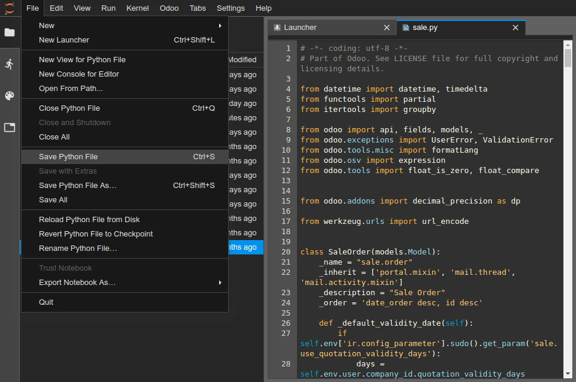
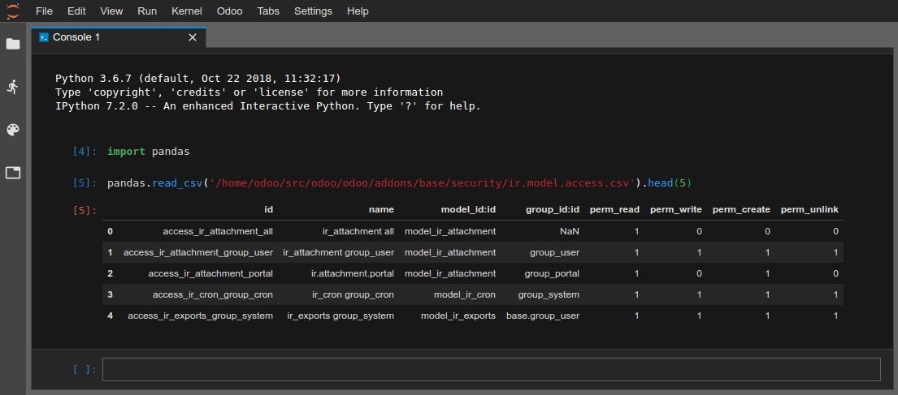
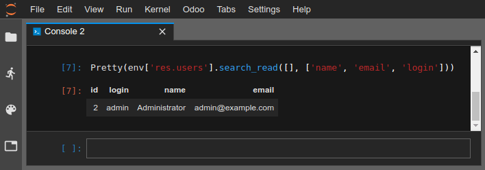

# Online Editor

## Overview

The online editor allows you to edit the source code of your builds from
a web browser. It also gives you the possibility to open terminals,
Python consoles, Konvergo ERP Shell consoles and
[Notebooks](https://jupyterlab.readthedocs.io/en/stable/user/notebook.html).


You can access the editor of a build through
`the branches tabs <odoosh-gettingstarted-branches-tabs>`,
`the builds dropdown menu <odoosh-gettingstarted-builds-dropdown-menu>`
or by adding */odoo-sh/editor* to your build domain name (e.g.
*https://odoo-addons-master-1.dev.odoo.com/odoo-sh/editor*).

## Edit the source code

The working directory is composed of the following folders:

    .
    ├── home
    │    └── odoo
    │         ├── src
    │         │    ├── odoo                Konvergo ERP Community source code
    │         │    │    └── odoo-bin       Konvergo ERP server executable
    │         │    ├── enterprise          Konvergo ERP Enterprise source code
    │         │    ├── themes              Konvergo ERP Themes source code
    │         │    └── user                Your repository branch source code
    │         ├── data
    │         │    ├── filestore           database attachments, as well as the files of binary fields
    │         │    └── sessions            visitors and users sessions
    │         └── logs
    │              ├── install.log         Database installation logs
    │              ├── odoo.log            Running server logs
    │              ├── update.log          Database updates logs
    │              └── pip.log             Python packages installation logs

You can edit the source code (files under */src*) in development and
staging builds.

> [!NOTE]
> Your changes won't be propagated to a new build, you must commit them
> in your source code if you want to make them persist.

For production builds, the source code is read-only, because applying
local changes on a production server is not a good practice.

- The source code of your Github repository is located under
  */src/user*,
- The source code of Konvergo ERP is located under
  - */src/odoo* ([odoo/odoo](https://github.com/odoo/odoo)),
  - */src/enterprise*
    ([odoo/enterprise](https://github.com/odoo/enterprise)),
  - */src/themes*
    ([odoo/design-themes](https://github.com/odoo/design-themes)).

To open a file in the editor, just double-click on it in the file
browser panel on the left.


You can then begin to make your changes. You can save your changes with
the menu `File --> Save .. File` or by hitting the `Ctrl+S` shortcut.



If you save a Python file which is under your Konvergo ERP server addons path,
Konvergo ERP will detect it and reload automatically so your changes are
reflected immediately, without having to restart the server manually.


However, if the change is a data stored in database, such as the label
of a field, or a view, you have to update the according module to apply
the change. You can update the module of the currently opened file by
using the menu `Konvergo ERP --> Update current module`. Note that the file
considered as currently opened is the file focused in the text editor,
not the file highlighted in the file browser.


You can also open a terminal and execute the command:

``` bash
$ odoo-bin -u <comma-separated module names> --stop-after-init
```

## Commit & Push your changes

You have the possibility to commit and push your changes to your Github
repository.

- Open a terminal (`File --> New --> Terminal`),
- Change the directory to *~/src/user* using `cd ~/src/user`,
- Stage your changes using `git add`,
- Commit your changes using `git commit`,
- Push your changes using `git push https HEAD:<branch>`.

In this last command,

- *https* is the name of your *HTTPS* Github remote repository (e.g.
  <https://github.com/username/repository.git>),
- HEAD is the reference to the latest revision you committed,
- \<branch\> must be replaced by the name of the branch to which you
  want to push the changes, most-likely the current branch if you work
  in a development build.


> [!NOTE]
> The SSH Github remote is not used because your SSH private key is not
> hosted in your build containers (for obvious security concerns) nor
> forwarded through an SSH Agent (as you access this editor through a
> web browser) and you therefore cannot authenticate yourself to Github
> using SSH. You have to use the HTTPS remote of your Github repository
> to push your changes, which is added automatically named as *https* in
> your Git remotes. You will be prompted to enter your Github username
> and password. If you activated the two-factor authentication on
> Github, you can create a [personal access
> token](https://help.github.com/articles/creating-a-personal-access-token-for-the-command-line/)
> and use it as password. Granting the `repo` permission suffices.

> [!NOTE]
> The Git source folder *~/src/user* is not checked out on a branch but
> rather on a detached revision: This is because builds work on specific
> revisions rather than branches. In other words, this means you can
> have multiple builds on the same branch, but on different revisions.

Once your changes are pushed, according to your
`branch push behavior <odoosh-gettingstarted-branches-tabs-settings>`, a
new build may be created. You can continue to work in the editor you
pushed from, as it will have the same revision as the new build that was
created, but always make sure to be in an editor of a build using the
latest revision of your branch.

## Consoles

You can open Python consoles, which are [IPython interactive
shells](https://ipython.readthedocs.io/en/stable/interactive/tutorial.html).
One of the most interesting addition to use a Python console rather than
a IPython shell within a terminal is the [rich
display](https://ipython.readthedocs.io/en/stable/config/integrating.html#rich-display)
capabilities. Thanks to this, you will be able to display objects in
HTML.

You can for instance display cells of a CSV file using
[pandas](https://pandas.pydata.org/pandas-docs/stable/tutorials.html).



You can also open an Konvergo ERP Shell console to play around with the Konvergo ERP
registry and model methods of your database. You can also directly read
or write on your records.

> [!WARNING]
> In an Konvergo ERP Console, transactions are automatically committed. This
> means, for instance, that changes in records are applied effectively
> in the database. If you change the name of a user, the name of the
> user is changed in your database as well. You therefore should use
> Konvergo ERP consoles carefully on production databases.

You can use *env* to invoke models of your database registry, e.g.
`env['res.users']`.

``` python
env['res.users'].search_read([], ['name', 'email', 'login'])
[{'id': 2,
'login': 'admin',
'name': 'Administrator',
'email': 'admin@example.com'}]
```

The class `Pretty` gives you the possibility to easily display lists and
dicts in a pretty way, using the [rich
display](https://ipython.readthedocs.io/en/stable/config/integrating.html#rich-display)
mentioned above.



You can also use
[pandas](https://pandas.pydata.org/pandas-docs/stable/tutorials.html) to
display graphs.


