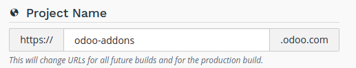
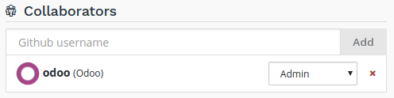
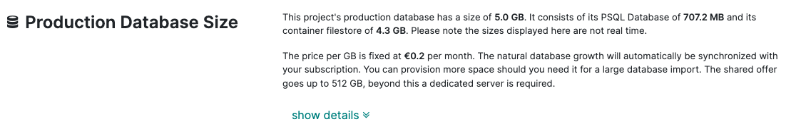
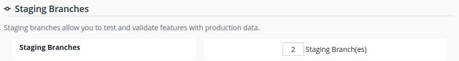
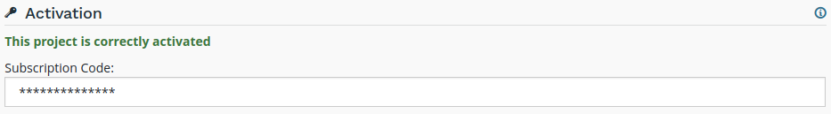

# Settings

## Overview

The settings allow you to manage the configuration of your project.

## Project name

The name of your project.

This defines the address that will be used to access your production
database.

Addresses of your staging and development builds are derived from this
name and assigned automatically. However, when you change your project
name, only future builds will use the new name.

## Collaborators

Manage the Github users who can access your project.

There are two levels of users:

- Admin: has access to all features of Odoo.sh.
- User: does not have access to the project settings nor to the
  production and staging databases.

The user group is meant for developers who can make modifications in
your code but are not allowed to access the production data. Users of
this group cannot connect to the production and staging databases using
the *1-click connect* feature, but they can of course use their regular
account on these databases if they have one, using their regular
credentials.

In addition, they cannot use the webshell nor have access to the server
logs.

||
||
||
||
||
||
||
||
||
||
||
||
||
||
||
||
||
||
||
||

> [!NOTE]
> \* Only in staging branches

> \ 0.5"\>●\</span\>

> \ 0.5"\>●\</span\>

> \ 0.5"\>●\</span\>

## Public Access

Allow public access to your development builds.

If activated, this option exposes the Builds page publicly, allowing
visitors to connect to your development builds.

In addition, visitors have access to the logs, shell and mails of your
development builds.

Production and staging builds are excluded, visitors can only see their
status.

## Custom domains

To configure additional domains please refer to the corresponding
branch's `settings tab
<odoosh-gettingstarted-branches-tabs-settings>`.

## Submodules

Configure the deploy keys for the private repositories you use as
submodules in your branches to allow Odoo.sh to download them.

> [!WARNING]
> These settings are required for **private repositories** only. If you
> are looking on how to set up your submodules, instructions are
> available in the chapter `Submodules
> <odoosh-advanced-submodules>` of this documentation.

When a repository is private, it is not possible to publicly download
its branches and revisions. For that reason, you need to configure a
deploy key for Odoo.sh, so the remote Git server allows our platform to
download the revisions of this private repository.

To configure the deploy key for a private repository, proceed as
follows:

- in the input, paste the SSH URL of your private sub-repository and
  click on *Add*,
  - e.g. *git@github.com:USERNAME/REPOSITORY.git*
  - it can be another Git server than Github, such as Bitbucket, Gitlab
    or even your own self-hosted server
- copy the public key,
  - it should look like *ssh-rsa some...random...characters...here...==*
- in the settings of the private sub-repository, add the public key
  amongst the deploy keys.
  - Github.com: `Settings --> Deploy keys --> Add deploy key`
  - Bitbucket.com: `Settings --> Access keys --> Add key`
  - Gitlab.com: `Settings --> Repository --> Deploy Keys`
  - Self-hosted: append the key to the git user’s authorized_keys file
    in its .ssh directory

## Storage Size

This section shows the storage size used by your project.

Storage size is computed as follows:

- the size of the PostgreSQL database
- the size of the disk files available in your container: database
  filestore, sessions storage directory...

> [!WARNING]
> In case you want to analyze disk usage, you can run the tool
> [ncdu](https://dev.yorhel.nl/ncdu/man) in your Web Shell.

Should your production database size grow to exceed what's provisioned
in your subscription, it will automatically be synchronized with it.

## Database Workers

Additional database workers can be configured here. More workers help
increase the load your production database is able to handle. If you add
more, it will automatically be synchronized with your subscription.

> [!WARNING]
> Adding more workers will not magically solve all performance issues.
> It only allows the server to handle more connections at the same time.
> If some operations are unusually slow, it's most likely a problem with
> the code, if it's not due to your own customizations you can open a
> ticket [here](https://www.odoo.com/help).

## Staging Branches

Additional staging branches allow you to develop and test more features
at the same time. If you add more, it will automatically be synchronized
with your subscription.

## Activation

Shows the status of the project's activation. You can change the
project's activation code if needed.

