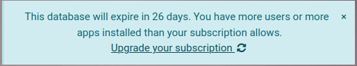

show-content  

# On-premise

## Register a database

To register your database, enter your subscription code in the banner in
the app dashboard. If the registration is successful, the banner will
turn green and display the database expiration date.

> [!TIP]
> The expiration date is also displayed at the bottom of the Settings
> page.

## Duplicate a database

Duplicate a database by accessing the database manager on your server
(\<odoo-server\>/web/database/manager).
Typically, you want to duplicate your production database into a
neutralized testing database. It can be done by checking the neutralize
box when prompted, which executes all `neutralize.sql` scripts for every
installed module.

## Common error messages and solutions

### Registration error

In case of a registration error, the following message should be
displayed.

To resolve the issue:

- Check the **validity of your Odoo Enterprise subscription** by
  verifying if your subscription details have the tag `In Progress` on
  your [Odoo Account](https://accounts.odoo.com/my/subscription) or
  contact your Account Manager.

- Ensure that **no other database is linked** to the subscription code,
  as only one database can be linked per subscription.

  > [!TIP]
  > If a test or a development database is needed, you can
  > `duplicate a database
  > <on-premise/duplicate>`.

- Verify that **no databases share the same UUID** (Universally Unique
  Identifier) by opening your [Odoo
  Contract](https://accounts.odoo.com/my/subscription). If two or more
  databases share the same UUID, their name will be displayed.

  

  If that is the case, manually change the database(s) UUID or [send a
  support ticket](https://www.odoo.com/help).

- As the update notification must be able to reach Odoo's subscription
  validation servers, ensure your **network and firewall settings**
  allow the Odoo server to open outgoing connections towards:

  - services.odoo.com on port
    443 (or
    80)
  - for older deployments,
    services.openerp.com on port
    443 (or
    80)

  These ports must be kept open even after registering a database, as
  the update notification runs once a week.

### Too many users error

If you have more users in a local database than provisioned in your Odoo
Enterprise subscription, the following message should be displayed.

When the message appears, you have 30 days to act before the database
expires. The countdown is updated every day.

To resolve the issue, either:

- **Add more users** to your subscription by clicking the
  `Upgrade your subscription` link displayed in the message to validate
  the upsell quotation and pay for the extra users.
- `Deactivate users <users/deactivate>` and **reject** the upsell
  quotation.

> [!IMPORTANT]
> If you are on a monthly subscription plan, the database will
> automatically update to reflect the added user(s). If you are on a
> yearly or multi-year plan, an expiration banner will appear in the
> database. You can create the upsell quotation by clicking the banner
> to update the subscription or [send a support
> ticket](https://www.odoo.com/help) to resolve the issue.

Once your database has the correct number of users, the expiration
message disappears automatically after a few days, when the next
verification occurs.

### Database expired error

If your database expires before you renew your subscription, the
following message should be displayed.

This message appears if you fail to act before the end of the 30-day
countdown.

To resolve the issue, either:

- Click the `Renew your subscription` link displayed in the message and
  complete the process. If you pay by wire transfer, your subscription
  will be renewed when the payment arrives which can take a few days.
  Credit card payments are processed immediately.
- [Send a support ticket](https://www.odoo.com/help).

on_premise/packages on_premise/source on_premise/update
on_premise/deploy on_premise/email_gateway on_premise/geo_ip
on_premise/community_to_enterprise

