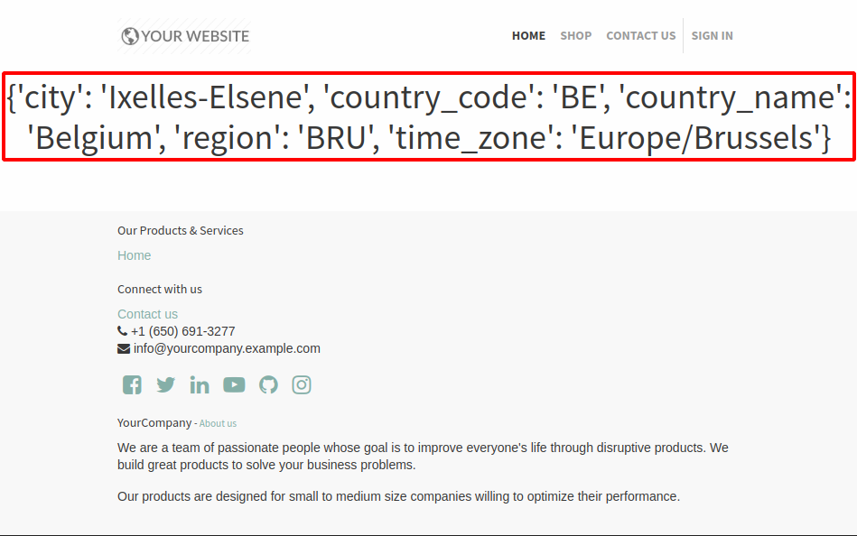

# Geo IP

> [!NOTE]
> This documentation only applies to On-premise databases.

## Installation

> [!WARNING]
> Please note that the installation depends on your computer's operating
> system and distribution. We will assume that a Linux operating system
> is being used.

1.  Install [geoip2](https://pypi.org/project/geoip2/) Python library  
    ``` bash
    pip install geoip2
    ```

2.  Download the [GeoLite2 City
    database](https://dev.maxmind.com/geoip/geoip2/geolite2/). You
    should end up with a file called `GeoLite2-City.mmdb`

3.  Move the file to the folder `/usr/share/GeoIP/`  
    ``` bash
    mv ~/Downloads/GeoLite2-City.mmdb /usr/share/GeoIP/
    ```

4.  Restart the server

> [!NOTE]
> If you can't/don't want to locate the geoip database in
> `/usr/share/GeoIP/`, you can use the `--geoip-db` option of the Konvergo ERP
> command line interface. This option takes the absolute path to the
> GeoIP database file and uses it as the GeoIP database. For example:
>
> ``` bash
> ./odoo-bin --geoip-db= ~/Downloads/GeoLite2-City.mmdb
> ```
>
> <div class="seealso">
>
> \- `CLI documentation </developer/reference/cli>`.
>
> </div>

> [!WARNING]
> `GeoIP` Python library can also be used. However this version is
> discontinued since January 1. See [GeoLite Legacy databases are now
> discontinued](https://support.maxmind.com/geolite-legacy-discontinuation-notice/)

## How to test GeoIP geolocation in your Konvergo ERP website

1.  Go to your website. Open the web page that you want to test `GeoIP`.
2.  Choose `Customize --> HTML/CSS/JS Editor`.
3.  Add the following piece of XML in the page :

``` xml
<h1 class="text-center" t-esc="request.session.get('geoip')"/>
```

You should end up with a dictionary indicating the location of the IP
address.



> [!NOTE]
> If the curly braces are empty `{}`, it can be for any of the following
> reasons :
>
> - The browsing IP address is the localhost (`127.0.0.1`) or a local
>   area network one (`192.168.*.*`)
> - If a reversed proxy is used, make sure to configure it correctly.
>   See `proxy mode
>   <odoo-bin --proxy-mode>`
> - `geoip2` is not installed or the GeoIP database file wasn't found
> - The GeoIP database was unable to resolve the given IP address
