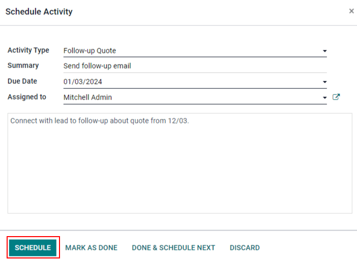
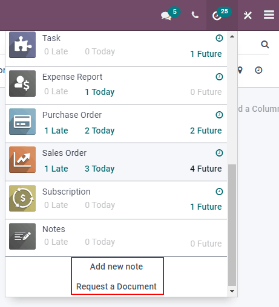
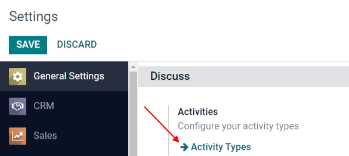
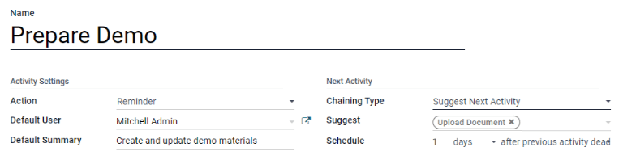

# Activities

*Activities* are follow-up tasks tied to a record in an Konvergo ERP database.
Activities can be scheduled on any page of the database that contains a
chatter thread, kanban view, list view, or activities view of an
application.

## Schedule activities

One way that activities are created is by clicking the
`Schedule Activity` button, located at the top of the *chatter* on any
record. On the pop-up window that appears, select an `Activity Type`
from the drop-down menu.

> [!TIP]
> Individual applications have a list of *Activity Types* dedicated to
> that application. For example, to view and edit the activities
> available for the *CRM* application, go to
> `CRM app --> Configuration --> Activity Types`.

Enter a title for the activity in the `Summary` field, located in the
`Schedule
Activity` pop-up window.

To assign the activity to a different user, select a name from the
`Assigned to` drop-down menu. Otherwise, the user creating the activity
is automatically assigned.

Lastly, feel free to add any additional information in the optional
`Log a note...` field.

> [!NOTE]
> The `Due Date` field on the `Schedule Activity` pop-up window
> auto-populates based on the configuration settings for the selected
> `Activity Type`. However, this date can be changed by selecting a day
> on the calendar in the `Due Date` field.

Lastly, click one of the following buttons:

- `Schedule`: adds the activity to the chatter under
  `Planned activities`.
- `Mark as Done`: adds the details of the activity to the chatter under
  `Today`. The activity is not scheduled, it is automatically marked as
  completed.
- `Done \& Schedule Next`: adds the task under `Today` marked as done,
  and opens a new activity window.
- `Discard`: discards any changes made on the pop-up window.

> [!NOTE]
> Depending on the activity type, the `Schedule` button may be replaced
> by a `Save` button, or an `Open Calendar` button.

Scheduled activities are added to the chatter for the record under
`Planned activities`.

Activities can also be scheduled from the kanban, list, or activities
view of an application.

Kanban view

Select a record on which to schedule an activity. Click on the
`🕘 (clock)` icon, then `Schedule An Activity`, and proceed to fill out
the pop-up form.

List view

Select a record on which to schedule an activity. Click on the
`🕘 (clock)` icon, then `Schedule An Activity`. If the record already
has an activity scheduled, the clock icon may be replaced by a
`📞 (phone)` or an `✉️ (envelope)` icon.

Activity view

To open the activity view for an application, select the `🕘 (clock)`
icon from the menu bar anywhere in the database. Select any application
from the drop-down menu, and click the `🕘 (clock)` icon for the desired
app.

Select a record on which to schedule an activity. Move across the row to
find the desired activity type, then click the `＋ (plus sign)`.

> [!NOTE]
> Activity colors, and their relation to an activity's due date, is
> consistent throughout Konvergo ERP, regardless of the activity type, or the
> view.
>
> - Activities that appear in **green** indicate a due date sometime in
>   the future.
> - **Yellow** indicates that the activity's due date is today.
> - **Red** indicates that the activity is overdue and the due date has
>   passed.
>
> For example, if an activity is created for a phone call, and the due
> date passes, the activity appears with a red phone in list view, and a
> red clock on the kanban view.

## View scheduled activities

To view scheduled activities, open either the `Sales app` or `CRM app`
and click the `🕘 (clock)` icon, located to the far-right side of the
other view options.

Doing so opens the activities menu, showcasing all the scheduled
activities for the user, by default. To show all activities for every
user, remove the `My Pipeline` filter from the `Search...` bar.

To view a consolidated list of activities separated by the application
where they were created, and by deadline, click the `🕘 (clock)` icon on
the header menu to see the activities for that specific application in a
drop-down menu.

The possibility to `Add new note` and `Request a Document` appear at the
bottom of this drop-down menu, when the `🕘 (clock)` icon on the header
menu is clicked.

## Configure activity types

To configure the types of activities in the database, go to
`Settings app --> Discuss
--> Activities --> Activity Types`.

Doing so reveals the `Activity Types` page, where the existing activity
types are found.

To edit an existing activity type, select it from the list, then click
`Edit`. To create a new activity type, click `Create`.

At the top of a blank activity type form, start by choosing a `Name` for
the new activity type.

### Activity settings

#### Action

The *Action* field specifies the intent of the activity. Some actions
trigger specific behaviors after an activity is scheduled.

- If `Upload Document` is selected, a link to upload a document is added
  directly to the planned activity in the chatter.
- If either `Phonecall` or `Meeting` are selected, users have the option
  to open their calendar to schedule a time for this activity.
- If `Request Signature` is selected, a link is added to the planned
  activity in the chatter that opens a signature request pop-up window.

> [!NOTE]
> The actions available to select on an activity type vary, depending on
> the applications currently installed in the database.

#### Default user

To automatically assign this activity to a specific user when this
activity type is scheduled, choose a name from the `Default User`
drop-down menu. If this field is left blank, the activity is assigned to
the user who creates the activity.

#### Default summary

To include notes whenever this activity type is created, enter them into
the `Default
Summary` field.

> [!NOTE]
> The information in the `Default User` and `Default Summary` fields are
> included when an activity is created. However, they can be altered
> before the activity is scheduled or saved.

### Next activity

To automatically suggest, or trigger, a new activity after an activity
has been marked complete, the `Chaining Type` must be set.

#### Suggest next activity

In the `Chaining Type` field, select `Suggest Next Activity`. Upon doing
so, the field underneath changes to: `Suggest`. Click the `Suggest`
field drop-down menu to select any activities to recommend as follow-up
tasks to this activity type.

In the `Schedule` field, choose a default deadline for these activities.
To do so, configure a desired number of `Days`, `Weeks`, or `Months`.
Then, decide if it should occur `after completion date` or
`after previous activity
deadline`.

This `Schedule` field information can be altered before the activity is
scheduled.

When all configurations are complete, click `Save`.

> [!NOTE]
> If an activity has the `Chaining Type` set to `Suggest Next Activity`,
> and has activities listed in the `Suggest` field, users are presented
> with recommendations for activities as next steps.

#### Trigger next activity

Setting the `Chaining Type` to `Trigger Next Activity` immediately
launches the next activity once the previous one is completed.

If `Trigger Next Activity` is selected in the `Chaining Type` field, the
field beneath changes to: `Trigger`. From the `Trigger` field drop-down
menu, select the activity that should be launched once this activity is
completed.

In the `Schedule` field, choose a default deadline for these activities.
To do so, configure a desired number of `Days`, `Weeks`, or `Months`.
Then, decide if it should occur `after completion date` or
`after previous activity
deadline`.

This `Schedule` field information can be altered before the activity is
scheduled.

When all configurations are complete, click `Save`.

> [!NOTE]
> When an activity has the `Chaining Type` set to
> `Trigger Next Activity`, marking the activity as
> Done immediately launches the next
> activity listed in the `Trigger` field.

\- `/applications/productivity/discuss` -
`/applications/productivity/discuss/team_communication`

