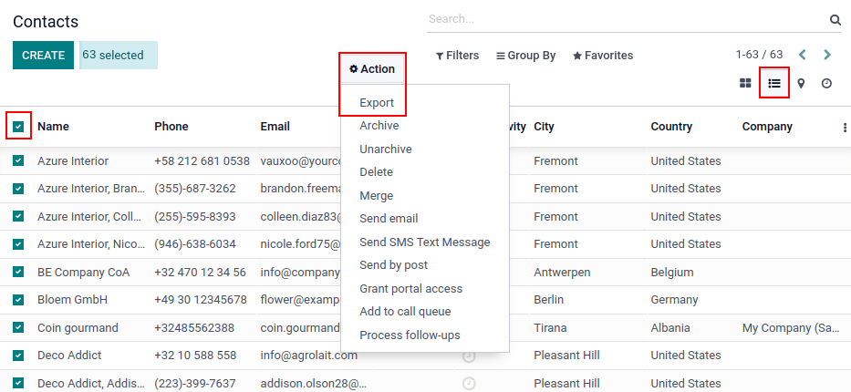
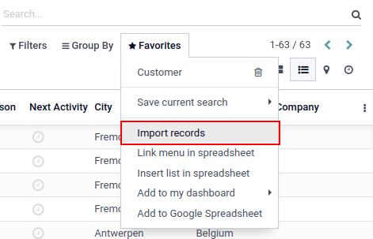
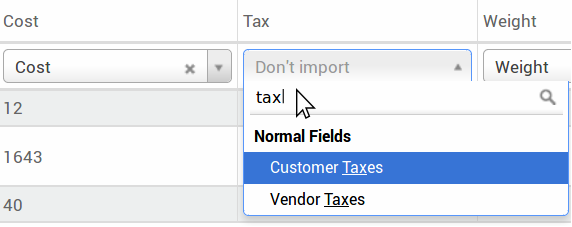

# Export and import data

In Konvergo ERP, it is sometimes necessary to export or import data for running
reports, or for data modification. This document covers the export and
import of data into and out of Konvergo ERP.

> [!IMPORTANT]
> Sometimes, users run into a 'time out' error, or a record does not
> process, due to its size. This can occur with large exports, or in
> cases where the import file is too large. To circumvent this
> limitation surrounding the size of the records, process exports or
> imports in smaller batches.

## Export data from Konvergo ERP

When working with a database, it is sometimes necessary to export data
in a distinct file. Doing so can aid in reporting on activities,
although, Konvergo ERP provides a precise and easy reporting tool with each
available application.

With Konvergo ERP, the values can be exported from any field in any record. To
do so, activate the list view (`☰ (three horizontal lines)` icon), on
the items that need to be exported, and then select the records that
should be exported. To select a record, tick the checkbox next to the
corresponding record. Finally, click on `⚙️ Action`, and then `Export`.



When clicking on `Export`, an `Export Data` pop-over window appears,
with several options for the data to export:


1.  With the `I want to update data (import-compatable export)` option
    ticked, the system only shows the fields that can be imported. This
    is helpful in the case where the existing records need to be
    updated. This works like a filter. Leaving the box unticked, gives
    many more field options because it shows all the fields, not just
    the ones that can be imported.
2.  When exporting, there is the option to export in two formats:
    <span class="title-ref">.csv</span> and
    <span class="title-ref">.xls</span>. With
    <span class="title-ref">.csv</span>, items are separated by a comma,
    while <span class="title-ref">.xls</span> holds information about
    all the worksheets in a file, including both content and formatting.
3.  These are the items that can be exported. Use the `> (right arrow)`
    icon to display more sub-field options. Use the `Search` bar to find
    specific fields. To use the `Search` option more efficiently, click
    on all the `> (right arrows)` to display all fields.
4.  The `+ (plus sign)` icon button is present to add fields to the
    `Fields to
    export` list.
5.  The `↕️ (up-down arrow)` to the left of the selected fields can be
    used to move the fields up and down, to change the order in which
    they are displayed in the exported file. Drag-and-drop using the
    `↕️ (up-down arrow)` icon.
6.  The `🗑️ (trash can)` icon is used to remove fields. Click on the
    `🗑️ (trash
    can)` icon to remove the field.
7.  For recurring reports, it is helpful to save export presets. Select
    all the needed fields, and click on the template drop-down menu.
    Once there, click on `New template`, and give a unique name to the
    export just created. The next time the same list needs to be
    exported, select the related template that was previously saved from
    the drop-down menu.

> [!TIP]
> It is helpful to know the field's external identifier. For example,
> `Related Company` in the export user interface is equal to *parent_id*
> (external identifier). This is helpful because then, the only data
> exported is what should be modified and re-imported.

## Import data into Konvergo ERP

Importing data into Konvergo ERP is extremely helpful during implementation, or
in times where data needs to be updated in bulk. The following
documentation covers how to import data into an Konvergo ERP database.

> [!WARNING]
> Imports are permanent and **cannot** be undone. However, it is
> possible to use filters (<span class="title-ref">created on</span> or
> <span class="title-ref">last modified</span>) to identify records
> changed or created by the import.

> [!TIP]
> Activating `developer mode <developer-mode>` changes the visible
> import settings in the left menu. Doing so reveals an `Advanced` menu.
> Included in this advanced menu are two options:
> `Track history during import` and `Allow matching with subfields`.
>
>  alt="Advanced import options when developer mode is activated." />
>
> If the model uses openchatter, the `Track history during import`
> option sets up subscriptions and sends notifications during the
> import, but leads to a slower import.
>
> Should the `Allow matching with subfields` option be selected, then
> all subfields within a field are used to match under the `Konvergo ERP Field`
> while importing.

### Get started

Data can be imported on any Konvergo ERP business object using either Excel
(<span class="title-ref">.xlsx</span>) or `CSV
(Comma-separated Values)` (<span class="title-ref">.csv</span>) formats.
This includes: contacts, products, bank statements, journal entries, and
orders.

Open the view of the object to which the data should be
imported/populated, and click on `⭐ Favorites --> Import records`.



After clicking `Import records`, Konvergo ERP reveals a separate page with
templates that can be downloaded and populated with the company's own
data. Such templates can be imported in one click, since the data
mapping is already done. To download a template click
`Import Template for
Customers` at the center of the page.

> [!IMPORTANT]
> When importing a `CSV (Comma-separated Values)` file, Konvergo ERP provides
> `Formatting` options. These options do **not** appear when importing
> the proprietary Excel file type (<span class="title-ref">.xls</span>,
> <span class="title-ref">.xlsx</span>).
>
>  alt="Formatting options presented when a CVS file is imported in Konvergo ERP." />

Make necessary adjustments to the *Formatting* options, and ensure all
columns in the `Konvergo ERP field` and `File Column` are free of errors.
Finally, click `Import` to import the data.

### Adapt a template

Import templates are provided in the import tool of the most common data
to import (contacts, products, bank statements, etc.). Open them with
any spreadsheet software (*Microsoft Office*, *OpenOffice*, *Google
Drive*, etc.).

Once the template is downloaded, proceed to follow these steps:

- Add, remove, and sort columns to best fit the data structure.
- It is strongly advised to **not** remove the `External ID` (ID) column
  (see why in the next section).
- Set a unique ID to every record by dragging down the ID sequencing in
  the `External ID` (ID) column.


> [!NOTE]
> When a new column is added, Konvergo ERP may not be able to map it
> automatically, if its label does not fit any field within Konvergo ERP.
> However, new columns can be mapped manually when the import is tested.
> Search the drop-down menu for the corresponding field.
>
>  alt="Drop-down menu expanded in the initial import screen on Konvergo ERP." />
>
> Then, use this field's label in the import file to ensure future
> imports are successful.

> [!TIP]
> Another useful way to find out the proper column names to import is to
> export a sample file using the fields that should be imported. This
> way, if there is not a sample import template, the names are accurate.

### Import from another application

The `External ID` (ID) is a unique identifier for the line item. Feel
free to use one from previous software to facilitate the transition to
Konvergo ERP.

Setting an ID is not mandatory when importing, but it helps in many
cases:

- Update imports: import the same file several times without creating
  duplicates.
- `Import relation fields <export_import_data/relation-fields>`.

To recreate relationships between different records, the unique
identifier from the original application should be used to map it to the
`External ID` (ID) column in Konvergo ERP.

When another record is imported that links to the first one, use
**XXX/ID** (XXX/External ID) for the original unique identifier. This
record can also be found using its name.

> [!WARNING]
> It should be noted that there will be a conflict if two or more
> records have the same name.

The `External ID` (ID) can also be used to update the original import,
if modified data needs to be re-imported later, therefore, it is a good
practice to specify it whenever possible.

### Field missing to map column

Konvergo ERP heuristically tries to find the type of field for each column
inside the imported file, based on the first ten lines of the files.

For example, if there is a column only containing numbers, only the
fields with the *integer* type are presented as options.

While this behavior might be beneficial in most cases, it is also
possible that it could fail, or the column may be mapped to a field that
is not proposed by default.

If this happens, check the
`Show fields of relation fields (advanced) option`, then a complete list
of fields becomes available for each column.


### Change data import format

> [!NOTE]
> Konvergo ERP can automatically detect if a column is a date, and tries to
> guess the date format from a set of most commonly used date formats.
> While this process can work for many date formats, some date formats
> are not recognizable. This can cause confusion, due to day-month
> inversions; it is difficult to guess which part of a date format is
> the day, and which part is the month, in a date, such as
> <span class="title-ref">01-03-2016</span>.

When importing a `CSV (Comma-separated Values)` file, Konvergo ERP provides
`Formatting` options.

To view which date format Konvergo ERP has found from the file, check the
`Date Format` that is shown when clicking on options under the file
selector. If this format is incorrect, change it to the preferred format
using *ISO 8601* to define the format.

> [!IMPORTANT]
> *ISO 8601* is an international standard, covering the worldwide
> exchange, along with the communication of date and time-related data.
> For example, the date format should be
> <span class="title-ref">YYYY-MM-DD</span>. So, in the case of July
> 24th 1981, it should be written as
> <span class="title-ref">1981-07-24</span>.

> [!TIP]
> When importing Excel files (<span class="title-ref">.xls</span>,
> <span class="title-ref">.xlsx</span>), consider using *date cells* to
> store dates. This maintains locale date formats for display,
> regardless of how the date is formatted in Konvergo ERP. When importing a
> `CSV (Comma-separated Values)` file, use Konvergo ERP's `Formatting` section
> to select the date format columns to import.

### Import numbers with currency signs

Konvergo ERP fully supports numbers with parenthesis to represent negative
signs, as well as numbers with currency signs attached to them. Konvergo ERP
also automatically detects which thousand/decimal separator is used. If
a currency symbol unknown to Konvergo ERP is used, it might not be recognized as
a number, and the import crashes.

> [!NOTE]
> When importing a `CSV (Comma-separated Values)` file, the `Formatting`
> menu appears on the left-hand column. Under these options, the
> `Thousands Separator` can be changed.

Examples of supported numbers (using 'thirty-two thousand' as the
figure):

- 32.000,00
- 32000,00
- 32,000.00
- -32000.00
- (32000.00)
- \$ 32.000,00
- (32000.00 €)

Example that will not work:

- ABC 32.000,00
- \$ (32.000,00)

> [!IMPORTANT]
> A `() (parenthesis)` around the number indicates that the number is a
> negative value. The currency symbol **must** be placed within the
> parenthesis for Konvergo ERP to recognize it as a negative currency value.

### Import preview table not displayed correctly

By default, the import preview is set on commas as field separators, and
quotation marks as text delimiters. If the
`CSV (Comma-separated Values)` file does not have these settings, modify
the `Formatting` options (displayed under the `Import` `CSV
(Comma-separated Values)` file bar after selecting the
`CSV (Comma-separated Values)` file).

> [!IMPORTANT]
> If the `CSV (Comma-separated Values)` file has a tabulation as a
> separator, Konvergo ERP does **not** detect the separations. The file format
> options need to be modified in the spreadsheet application. See the
> following `Change CSV file format <export_import_data/change-csv>`
> section.

### Change CSV file format in spreadsheet application

When editing and saving `CSV (Comma-separated Values)` files in
spreadsheet applications, the computer's regional settings are applied
for the separator and delimiter. Konvergo ERP suggests using *OpenOffice* or
*LibreOffice*, as both applications allow modifications of all three
options (from *LibreOffice* application, go to
`'Save As' dialog box --> Check the box 'Edit filter
settings' --> Save`).

Microsoft Excel can modify the encoding when saving
(`'Save As' dialog box -->
'Tools' drop-down menu --> Encoding tab`).

### Difference between Database ID and External ID

Some fields define a relationship with another object. For example, the
country of a contact is a link to a record of the 'Country' object. When
such fields are imported, Konvergo ERP has to recreate links between the
different records. To help import such fields, Konvergo ERP provides three
mechanisms.

> [!IMPORTANT]
> **Only one** mechanism should be used per field that is imported.

For example, to reference the country of a contact, Konvergo ERP proposes three
different fields to import:

- `Country`: the name or code of the country
- `Country/Database ID`: the unique Konvergo ERP ID for a record, defined by the
  ID PostgreSQL column
- `Country/External ID`: the ID of this record referenced in another
  application (or the <span class="title-ref">.XML</span> file that
  imported it)

For the country of Belgium, for example, use one of these three ways to
import:

- `Country`: <span class="title-ref">Belgium</span>
- `Country/Database ID`: <span class="title-ref">21</span>
- `Country/External ID`: <span class="title-ref">base.be</span>

According to the company's need, use one of these three ways to
reference records in relations. Here is an example when one or the other
should be used, according to the need:

- Use `Country`: this is the easiest way when data comes from
  `CSV (Comma-separated
  Values)` files that have been created manually.
- Use `Country/Database ID`: this should rarely be used. It is mostly
  used by developers as the main advantage is to never have conflicts
  (there may be several records with the same name, but they always have
  a unique Database ID)
- Use `Country/External ID`: use *External ID* when importing data from
  a third-party application.

When *External IDs* are used, import `CSV (Comma-separated Values)`
files with the `External ID` (ID) column defining the *External ID* of
each record that is imported. Then, a reference can be made to that
record with columns, like <span class="title-ref">Field/External
ID</span>. The following two `CSV (Comma-separated Values)` files
provide an example for products and their categories.

- `CSV file for categories
  <export_import_data/External_id_3rd_party_application_product_categories.csv>`
- `CSV file for Products
  <export_import_data/External_id_3rd_party_application_products.csv>`

### Import relation fields

An Konvergo ERP object is always related to many other objects (e.g. a product
is linked to product categories, attributes, vendors, etc.). To import
those relations, the records of the related object need to be imported
first, from their own list menu.

This can be achieved by using either the name of the related record, or
its ID, depending on the circumstances. The ID is expected when two
records have the same name. In such a case add <span class="title-ref">/
ID</span> at the end of the column title (e.g. for product attributes:
<span class="title-ref">Product Attributes / Attribute / ID</span>).

#### Options for multiple matches on fields

If, for example, there are two product categories with the child name
<span class="title-ref">Sellable</span> (e.g.
<span class="title-ref">Misc. Products/Sellable</span> &
<span class="title-ref">Other Products/Sellable</span>), the validation
is halted, but the data may still be imported. However, Konvergo ERP recommends
that the data is not imported because it will all be linked to the first
<span class="title-ref">Sellable</span> category found in the *Product
Category* list (<span class="title-ref">Misc. Products/Sellable</span>).
Konvergo ERP, instead, recommends modifying one of the duplicate's values, or
the product category hierarchy.

However, if the company does not wish to change the configuration of
product categories, Konvergo ERP recommends making use of the *External ID* for
this field, 'Category'.

#### Import many2many relationship fields

The tags should be separated by a comma, without any spacing. For
example, if a customer needs to be linked to both tags:
<span class="title-ref">Manufacturer</span> and
<span class="title-ref">Retailer</span> then 'Manufacturer,Retailer'
needs to be encoded in the same column of the
`CSV (Comma-separated Values)` file.

- `CSV file for Manufacturer, Retailer <export_import_data/m2m_customers_tags.csv>`

#### Import one2many relationships

If a company wants to import a sales order with several order lines, a
specific row **must** be reserved in the `CSV (Comma-separated Values)`
file for each order line. The first order line is imported on the same
row as the information relative to order. Any additional lines need an
additional row that does not have any information in the fields relative
to the order.

As an example, here is a `CSV (Comma-separated Values)` file of some
quotations that can be imported, based on demo data:

- `File for some Quotations
  <export_import_data/purchase.order_functional_error_line_cant_adpat.csv>`

The following `CSV (Comma-separated Values)` file shows how to import
purchase orders with their respective purchase order lines:

- `Purchase orders with their respective purchase order lines
  <export_import_data/o2m_purchase_order_lines.csv>`

The following `CSV (Comma-separated Values)` file shows how to import
customers and their respective contacts:

- `Customers and their respective contacts
  <export_import_data/o2m_customers_contacts.csv>`

### Import records several times

If an imported file contains one of the columns: `External ID` or
`Database ID`, records that have already been imported are modified,
instead of being created. This is extremely useful as it allows users to
import the same `CSV (Comma-separated Values)` file several times, while
having made some changes in between two imports.

Konvergo ERP takes care of creating or modifying each record, depending if it is
new or not.

This feature allows a company to use the *Import/Export tool* in Konvergo ERP to
modify a batch of records in a spreadsheet application.

### Value not provided for a specific field

If all fields are not set in the CSV file, Konvergo ERP assigns the default
value for every non-defined field. But, if fields are set with empty
values in the `CSV (Comma-separated Values)` file, Konvergo ERP sets the empty
value in the field, instead of assigning the default value.

### Export/import different tables from an SQL application to Konvergo ERP

If data needs to be imported from different tables, relations need to be
recreated between records belonging to different tables. For instance,
if companies and people are imported, the link between each person and
the company they work for needs to be recreated.

To manage relations between tables, use the
<span class="title-ref">External ID</span> facilities of Konvergo ERP. The
<span class="title-ref">External ID</span> of a record is the unique
identifier of this record in another application. The
<span class="title-ref">External ID</span> must be unique across all
records of all objects. It is a good practice to prefix this
<span class="title-ref">External ID</span> with the name of the
application or table. (like, 'company_1', 'person_1' - instead of '1')

As an example, suppose there is an SQL database with two tables that are
to be imported: companies and people. Each person belongs to one
company, so the link between a person and the company they work for must
be recreated.

Test this example, with a `sample of a PostgreSQL database
<export_import_data/database_import_test.sql>`.

First, export all companies and their *External ID*. In PSQL, write the
following command:

``` sh
> copy (select 'company_'||id as "External ID",company_name as "Name",'True' as "Is a Company" from companies) TO '/tmp/company.csv' with CSV HEADER;
```

This SQL command creates the following `CSV (Comma-separated Values)`
file:

``` text
External ID,Name,Is a Company
company_1,Bigees,True
company_2,Organi,True
company_3,Boum,True
```

To create the `CSV (Comma-separated Values)` file for people linked to
companies, use the following SQL command in PSQL:

``` sh
> copy (select 'person_'||id as "External ID",person_name as "Name",'False' as "Is a Company",'company_'||company_id as "Related Company/External ID" from persons) TO '/tmp/person.csv' with CSV
```

It produces the following `CSV (Comma-separated Values)` file:

``` text
External ID,Name,Is a Company,Related Company/External ID
person_1,Fabien,False,company_1
person_2,Laurence,False,company_1
person_3,Eric,False,company_2
person_4,Ramsy,False,company_3
```

In this file, Fabien and Laurence are working for the Bigees company
(<span class="title-ref">company_1</span>), and Eric is working for the
Organi company. The relation between people and companies is done using
the *External ID* of the companies. The *External ID* is prefixed by the
name of the table to avoid a conflict of ID between people and companies
(<span class="title-ref">person_1</span> and
<span class="title-ref">company_1</span>, who shared the same ID 1 in
the original database).

The two files produced are ready to be imported in Konvergo ERP without any
modifications. After having imported these two
`CSV (Comma-separated Values)` files, there are four contacts and three
companies (the first two contacts are linked to the first company). Keep
in mind to first import the companies, and then the people.
