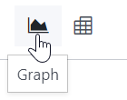
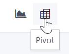

# Reporting

You can find several reports under the `Reporting` menu of most apps
that let you analyze and visualize the data of your records.

## Selecting a view

Depending on the report, Odoo can display the data in various ways.
Sometimes, a unique view fully tailored to the report is available,
while several views are available for others. However, two generic views
are dedicated to reporting: the graph and pivot views.

### Graph view

The `graph view <reporting/using-graph>` is used to visualize your
records' data, helping you identify patterns and trends. The view is
often found under the `Reporting` menu of apps but can be found
elsewhere. Click the **graph view button** located at the top right to
access it.

### Pivot view

The `pivot view <reporting/using-pivot>` is used to aggregate your
records' data and break it down for analysis. The view is often found
under the `Reporting` menu of apps but can be found elsewhere. Click the
**pivot view button** located at the top right to access it.

## Choosing measures

After selecting a view, you should ensure only the relevant records are
`filtered <search>`. Next, you should choose what is measured. By
default, a measure is always selected. If you wish to edit it, click
`Measures` and choose one or, only for pivots, multiple measures.

> [!NOTE]
> When you select a measure, Odoo aggregates the values recorded on that
> field for the filtered records. Only numerical fields
> (`integer <studio/fields/simple-fields/integer>`,
> `decimal <studio/fields/simple-fields/decimal>`, `monetary
> <studio/fields/simple-fields/monetary>`) can be measured. In addition,
> the `Count` option is used to count the total number of filtered
> records.

After choosing what you want to measure, you can define how the data
should be `grouped
<search/group>` depending on the dimension you want to analyze. By
default, the data is often grouped by *Date \> Month*, which is used to
analyze the evolution of a measure over the months.

> [!TIP]
> When you filter a single time period, the option to compare it against
> another one appears.
>
> 

Select measures

Among other measures, you could add the `Margin` and `Count` measures to
the Sales Analysis report. By default, the `Untaxed Amount` measure is
selected.

Group measures

You could group the measures by `Product Category` at the level of rows
on the previous Sales Analysis report example.

## Using the pivot view

Grouping data is quintessential to the pivot view. It enables drilling
down the data to gain deeper insights. While you can use the `Group By`
option to quickly add a group at the level of rows, as shown in the
example above, you can also click the plus button (`➕`) next to the
`Total` header at the level of rows *and* columns, and then select one
of the **preconfigured groups**. To remove one, click the minus button
(`➖`).

Once you have added a group, you can add new ones on the opposite axis
or the newly created subgroups.

You could further divide the measures on the previous Sales Analysis
report example by the `Salesperson` group at the level of columns and by
the `Order Date > Month` group on the
`All / Saleable / Office Furniture` product category.

> [!TIP]
> - Switch the rows and columns' groups by clicking the flip axis button
> (`⇄`). - Click on a measure's label to sort the values by ascending
> (⏶) or descending (⏷) order. - Download a
> .xlsx version of the pivot by clicking
> the download button (`⭳`).

## Using the graph view

Three graphs are available: the bar, line, and pie charts.

**Bar charts** are used to show the distribution or a comparison of
several categories. They are especially useful as they can deal with
larger data sets.

**Line charts** are useful to show changing time series and trends over
time.

**Pie charts** are used to show the distribution or a comparison of a
small number of categories when they form a meaningful whole.

Bar chart

Line chart

Pie chart

> [!TIP]
> For **bar** and **line** charts, you can use the stacked option when
> you have at least two groups, which then appear on top of each other
> instead of next to each other.
>
> 

>
> 

>
> Stacked bar chart
>
> 
>
> 

>
> 

>
> Regular bar chart
>
> 
>
> 

>
> 

>
> Stacked line chart
>
> 
>
> 

>
> 

>
> Regular line chart
>
> 
>
> 

>
> 

>
> For **line** charts, you can use the cumulative option to sum values,
> which is especially useful to show the change in growth over a time
> period.
>
> 

>
> 

>
> Cumulative line chart
>
> 
>
> 

>
> 

>
> Regular line chart
>
> 
>
> 

>
> 

