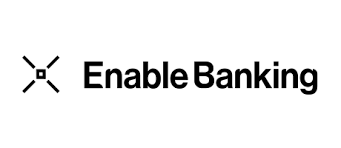

# Enable Banking

**Enable Banking** is a third-party provider aggregating banking
information from bank accounts all in one place. It offers non-intrusive
connectivity to ASPSPs' official APIs across Europe without storing
data.

**Konvergo ERP** synchronizes directly with banks to get access to all bank
transactions and automatically import them into your database.

\- `../bank_synchronization` - [Enable Banking
website](https://enablebanking.com/)

## Configuration

### Link bank accounts with Konvergo ERP

1.  Start synchronization by clicking on
    `Accounting --> Configuration -->
    Add a Bank Account`;

2.  Select your bank;

3.  Make sure you give your consent to share your account information
    with Konvergo ERP by clicking `Continue authentication`;

    

4.  Finally, you are redirected to your bank's login page.
