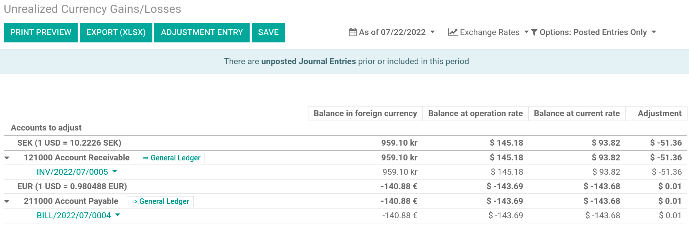
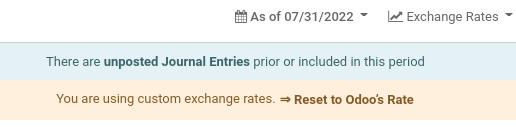

# Manage a bank account in a foreign currency

In Odoo, every transaction is recorded in the default currency of the
company, and reports are all based on that default currency. When you
have a bank account in a foreign currency, for every transaction, Odoo
stores two values:

- The debit/credit in the currency of the *company*;
- The debit/credit in the currency of the *bank account*.

Currency rates are updated automatically using the web services of a
banking institution. By default, Odoo uses the European Central Bank's
web services but other options are available.

## Configuration

### Activate multi-currencies

To work with multiple currencies, go to
`Accounting --> Configuration --> Settings
--> Currencies` and tick `Multi-Currencies`. Under
`Post Exchange difference
entries in:`, provide a `Journal`, a `Gain Account`, a `Loss Account`,
and then click on `Save`.

### Configure currencies

Once Odoo is configured to support multiple currencies, they are all
created by default, but not necessarily active. To activate the new
currencies, click on `Activate Other Currencies` under the
`Multi-Currencies` setting or go to `Accounting --> Configuration
--> Accounting: Currencies`.

When the currencies are activated, you can choose to **automate** the
currency rate update, or leave it on **manual**. To configure the rate
update, go back to `Accounting -->
Configuration --> Settings --> Currencies`, check
`Automatic Currency Rates`, set `Interval` to your desired frequency,
and then click on `Save`. You also have the option to choose the
`Service` you wish to obtain currency rates from.

Click on the Update now button (`🗘`) besides the `Next Run` field to
update the currency rates manually.

### Create a new bank account

In the accounting application, go to
`Accounting --> Configuration --> Journals` and create a new one. Enter
a `Journal Name` and set the `Type` to
Bank. In the `Journal Entries` tab, enter
a **short code**, a **currency**, and then finally click on the
`Bank Account` field to create a new account. In the pop-up window of
the account creation, enter a name, a code (ex.: 550007), set its type
to Bank and Cash, set a currency type,
and save. When you are back on the **journal**, click on the
`Account Number` field, and in the pop-up window, fill out the
`Account Number`, `Bank` of your account, and save.

Upon creation of the journal, Odoo automatically links the bank account
to the journal. It can be found under
`Accounting --> Configuration --> Accounting: Chart of Accounts`.

## Vendor bill in a foreign currency

To pay a bill in a foreign currency, simply select the currency next to
the `Journal` field and register the payment. Odoo automatically creates
and posts the foreign **exchange gain or loss** as a new journal entry.

> [!NOTE]
> Note that you can pay a foreign bill with another currency. In that
> case, Odoo automatically converts between the two currencies.

## Unrealized Currency Gains/Losses Report

This report gives an overview of all unrealized amounts in a foreign
currency on your balance sheet, and allows you to adjust an entry or
manually set an exchange rate. To access this report, go to
`Reporting --> Management: Unrealized Currency Gains/Losses`. From here,
you have access to all open entries in your **balance sheet**.

If you wish to use a different currency rate than the one set in
`Accounting -->
Configuration --> Settings --> Currencies`, click the `Exchange Rates`
button and change the rate of the foreign currencies in the report.

When manually changing **exchange rates**, a yellow banner appears
allowing you to reset back to Odoo's rate. To do so, simply click on
`Reset to Odoo's Rate`.

In order to update your **balance sheet** with the amount of the
`adjustment` column, click on the `Adjustment Entry` button. In the
pop-up window, select a `Journal`, `Expense Account` and
`Income Account` to calculate and process the **unrealized gains and
losses**.

You can set the date of the report in the `Date` field. Odoo
automatically reverses the booking entry to the date set in
`Reversal Date`.

Once posted, the `adjustment` column should indicate
0.00, meaning all **unrealized
gains/losses** have been adjusted.

