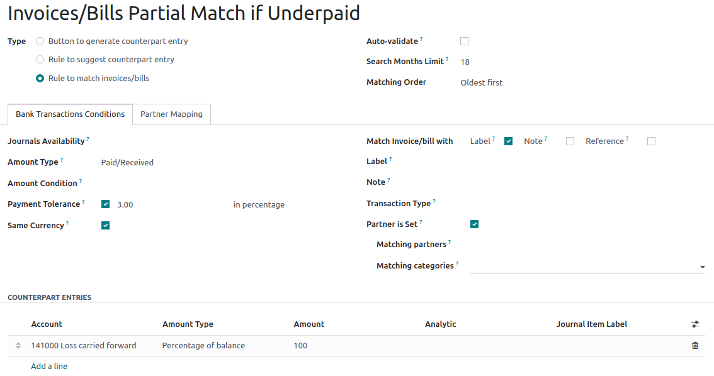

# Reconciliation models

Reconciliation models are used to automate the
`bank reconciliation <reconciliation>` process, which is especially
handy when dealing with recurring entries like bank fees. Reconciliation
models can also be helpful in handling
`cash discounts <../customer_invoices/cash_discounts>`.

Each model is created based on a `model type <models/type>` and
`bank transaction
conditions`.

\- `bank_synchronization` - [Konvergo ERP Tutorials: Reconciliation
models](https://www.odoo.com/slides/slide/reconciliation-models-1841?fullscreen=1)

## Reconciliation model types

The reconciliation models are available by going to
`Accounting --> Configuration
--> Banks: Reconciliation Models`. For each reconciliation model, a
`Type` must be set. Three types of models exist:

- `Button to generate counterpart entry`: a button is created in the
  resulting entry section of the bank reconciliation view. If clicked,
  this button generates a counterpart entry to reconcile with the active
  transaction based on the rules set in the model. The rules specified
  in the model determine the counterpart entry's account(s), amount(s),
  label(s), and analytic distribution;
- `Rule to suggest counterpart entry`: used for recurring transactions
  to match the transaction to a new entry based on conditions that must
  match the information on the transaction;
- `Rule to match invoices/bills`: used for recurring transactions to
  match the transaction to existing invoices, bills, or payments based
  on conditions that must match the information on the transaction.

## Default reconciliation models

In Konvergo ERP, different models are available by default depending on the
company's fiscal localization. These can be updated if needed. Users can
also create their own reconciliation models by clicking `New`.

> [!IMPORTANT]
> If a record matches with several reconciliation models, the first one
> in the *sequence* of models is applied. You can rearrange the order by
> dragging and dropping the handle next to the name.
>
> 

### Invoices/Bills perfect match

This model should be at the top of the *sequence* of models, as it
enables Konvergo ERP to suggest matching existing invoices or bills with a bank
transaction based on set conditions.

Konvergo ERP automatically reconciles the payment when the `Auto-validate`
option is selected, and the model conditions are perfectly met. In this
case, it expects to find on the bank statement's line the
invoice/payment's reference (as `Label` is selected) and the partner's
name (as `Partner is set` is selected) to suggest the correct
counterpart entry and reconcile the payment automatically.

### Invoices/Bills partial match if underpaid

This model suggests a customer invoice or vendor bill that partially
matches the payment when the amount received is slightly lower than the
invoice amount, for example in the case of **cash discounts**. The
difference is reconciled with the account indicated in the
`counterpart entries` tab.

The reconciliation model `Type` is `Rule to match invoices/bills`, and
the `Payment tolerance` should be set.

> [!NOTE]
> The `Payment tolerance` is only applicable to lower payments. It is
> disregarded when an overpayment is received.

`../customer_invoices/cash_discounts`

### Line with bank fees

This model suggests a counterpart entry according to the rules set in
the model. In this case, the reconciliation model `Type` is
`Rule to suggest counterpart entry`, and the `Label` can be used for
example, to identify the information referring to the `Bank fees` in the
label of the transaction.

> [!NOTE]
> [Regular expressions](https://regexone.com/), often abbreviated as
> **Regex**, can be used in Konvergo ERP in various ways to search, validate,
> and manipulate data within the system. Regex can be powerful but also
> complex, so it's essential to use it judiciously and with a good
> understanding of the patterns you're working with.
>
> To use regular expressions in your reconciliation models, set the
> `Transaction Type` to `Match Regex` and add your expression. Konvergo ERP
> automatically retrieves the transactions that match your Regex
> expression and the conditions specified in your model.
>
> 

## Partner mapping

Partner mapping allows you to establish rules for automatically matching
transactions to the correct partner account, saving time and reducing
the risk of errors that can occur during manual reconciliation. For
example, you can create a partner mapping rule for incoming payments
with specific reference numbers or keywords in the transaction
description. When an incoming payment meets these criteria, Konvergo ERP
automatically maps it to the corresponding customer's account.

To create a partner mapping rule, go to the `Partner Mapping` tab and
enter the `Find Text in Label`, `Find Text in Notes`, and `Partner`.

