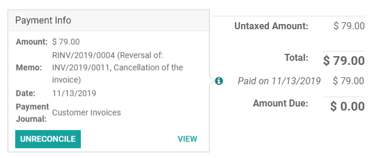

# Credit notes and refunds

A **credit/debit note**, or **credit/debit memo**, is a document issued
to a customer that notifies them that they have been *credited/debited*
a certain amount.

Several use cases can lead to a credit note, such as:

> - a mistake in the invoice
> - a return of the goods, or a rejection of the services
> - the goods delivered are damaged

Debit notes are less common but are most frequently used to track debts
owed by customers or to vendors because of modifications to confirmed
customer invoices or vendor bills.

> [!NOTE]
> Issuing a credit/debit note is the only legal way to cancel, refund,
> or modify a validated invoice. Do not forget to **register the
> payment** afterward if you need to send money back to your customer
> and/or validate the
> `return </applications/sales/sales/products_prices/returns>` if a
> storable product is returned.

## Issue a credit note

You can create a credit note from scratch by going to
`Accounting --> Customers -->
Credit Notes`, and by clicking on `Create`. Filling out a credit note
form works the same way as an invoice form.

However, most of the time, credit notes are generated directly from the
related invoices. To do so, go to
`Accounting --> Customers --> Invoices`, open the related **customer
invoice**, and click on `Add Credit Note`.

You can choose between three options:

> - `Partial Refund`
> - `Full Refund`
> - `Full refund and new draft invoice`

> [!NOTE]
> A credit note sequence starts with R
> and is followed by the number of the related document (e.g.,
> RINV/2019/0004 is related to the invoice INV/2019/0004).

### Partial refund

When selecting the `Partial Refund` option, Odoo creates a draft credit
note already prefilled with all the necessary information from the
original invoice. This is the option to choose if you wish to do a
partial refund or if you want to modify any detail of the credit note.

> [!NOTE]
> This is the only option for invoices marked as *in payment* or *paid*.

### Full refund

When selecting the `Full Refund` option, Odoo creates a credit note,
automatically validates it, and reconciles it with the related invoice.

This is the option to choose for a full refund or to **cancel** a
*validated* invoice.

### Full refund and new draft invoice

When selecting the `Full refund and new draft invoice` option, Odoo
creates a credit note, automatically validates it, reconciles it with
the related invoice, and opens a new draft invoice prefilled with the
same details from the original invoice.

This is the option to **modify** the content of a *validated* invoice.

## Issue a debit note

You can create a debit note from scratch by going to
`Accounting --> Customers -->
Invoices` or by clicking on the related invoice you wish to issue a
debit note for. On the invoice form view, click `Add debit note`, fill
in the information, and click `Create`.

## Record a vendor refund

**Vendor refunds** are recorded the same way as credit notes:

You can either create a credit note from scratch by going to
`Accounting --> Vendors
--> Refund`, and by clicking on `Create`; or by opening the related
**vendor bill**, and clicking on `Add Credit Note`.

## Record a debit note

**Debit notes** from vendors are recorded in a similar way to how they
are issued to customers:

Go to `Accounting --> Vendors --> Bills`, open the related bill you wish
to record a debit note for, and click `Add debit note`. Fill in the
information, and click `Create debit note`.

## Journal entries

Issuing a credit/debit note from an invoice/bill creates a **reverse
entry** that zeroes out the journal items generated by the original
invoice.

The journal invoice of an entry:

And here is the credit note’s journal entry generated to reverse the
original invoice above:

