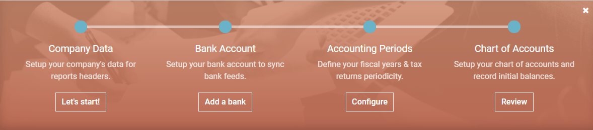
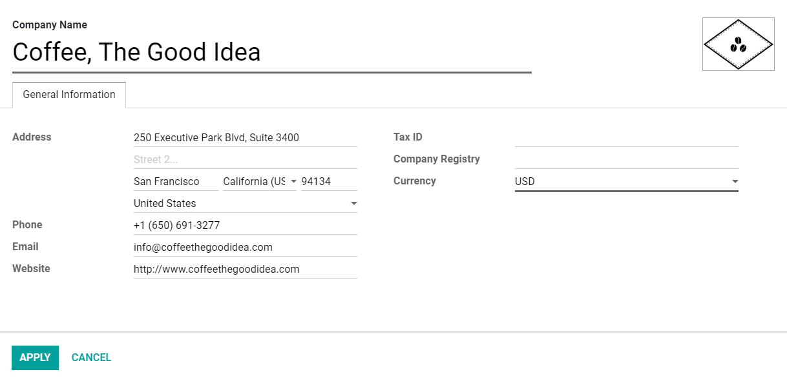

show-content  

# Get started

When you first open your Konvergo ERP Accounting app, the *Accounting Overview*
page welcomes you with a step-by-step onboarding banner, a wizard that
helps you get started. This onboarding banner is displayed until you
choose to close it.

The settings visible in the onboarding banner can still be modified
later by going to `Accounting --> Configuration --> Settings`.

> [!NOTE]
> Konvergo ERP Accounting automatically installs the appropriate **Fiscal
> Localization Package** for your company, according to the country
> selected at the creation of the database. This way, the right
> accounts, reports, and taxes are ready-to-go.
> `Click here <fiscal_localizations/packages>` for more information
> about Fiscal Localization Packages.

## Accounting onboarding banner

The step-by-step Accounting onboarding banner is composed of four steps:

1.  `accounting-setup-company`
2.  `accounting-setup-bank`
3.  `accounting-setup-periods`
4.  `accounting-setup-chart`

### Company Data

This menu allows you to add your company’s details such as the name,
address, logo, website, phone number, email address, and Tax ID, or VAT
number. These details are then displayed on your documents, such as on
invoices.

> [!NOTE]
> You can also change these settings by going to
> `Settings --> General Settings -->
> Settings --> Companies` and clicking on **Update Info**.

### Bank Account

Connect your bank account to your database and have your bank statements
synced automatically. To do so, find your bank in the list, click on
*Connect*, and follow the instructions on-screen.

> [!NOTE]
> `Click here <bank/bank_synchronization>` for more information about
> this feature.

If your Bank Institution can’t be synchronized automatically, or if you
prefer not to sync it with your database, you may also configure your
bank account manually by clicking on *Create it*, and filling out the
form.

- **Name**: the bank account's name, as displayed on Konvergo ERP.
- **Account Number**: your bank account number (IBAN in Europe).
- **Bank**: click on *Create and Edit* to configure the bank's details.
  Add the bank institution's name and its Identifier Code (BIC or
  SWIFT).
- **Code**: this code is your Journal's *Short Code*, as displayed on
  Konvergo ERP. By default, Konvergo ERP creates a new Journal with this Short Code.
- **Journal**: This field is displayed if you have an existing Bank
  Journal that is not linked yet to a bank account. If so, then select
  the *Journal* you want to use to record the financial transactions
  linked to this bank account or create a new one by clicking on *Create
  and Edit*.

> [!NOTE]
> - You can add as many bank accounts as needed with this tool by going
> to `Accounting
> --> Configuration`, and clicking on *Add a Bank Account*. -
> `Click here <bank>` for more information about Bank Accounts.

### Accounting Periods

Define here your **Fiscal Years**’ opening and closing dates, which are
used to generate reports automatically, and your **Tax Return
Periodicity**, along with a reminder to never miss a tax return
deadline.

By default, the opening date is set on the 1st of January and the
closing date on the 31st of December, as this is the most common use.

> [!NOTE]
> You can also change these settings by going to
> `Accounting --> Configuration -->
> Settings --> Fiscal Periods` and updating the values.

### Chart of Accounts

With this menu, you can add accounts to your **Chart of Accounts** and
indicate their initial opening balances.

Basic settings are displayed on this page to help you review your Chart
of Accounts. To access all the settings of an account, click on the
*double arrow button* at the end of the line.

> [!NOTE]
> `Click here <get_started/chart_of_accounts>` for more information on
> how to configure your Chart of Accounts.

## Invoicing onboarding banner

There is another step-by-step onboarding banner that helps you take
advantage of your Konvergo ERP Invoicing and Accounting apps. The *Invoicing
onboarding banner* is the one that welcomes you if you use the Invoicing
app rather than the Accounting app.

If you have Konvergo ERP Accounting installed on your database, you can reach it
by going to `Accounting --> Customers --> Invoices`.

The Invoicing onboarding banner is composed of four main steps:

1.  `invoicing-setup-company`
2.  `invoicing-setup-layout`
3.  `invoicing-setup-payment`
4.  `invoicing-setup-sample`

### Company Data

This form is the same as
`the one presented in the Accounting onboarding banner
<accounting-setup-company>`.

### Invoice Layout

With this tool, you can design the appearance of your documents by
selecting which layout template, paper format, colors, font, and logo
you want to use.

You can also add your *Company Tagline* and the content of the
documents’ *footer*. Note that Konvergo ERP automatically adds the company's
phone number, email, website URL, and Tax ID (or VAT number) to the
footer, according to the values you previously configured in the
`Company Data
<accounting-setup-company>`.

> [!TIP]
> Add your **bank account number** and a link to your **General Terms &
> Condition** in the footer. This way, your contacts can find the full
> content of your GT&C online without having to print them on the
> invoices you issue.

> [!NOTE]
> These settings can also be modified by going to
> `Settings --> General Settings`, under the *Business Documents*
> section.

### Payment Method

This menu helps you configure the payment methods with which your
customers can pay you.

> [!IMPORTANT]
> Configuring a *Payment Provider* with this tool also activates the
> *Invoice Online Payment* option automatically. With this, users can
> directly pay online, from their Customer Portal.

### Sample Invoice

Send yourself a sample invoice by email to make sure everything is
correctly configured.

\* `bank` \* `get_started/chart_of_accounts` \*
`bank/bank_synchronization` \* `../fiscal_localizations` \* [Konvergo ERP
Tutorials: Accounting and Invoicing - Getting started
\[video\]](https://www.odoo.com/slides/slide/getting-started-1692)

get_started/cheat_sheet get_started/chart_of_accounts
get_started/multi_currency get_started/avg_price_valuation
get_started/vat_units

