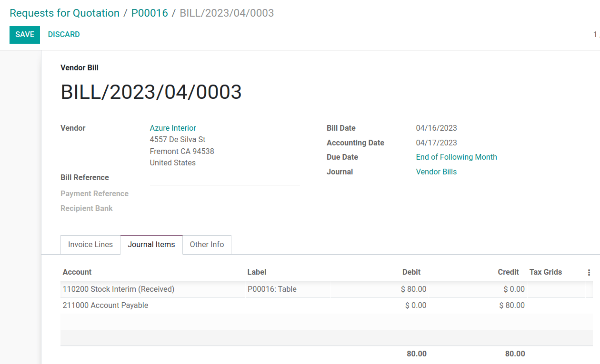
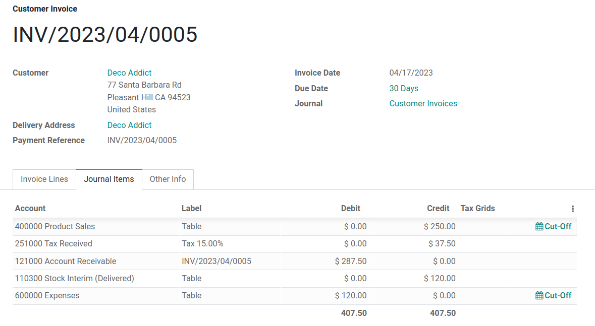

# Average price on returned goods

*Average cost valuation* (AVCO) is an inventory valuation method that
evaluates cost based on the total cost of goods bought or produced
during a period, divided by the total number of items on-hand. Inventory
valuation is used to:

- reflect the value of a company's assets;
- keep track of the amount of unsold goods;
- account for monetary value in goods that have yet to generate profit;
- report on flow of goods throughout the quarter.

Because `AVCO (Average Cost Valuation)` uses the weighted average to
evaluate the cost, it is a good fit for companies that sell only a few
different products in large quantities. In Odoo, this costing analysis
is *automatically updated* each time products are received.

Thus, when shipments are returned to their supplier, Odoo automatically
generates accounting entries to reflect the change in inventory
valuation. However, Odoo does **not** automatically update the
`AVCO (Average Cost Valuation)` calculation, because
`this can potentially create inconsistencies with inventory
valuation <inventory/avg_price/leaving_inventory>`.

> [!NOTE]
> This document addresses a specific use case for theoretical purposes.
> For instructions on how to set up and use
> `AVCO (Average Cost Valuation)`, refer to the
> `inventory valuation configuration
> <../../../inventory_and_mrp/inventory/warehouses_storage/inventory_valuation/inventory_valuation_config>`
> doc.

\- `Using inventory valuation
<../../../inventory_and_mrp/inventory/warehouses_storage/inventory_valuation/using_inventory_valuation>` -
`Other inventory valuation methods <inventory/inventory_valuation_config/costing_methods>`

## Configuration

To use average cost inventory valuation on a product, navigate to
`Inventory -->
Configuration --> Product Categories` and select the category that will
be using `AVCO (Average Cost Valuation)`. On the product category page,
set `Costing Method` to Average Cost
(AVCO) and `Inventory Valuation` to
Automated.

`Inventory valuation configuration
<../../../inventory_and_mrp/inventory/warehouses_storage/inventory_valuation/inventory_valuation_config>`

## Using average cost valuation

The average cost method adjusts the inventory valuation when products
are received in the warehouse. This section explains how it works, but
if the explanation is unnecessary, skip to the `return
to supplier use case <inventory/avg_cost/return>` section.

### Formula

When new products arrive, the new average cost for each product is
recomputed using the formula:

$$Avg~Cost = \frac{(Old~Qty \times Old~Avg~Cost) + (Incoming~Qty \times Purchase~Price)}{Final~Qty}$$

- **Old Qty**: product count in stock before receiving the new shipment;
- **Old Avg Cost**: calculated average cost for a single product from
  the previous inventory valuation;
- **Incoming Qty**: count of products arriving in the new shipment;
- **Purchase Price**: estimated price of products at the reception of
  products (since vendor bills may arrive later). The amount includes
  not only the price for the products, but also added costs, such as
  shipping, taxes, and
  `landed costs <inventory/reporting/landed_costs>`. At reception of the
  vendor bill, this price is adjusted;
- **Final Qty**: quantity of on-hand stock after the stock move.

> [!IMPORTANT]
> When products leave the warehouse, the average cost **does not**
> change. Read about why the average cost valuation is **not** adjusted
> `here <inventory/avg_price/leaving_inventory>`.

### Compute average cost

To understand how the average cost of a product changes with each
shipment, consider the following table of warehouse operations and stock
moves. Each is a different example of how the average cost valuation is
affected.

| Operation                     | Incoming Value | Inventory Value | Qty On Hand | Avg Cost |
|-------------------------------|----------------|-----------------|-------------|----------|
|                               |                | \$0             | 0           | \$0      |
| Receive 8 tables at \$10/unit | 8 \* \$10      | \$80            | 8           | \$10     |
| Receive 4 tables at \$16/unit | 4 \* \$16      | \$144           | 12          | \$12     |
| Deliver 10 tables             | -10 \* \$12    | \$24            | 2           | \$12     |

Ensure comprehension of the above computations by reviewing the "Receive
8 tables at \$10/unit" example.

Initially, the product stock is 0, so all values are \$0.

In the first warehouse operation, 8
tables are received at \$10 each. The
average cost is calculated using the
`formula <inventory/avg_cost/formula>`:

$$Avg~Cost = \frac{0 + 8 \times $10}{8} = \frac{$80}{8} = $10$$

- Since the *incoming quantity* of tables is
  8 and the *purchase price* for each is
  \$10,
- The inventory value in the numerator is evaluated to
  \$80;
- \$80 is divided by the total amount of
  tables to store, 8;
- \$10 is the average cost of a single
  table from the first shipment.

To verify this in Odoo, in the *Purchase* app, order
8 quantities of a new product,
Table, with no previous stock moves, for
\$10 each.

In the table's `Product Category` field in the `General Information` tab
of the product form, click the `➡️ (arrow)` icon, to open an
`External Link` to edit the product category. Set the `Costing Method`
to Average Cost (AVCO) and
`Inventory Valuation` to Automated.

Then, return to the purchase order. Click `Confirm Order`, and click
`Receive
Products` to confirm receipt.

Next, check the inventory valuation record generated by the product
reception by navigating to
`Inventory --> Reporting --> Inventory Valuation`. Select the drop-down
for Table, and view the `Total Value`
column for the *valuation layer* (`inventory
valuation at a specific point in time = on-hand quantity * unit price`).
The 8 tables in-stock are worth \$80.

> [!TIP]
> When the product category's `Costing Method` is set to `AVCO`, then
> the average cost of a product is also displayed on the `Cost` field,
> under the `General Information` tab, on the product page itself.

#### Product delivery (use case)

For outgoing shipments,
`outbound products have no effect on the average cost valuation
<inventory/avg_cost/definite_rule>`. Although the average cost valuation
is not recalculated, the inventory value still decreases because the
product is removed from stock and delivered to the customer location.

To demonstrate that the average cost valuation is not recalculated,
examine the "Deliver 10 tables" example.

$$Avg~Cost = \frac{12 \times $12 + (-10) \times $12}{12-10} = \frac{24}{2} = $12$$

1.  Because 10 tables are being sent out to customers, the *incoming
    quantity* is -10. The previous
    average cost (\$12) is used in lieu
    of a vendor's *purchase price*;
2.  The *incoming inventory value* is -10 \*
    \$12 = -\$120;
3.  The old *inventory value* (\$144) is
    added to the *incoming inventory value*
    (-\$120), so
    \$144 + -\$120 = \$24;
4.  Only 2 tables remain after shipping
    out 10 tables from
    12. So the current *inventory value*
    (\$24) is divided by the on-hand
    quantity (2);
5.  \$24 / 2 = \$12, which is the same
    average cost as the previous operation.

To verify this in Odoo, sell 10 tables in
the *Sales* app, validate the delivery, and then review the inventory
valuation record by going to in `Inventory --> Reporting -->
Inventory Valuation`. In the topmost valuation layer, delivering
10 tables reduces the product's value by
-\$120.

**Note**: What is not represented in this stock valuation record is the
revenue made from this sale, so this decrease is not a loss to the
company.

## Return items to supplier (use case)

Because the price paid to suppliers can differ from the price the
product is valued at with the `AVCO (Average Cost Valuation)` method,
Odoo handles returned items in a specific way.

1.  Products are returned to suppliers at the original purchase price,
    but;
2.  The internal cost valuation remains unchanged.

The above `example table <inventory/avg_cost/math_table>` is updated as
follows:

| Operation                     | Qty\*Avg Cost | Inventory Value | Qty On Hand | Avg Cost |
|-------------------------------|---------------|-----------------|-------------|----------|
|                               |               | \$24            | 2           | \$12     |
| Return 1 table bought at \$10 | -1 \* \$12    | \$12            | 1           | \$12     |

In other words, returns to vendors are perceived by Odoo as another form
of a product exiting the warehouse. To Odoo, because the table is valued
at \$12 per unit, the inventory value is reduced by
\$12 when the product is returned; the
initial purchase price of \$10 is
unrelated to the table's average cost.

To return a single table that was purchased for
\$10, navigate to the receipt in the
*Inventory* app for the
`8 tables purchased in Exercise 1 <inventory/avg_cost/ex-1>` by going to
the `Inventory Overview`, clicking on `Receipts`, and selecting the
desired receipt.

Then, click `Return` on the validated delivery order, and modify the
quantity to 1 in the reverse transfer
window. This creates an outgoing shipment for the table. Select
`Validate` to confirm the outgoing shipment.

Return to `Inventory --> Reporting --> Inventory Valuation` to see how
the outgoing shipment decreases the inventory value by \$12.

### Eliminate stock valuation errors in outgoing products

Inconsistencies can occur in a company's inventory when the average cost
valuation is recalculated on outgoing shipments.

To demonstrate this error, the table below displays a scenario in which
1 table is shipped to a customer and another is returned to a supplier
at the purchased price.

| Operation                                 | Qty\*Price | Inventory Value | Qty On Hand | Avg Cost |
|-------------------------------------------|------------|-----------------|-------------|----------|
|                                           |            | \$24            | 2           | \$12     |
| Ship 1 product to customer                | -1 \* \$12 | \$12            | 1           | \$12     |
| Return 1 product initially bought at \$10 | -1 \* \$10 | **\$2**         | **0**       | \$12     |

In the final operation above, the final inventory valuation for the
table is \$2 even though there are
0 tables left in stock.

Correct method

Use the average cost to value the return. This does not mean the company
gets \$12 back for a \$10 purchase; the item returned for \$10 is valued
internally at \$12. The inventory value change represents a product
worth \$12 no longer being accounted for in company assets.

## Anglo-Saxon accounting

In addition to using `AVCO (Average Cost Valuation)`, companies that use
**Anglo-Saxon accounting** also keep a holding account that tracks the
amount to be paid to vendors. Once a vendor delivers an order,
**inventory value** increases based on the vendor price of the products
that have entered the stock. The holding account (called **stock
input**) is credited and only reconciled once the vendor bill is
received.

\-
`Anglo-Saxon vs. Continental <inventory/inventory_valuation_config/accounting>`

The table below reflects journal entries and accounts. The *stock input*
account stores the money intended to pay vendors when the vendor bill
has not yet been received. To balance accounts when returning products
that have a price difference between the price the product is **valued
at** and the price it was bought for, a *price difference* account is
created.

| Operation                               | Stock Input | Price Diff | Inventory Value | Qty On Hand | Avg Cost |
|-----------------------------------------|-------------|------------|-----------------|-------------|----------|
|                                         |             |            | \$0             | 0           | \$0      |
| Receive 8 tables at \$10                | (\$80)      |            | \$80            | 8           | \$10     |
| Receive vendor bill \$80                | \$0         |            | \$80            | 8           | \$10     |
| Receive 4 tables at \$16                | (\$64)      |            | \$144           | 12          | \$12     |
| Receive vendor bill \$64                | \$0         |            | \$144           | 12          | \$12     |
| Deliver 10 tables to customer           | \$0         |            | \$24            | 2           | \$12     |
| Return 1 table initially bought at \$10 | **\$10**    | **\$2**    | **\$12**        | 1           | \$12     |
| Receive vendor refund \$10              | \$0         | \$2        | \$12            | 1           | \$12     |

### Product reception

#### Summary

At product reception, Odoo ensures companies can pay for goods that were
purchased by preemptively moving an amount matching the price of
received goods into the `liability account
</applications/finance/accounting/get_started/cheat_sheet>`, **Stock
Input**. Then, once the bill has been received, the amount in the
holding account is transferred to *Accounts Payable*. Transfers into
this account means the bill has been paid. **Stock Input** is reconciled
once the vendor bill is received.

Inventory valuation is a method of calculating how much each in-stock
product is worth internally. Since there is a difference between the
price the product is **valuated at** and the price the product was
actually **purchased for**, the **Inventory Valuation** account is
unrelated to the crediting and debiting operations of the **Stock
Input** account.

To conceptualize all this, follow the breakdown below.

#### Accounts balanced at received products

In this example, a company starts with zero units of a product,
table, in stock. Then, 8 tables are
received from the vendor:

1.  The **Stock Input** account stores
    \$80 of credit owed to the vendor.
    The amount in this account is unrelated to the inventory value.
2.  \$80 worth of tables came **in**
    (**debit** the *Inventory Value* account
    \$80), and
3.  \$80 must be paid **out** for
    received goods (**credit** the *Stock Input* account
    \$80).

##### In Odoo

Odoo generates an accounting journal entry when shipments that use
`AVCO (Average Cost Valuation)` costing method are received. Configure a
`Price Difference Account` by selecting the `➡️ (arrow)` icon next to
the `Product Category` field on the product page.

Under `Account Properties`, create a new `Price Difference Account` by
typing in the name of the account and clicking `Create and Edit`. Then
set the account `Type` as Expenses, and
click `Save`.

Then, receive the shipment in the *Purchase* app or *Inventory* app, and
navigate to the `Accounting app --> Accounting --> Journal Entries`. In
the list, find the `Reference` that matches the warehouse reception
operation for the relevant product.

Click on the line for 8 tables. This accounting journal entry shows that
when the 8 tables were received, the Stock
Valuation account increased by
\$80. Conversely, the **Stock Input**
account (set as Stock Interim (Received)
account by default) is credited \$80.

#### Accounts balanced at received vendor bill

In this example, a company starts with zero units of a product, table,
in stock. Then, 8 tables are received from the vendor. When the bill is
received from vendor for 8 tables:

1.  Use \$80 in the **Stock Input**
    account to pay the bill. This cancels out and the account now holds
    \$0.
2.  Debit **Stock Input** \$80 (to
    reconcile this account).
3.  Credit **Accounts payable** \$80.
    This account stores the amount the company owes others, so
    accountants use the amount to write checks to vendors.

##### In Odoo

Once the vendor requests payment, navigate to the
`Purchase app --> Orders -->
Purchase` and select the `PO (Purchase Order)` for 8 tables. Inside the
`PO (Purchase
Order)`, select `Create Bill`.

Switch to the `Journal Items` tab to view how
\$80 is transferred from the holding
account, Stock Interim (Received) to
Accounts Payable. `Confirm` the bill to
record the payment to the vendor.

### On product delivery

In the `above example table <inventory/avg_price/price-table>`, when 10
products are delivered to a customer, the **Stock Input** account is
untouched because there are no new products coming in. To put it simply:

1.  **Inventory valuation** is credited
    \$120. Subtracting from inventory
    valuation represents \$120 worth of
    products exiting the company.
2.  Debit **Accounts Receivable** to record revenue from the sale.

Understand Anglo-Saxon expensing

In the accounting journal entry invoicing a customer for 10 tables, the
accounts **Product Sales**, **Tax Received**, and **Accounts
Receivable** all pertain to the sale of the product. **Accounts
Receivable** is the account where the customer payment will be received.

Anglo-Saxon accounting recognizes the cost of goods sold (COGS) once the
sale is made. So, up until the product is sold, scrapped, or returned,
costs of keeping the product in stock are not accounted for. The
**Expense** account is debited \$120 to
log the costs of storing 10 tables during this period of time.

### On product return

In the `above example table <inventory/avg_price/price-table>`, when
returning 1 product to a vendor purchased at
\$10, a company expects
\$10 in the **Accounts Payable** account
from the vendor. However, **Stock Input** account must be debited
\$12 because the average cost is
\$12 at the time of the return. The
missing \$2 is accounted for in the
`Price Difference
Account`, which is set up in the product's `Product Category`.

> [!NOTE]
> Behavior of *price difference accounts* varies from localization. In
> this case, the account is intended to store differences between vendor
> price and *automated* inventory valuation methods.

Summary:

1.  Debit **Stock Input** account \$10 to
    move the table from stock to stock input. This move is to indicate
    that the table is to be processed for an outgoing shipment.
2.  Debit **Stock Input** an additional
    \$2 to account for the **Price
    Difference**.
3.  Credit **Stock Valuation** \$12
    because the item is leaving the stock.

Once the vendor's refund is received,

1.  Credit **Stock Input** account \$10
    to reconcile the price of the table.
2.  Debit **Accounts Payable** \$10 to
    have the accountants collect and register the payment in their
    journal.

