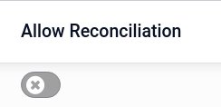

# Chart of accounts

The **chart of accounts (COA)** is the list of all the accounts used to
record financial transactions in the general ledger of an organization.
The chart of accounts can be found under
`Accounting-->Configuration-->Chart of Accounts`.

When browsing your chart of accounts, you can sort the accounts by
`Code`, `Account Name`, or `Type`, but other options are available in
the drop-down menu `(⋮)`.

## Configuration of an account

The country you select during the creation of your database (or
additional company in your database) determines which
`fiscal localization package <../../fiscal_localizations>` is installed
by default. This package includes a standard chart of accounts already
configured according to the country's regulations. You can use it
directly or set it according to your company's needs.

To create a new account, go to
`Accounting-->Configuration-->Chart of Accounts`, click `Create`, and
fill in (at the minimum) the required fields
(`Code, Account Name, Type`).

> [!WARNING]
> It is not possible to modify the **fiscal localization** of a company
> once a journal entry has been posted.

### Code and name

Each account is identified by its `Code` and `Name`, which also indicate
the account's purpose.

### Type

Correctly configuring the **account type** is critical as it serves
multiple purposes:

- Information on the account's purpose and behavior
- Generate country-specific legal and financial reports
- Set the rules to close a fiscal year
- Generate opening entries

To configure an account type, open the `Type` field's drop-down selector
and select the corresponding type from the following list:

| Report        | Category    | Account Types           |
|---------------|-------------|-------------------------|
| Balance Sheet | Assets      | Receivable              |
|               |             | Bank and Cash           |
|               |             | Current Assets          |
|               |             | Non-current Assets      |
|               |             | Prepayments             |
|               |             | Fixed Assets            |
|               | Liabilities | Payable                 |
|               |             | Credit Card             |
|               |             | Current Liabilities     |
|               |             | Non-current Liabilities |
|               | Equity      | Equity                  |
|               |             | Current Year Earnings   |
| Profit & Loss | Income      | Income                  |
|               |             | Other Income            |
|               | Expense     | Expense                 |
|               |             | Depreciation            |
|               |             | Cost of Revenue         |
| Other         | Other       | Off-Balance Sheet       |

#### Assets, deferred expenses, and deferred revenues automation

Some **account types** can **automate** the creation of
`assets <assets-automation>` entries,
`deferred expenses <deferred-expenses-automation>` entries, and
`deferred revenues <deferred-revenues-automation>` entries. To
**automate** entries, click `Setup` on an account line and go to the
`Automation` tab.

You have three choices for the `Automation` tab:

1.  `No`: this is the default value. Nothing happens.
2.  `Create in draft`: whenever a transaction is posted on the account,
    a draft entry is created but not validated. You must first fill out
    the corresponding form.
3.  `Create and validate`: you must also select a
    `Deferred Expense Model`. Whenever a transaction is posted on the
    account, an entry is created and immediately validated.

### Default taxes

In the `Setup` menu of an account, select a **default tax** to be
applied when this account is chosen for a product sale or purchase.

### Tags

Some accounting reports require **tags** to be set on the relevant
accounts. To add a tag, under `Setup`, click the `Tags` field and select
an existing tag or `Create` a new one.

### Account groups

**Account groups** are useful to list multiple accounts as
*sub-accounts* of a bigger account and thus consolidate reports such as
the **Trial Balance**. By default, groups are handled automatically
based on the code of the group. For example, a new account
131200 is going to be part of the group
131000. You can attribute a specific
group to an account in the `Group` field under `Setup`.

#### Create account groups manually

> [!NOTE]
> Regular users should not need to create account groups manually. The
> following section is only intended for rare and advanced use cases.

To create a new account group, activate
`developer mode <developer-mode>` and head to
`Accounting app-->Configuration-->Account Groups`. Here, create a new
group and enter the `name, code prefix, and company` to which that group
account should be available. Note that you must enter the same code
prefix in both `From` and `to` fields.

To display your **Trial Balance** report with your account groups, go to
`Accounting-->Reporting-->Trial Balance`, then open the `Options` menu
and select `Hierarchy and Subtotals`.

### Allow reconciliation

Some accounts, such as accounts made to record the transactions of a
payment method, can be used for the reconciliation of journal entries.

For example, an invoice paid with a credit card can be marked as `paid`
if reconciled with its payment. Therefore, the account used to record
credit card payments needs to be configured as **allowing
reconciliation**.

To do so, check the `Allow Reconciliation` box in the account's
settings, and `Save`; or enable the button from the chart of accounts
view.

### Deprecated

It is not possible to delete an account once a transaction has been
recorded on it. You can make them unusable by using the **Deprecated**
feature: check the `Deprecated` box in the account's settings, and
`Save`.

\* `cheat_sheet` \* `../vendor_bills/assets` \*
`../vendor_bills/deferred_expenses` \*
`../customer_invoices/deferred_revenues` \* `../../fiscal_localizations`
\* [Odoo Tutorials: Chart of
accounts](https://www.odoo.com/slides/slide/chart-of-accounts-1630) \*
[Odoo Tutorials: Update your chart of
accounts](https://www.odoo.com/slides/slide/update-your-chart-of-accounts-1658)

