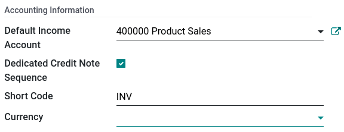
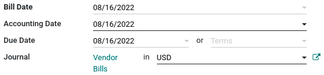

# Multi-currency system

Konvergo ERP allows you to issue invoices, receive bills, and record
transactions in currencies other than the main currency configured for
your company. You can also set up bank accounts in other currencies and
run reports on your foreign currency activities.

\- `../bank/foreign_currency`

## Configuration

### Main currency

The **main currency** is defined by default according to the company's
country. You can change it by going to
`Accounting --> Configuration --> Settings --> Currencies` and changing
the currency in the `Main Currency` setting.

### Enable foreign currencies

Go to `Accounting --> Configuration --> Currencies`, and enable the
currencies you wish to use by toggling the `Active` button.

### Currency rates

#### Manual update

To manually create and set a currency rate, go to
`Accounting --> Configuration -->
Currencies`, click on the currency you wish to change the rate of, and
under the `Rates` tab, click `Add a line` to create a new rate.

#### Automatic update

When you activate a second currency for the first time,
`Automatic Currency Rates` appears under
`Accounting Dashboard --> Configuration --> Settings --> Currencies`. By
default, you have to click on the **Update now** button (`🗘`) to update
the rates.

Konvergo ERP can update the rates at regular intervals. To do so, change the
`Interval` from `Manually` to `Daily`, `Weekly`, or `Monthly`. You can
also select the web service from which you want to retrieve the latest
currency rates by clicking on the `Service` field.

### Exchange difference entries

Konvergo ERP automatically records exchange differences entries on dedicated
accounts, in a dedicated journal.

You can define which journal and accounts to use to **post exchange
difference entries** by going to
`Accounting --> Configuration --> Settings --> Default Accounts` and
editing the `Journal`, `Gain Account`, and `Loss Account`.

If you receive a payment for a customer invoice one month after it was
issued, the exchange rate has likely changed since. Therefore, this
fluctuation implies some profit or loss due to the exchange difference,
which Konvergo ERP automatically records in the default **Exchange Difference**
journal.

### Chart of accounts

Each account can have a set currency. By doing so, all moves relevant to
the account are forced to have that account's currency.

To do so, go to `Accounting --> Configuration --> Charts of Accounts`
and select a currency in the field `Account Currency`. If left empty,
all active currencies are handled instead of just one.

### Journals

If a currency is set on a **journal**, that journal only handles
transactions in that currency.

To do so, go to `Accounting --> Configuration --> Journals`, open the
journal you want to edit, and select a currency in the field `Currency`.

## Multi-currency accounting

### Invoices, bills, and other documents

For all documents, you can select the currency and journal to use for
the transaction on the document itself.

### Payment registration

To register a payment in a currency other than your company's main
currency, click on the `Register Payment` payment button of your
document and, in the pop-up window, select a **currency** in the
`Amount` field.

### Bank transactions

When creating or importing bank transactions, the amount is in the
company's main currency. To input a **foreign currency**, select a
currency in the `Foreign Currency`. Once selected, enter the `Amount` in
your main currency for it to automatically get converted in the foreign
currency in the `Amount in Currency field`.

When reconciling, Konvergo ERP displays both the foreign currency amount and the
equivalent amount in your company's main currency.

### Exchange rate journal entries

To see **exchange difference journal entries**, go to
`Accounting Dashboard -->
Accounting --> Journals: Miscellaneous`.

