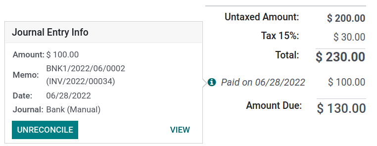
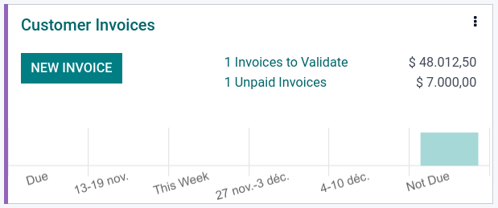

show-content  

# Payments

In Konvergo ERP, payments can either be automatically linked to an invoice or
bill or be stand-alone records for use at a later date:

- If a payment is **linked to an invoice or bill**, it reduces/settles
  the amount due of the invoice. You can have multiple payments related
  to the same invoice.
- If a payment is **not linked to an invoice or bill**, the customer has
  an outstanding credit with your company, or your company has an
  outstanding debit with a vendor. You can use those outstanding amounts
  to reduce/settle unpaid invoices/bills.

\- `Internal transfers <payments/internal_transfers>` -
`bank/reconciliation` - [Konvergo ERP Tutorials: Bank
Configuration](https://www.odoo.com/slides/slide/bank-configuration-1880)

## Registering payment from an invoice or bill

When clicking `Register payment` in a customer invoice or vendor bill,
it generates a new journal entry and changes the amount due according to
the payment amount. The counterpart is reflected in an
`outstanding <bank/outstanding-accounts>` **receipts** or **payments**
account. At this point, the customer invoice or vendor bill is marked as
`In payment`. Then, when the outstanding account is reconciled with a
bank statement line, the invoice or vendor bill changes to the `Paid`
status.

The information icon near the payment line displays more information
about the payment. You can access additional information, such as the
related journal, by clicking `View`.

> [!NOTE]
> - The customer invoice or vendor bill must be in the `Posted` status
> to register the payment. - If you unreconcile a payment, it still
> appears in your books but is no longer linked to the invoice. - If you
> (un)reconcile a payment in a different currency, a journal entry is
> automatically created to post the currency exchange gains/losses
> (reversal) amount. - If you (un)reconcile a payment and an invoice
> having cash basis taxes, a journal entry is automatically created to
> post the cash basis tax (reversal) amount.

> [!TIP]
> - If your main bank account is set as an `outstanding account
> <bank/outstanding-accounts>`, and the payment is registered in Konvergo ERP
> (not through a related bank statement), invoices and bills are
> directly registered as `Paid`.

## Registering payments not tied to an invoice or bill

When a new payment is registered via `Customers / Vendors --> Payments`
menu, it is not directly linked to an invoice or bill. Instead, the
account receivable or the account payable is matched with the
**outstanding account** until it is manually matched with its related
invoice or bill.

### Matching invoices and bills with payments

A blue banner appears when you validate a new invoice/bill and an
**outstanding payment** exists for this specific customer or vendor. It
can easily be matched from the invoice or bill by clicking `ADD` under
`Outstanding Credits` or `Outstanding Debits`.

The invoice or bill is now marked as `In payment` until it is reconciled
with its corresponding bank statement.

### Batch payment

Batch payments allow you to group different payments to ease
`reconciliation
<bank/reconciliation>`. They are also useful when you deposit
`checks <payments/checks>` to the bank or for
`SEPA payments <payments/pay_sepa>`. To do so, go to `Accounting -->
Customers --> Batch Payments` or
`Accounting --> Vendors --> Batch Payments`. In the list view of
payments, you can select and group several payments in a batch by
clicking `Action --> Create Batch Payment`.

\- `payments/batch` - `payments/batch_sdd`

### Payments matching

The `Payments matching` tool opens all unreconciled customer invoices or
vendor bills and allows you to process them individually, matching all
payments and invoices in one place. You can reach this tool from the
`Accounting Dashboard --> Customer Invoices / Vendor Bills`, click the
drop-down menu button (`⋮`), and select `Payments Matching`, or go to
`Accounting --> Accounting --> Reconciliation`.

> [!NOTE]
> During the `reconciliation <bank/reconciliation>`, if the sum of the
> debits and credits does not match, there is a remaining balance. This
> either needs to be reconciled at a later date or needs to be written
> off directly.

### Batch payments matching

You can use the batch reconciliation feature to reconcile several
outstanding payments or invoices simultaneously for a specific customer
or vendor. Go to `Accounting --> Reporting -->
Aged Receivable / Aged Payable`. You can see all transactions that have
not been reconciled yet for that partner, and when you select a customer
or vendor, the `Reconcile` option is displayed.

## Registering a partial payment

To register a **partial payment**, click `Register payment` from the
related invoice or bill, and enter the amount received or paid. Upon
entering the amount, a prompt appears to decide whether to `Keep open`
the invoice or bill, or `Mark as fully paid`. Select `Keep open` and
click `Create payment`. The invoice or bill is now marked as `Partial`.
Select `Mark as fully paid` if you wish to settle the invoice or bill
with a difference in the amount.

## Reconciling payments with bank statements

Once a payment has been registered, the status of the invoice or bill is
`In payment`. The next step is `reconciling <bank/reconciliation>` it
with the related bank statement line to have the transaction finalized
and the invoice or bill marked as `Paid`.

payments/online payments/checks payments/batch payments/batch_sdd
payments/follow_up payments/internal_transfers payments/pay_sepa
payments/pay_checks payments/forecast

