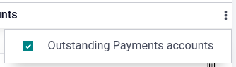

# Checks

There are two ways to handle payments received by checks in Odoo, either
by using `outstanding
accounts <checks/outstanding-account>` or by
`bypassing the reconciliation process
<checks/reconciliation-bypass>`.

**Using outstanding accounts is recommended**, as your bank account
balance stays accurate by taking into account checks yet to be cashed.

> [!NOTE]
> Both methods produce the same data in your accounting at the end of
> the process. But if you have checks that have not been cashed in, the
> **Outstanding Account** method reports these checks in the
> **Outstanding Receipts** account. However, funds appear in your bank
> account whether or not they are reconciled, as the bank value is
> reflected at the moment of the bank statement.

\* `Outstanding accounts <bank/outstanding-accounts>` \*
`Bank reconciliation <accounting/reconciliation>`

## Method 1: Outstanding account

When you receive a check, you
`record a payment <../bank/reconciliation>` by check on the invoice.
Then, when your bank account is credited with the check's amount, you
reconcile the payment and statement to move the amount from the
**Outstanding Receipt** account to the **Bank** account.

> [!TIP]
> You can create a new payment method named *Checks* if you would like
> to identify such payments quickly. To do so, go to
> `Accounting --> Configuration --> Journals --> Bank`, click the
> `Incoming Payments` tab, and `Add a line`. As `Payment
> Method`, select `Manual`, enter Checks
> as name, and `Save`.

## Method 2: Reconciliation bypass

When you receive a check, you
`record a payment <../bank/reconciliation>` on the related invoice. The
amount is then moved from the **Account Receivable** to the **Bank**
account, bypassing the reconciliation and creating only **one journal
entry**.

To do so, you *must* follow the following setup. Go to
`Accounting --> Configuration
--> Journals --> Bank`. Click the `Incoming Payments` tab and then
`Add a line`, select `Manual` as `Payment Method`, and enter
Checks as `Name`. Click the toggle menu
button, tick `Outstanding Receipts accounts`, and in the
`Outstanding Receipts accounts` column, and set the `Bank` account for
the **Checks** payment method.

## Payment registration

> [!NOTE]
> By default, there are two ways to register payments made by check:
>
> - **Manual**: for single checks;
> - **Batch**: for multiple checks at once.
>
> This documentation focuses on **single-check** payments. For **batch
> deposits**, see `the
> batch payments documentation <batch>`.

Once you receive a customer check, go to the related invoice
(`Accounting -->
Customer --> Invoices)`, and click `Register Payment`. Fill in the
payment information:

- `Journal: Bank`;
- `Payment method`: `Manual` (or **Checks** if you have created a
  specific payment method);
- `Memo`: enter the check number;
- Click `Create Payment`.

The generated journal entries are different depending on the payment
registration method chosen.

## Journal entries

### Outstanding account

The invoice is marked as `In Payment` as soon as you record the payment.
This operation produces the following **journal entry**:

| Account              | Statement Match | Debit  | Credit |
|----------------------|-----------------|--------|--------|
| Account Receivable   |                 |        | 100.00 |
| Outstanding Receipts |                 | 100.00 |        |

Then, once you receive the bank statements, match this statement with
the check of the **Outstanding Receipts** account. This produces the
following **journal entry**:

<table style="width:89%;">
<colgroup>
<col style="width: 30%" />
<col style="width: 27%" />
<col style="width: 15%" />
<col style="width: 15%" />
</colgroup>
<thead>
<tr class="header">
<th>Account</th>
<th>Statement Match</th>
<th>Debit</th>
<th>Credit</th>
</tr>
</thead>
<tbody>
<tr class="odd">
<td>Outstanding Receipts</td>
<td><blockquote>

X

</blockquote></td>
<td></td>
<td>100.00</td>
</tr>
<tr class="even">
<td>Bank</td>
<td></td>
<td>100.00</td>
<td></td>
</tr>
</tbody>
</table>

If you use this approach to manage received checks, you get the list of
checks that have not been cashed in the **Outstanding Receipt** account
(accessible, for example, from the general ledger).

### Reconciliation bypass

The invoice is marked as `Paid` as soon as you record the check.

With this approach, you bypass the use of **outstanding accounts**,
effectively getting only one journal entry in your books and bypassing
the reconciliation:

| Account            | Statement Match | Debit  | Credit |
|--------------------|-----------------|--------|--------|
| Account Receivable | X               |        | 100.00 |
| Bank               |                 | 100.00 |        |
