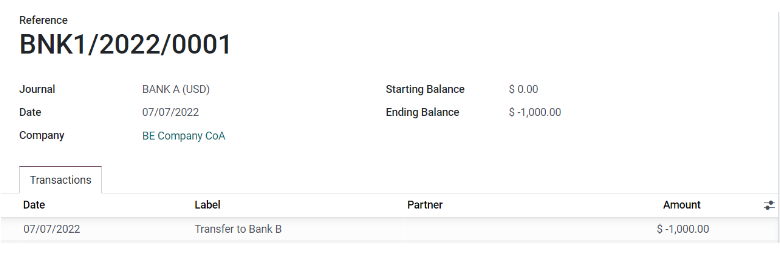
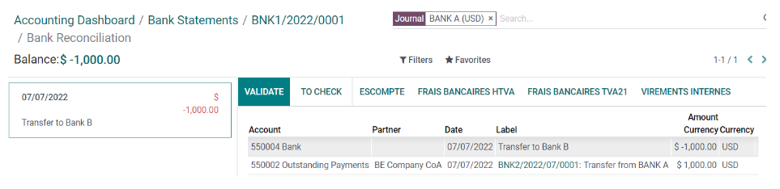

# Internal transfers

In Konvergo ERP, internal money transfers can be made in a few clicks. You need
at least either two bank accounts, two cash journals, or one bank
account and one cash journal.

## Configuration

An internal transfer account is automatically created on your database
based on your company's localization and depending on your country’s
legislation. If needed, the default `Internal
transfer account` can be modified by going to
`Accounting app --> Configuration -->
Settings` and then under the `Default Accounts` section.

> [!NOTE]
> At least two bank accounts are needed to make internal transfers.
> Refer to `Bank and cash accounts section <../bank>` to see how to add
> an additional bank account to your database.

## Register an internal transfer from one bank to another

Let's say you have two bank accounts registered on your database and you
want to transfer 1,000 USD from Bank A to Bank B.

### Log an internal transfer

From the Accounting Dashboard, click on the drop-down selection button
(`⋮`) on one of your banks. In the `New` column click on
`Internal Transfer` and enter the information related to the transfer.

> [!NOTE]
> Fill in the `Memo` field for automatic reconciliation.

`Save` and `Confirm` to register your internal transfer. The money is
now booked in the transfer account and another payment is
**automatically** created in the destination journal (Bank B).

#### Bank journal (Bank A)

| **Account**                   | **Debit**   | **Credit** |
|-------------------------------|-------------|------------|
| Outstanding Payments account  |             | \$1,000    |
| **Internal transfer account** | **\$1,000** |            |

#### Automated booking - Bank journal (BANK B)

| **Account**                   | **Debit** | **Credit**  |
|-------------------------------|-----------|-------------|
| Outstanding Receipts account  | \$1,000   |             |
| **Internal transfer account** |           | **\$1,000** |

> [!NOTE]
> There are one outstanding payment and one outstanding receipt pending
> in your two bank account journals, because the bank statement
> confirming the sending and receiving of the money has not been booked
> yet.

### Manage and reconcile bank statements

The next step is to book the bank statements to finalize the transaction
by creating, `importing <../bank/transactions>`, or
`synchronizing <../bank/bank_synchronization>` your
`Transactions lines`. Fill in the `Ending balance` and click on the
`Reconcile` button.

`../bank/reconciliation`

In the next window, choose counterparts for the payment - in this
example, the outstanding payment account - then click `Validate`.

#### Bank journal entry

| **Account**           | **Debit** | **Credit**  |
|-----------------------|-----------|-------------|
| Outstanding Payment   | \$1,000   |             |
| Bank Account (BANK A) |           | **\$1,000** |

The same steps must be repeated once you receive the bank statement
related to Bank B. Book and reconcile your bank statement lines.

#### Bank journal entry

| **Account**           | **Debit**   | **Credit** |
|-----------------------|-------------|------------|
| Outstanding Receipt   |             | \$1,000    |
| Bank Account (BANK B) | **\$1,000** |            |
