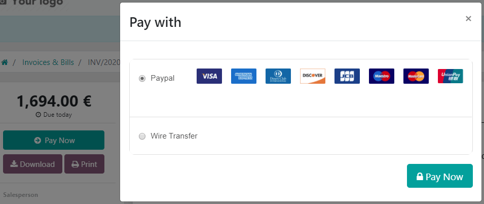
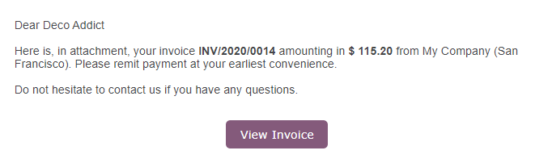
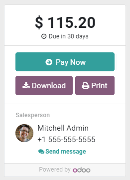

show-content  

# Online payments

online/install_portal_patch

To make it more convenient for your customers to pay the invoices you
issue, you can activate the **Invoice Online Payment** feature, which
adds a *Pay Now* button on their **Customer Portal**. This allows your
customers to see their invoices online and pay directly with their
favorite payment method, making the payment process much easier.

## Configuration

Make sure your
`payment providers are correctly configured <../../payment_providers>`.

> [!NOTE]
> By default,
> "`Wire Transfer </applications/finance/payment_providers/wire_transfer>`"
> is the only payment provider activated, but you still have to fill out
> the payment details.

To activate the Invoice Online Payment, go to
`Accounting --> Configuration -->
Settings --> Customer Payments`, enable **Invoice Online Payment**, and
click on *Save*.

## Customer Portal

After issuing the invoice, click on *Send & Print* and send the invoice
by email to the customer. They will receive an email with a link that
redirects them to the invoice on their **Customer Portal**.

They can choose which Payment Provider to use by clicking on *Pay Now*.

- `/applications/finance/payment_providers`

