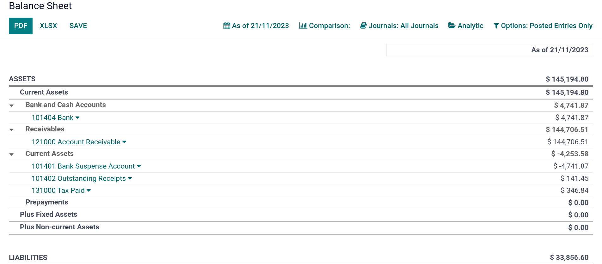
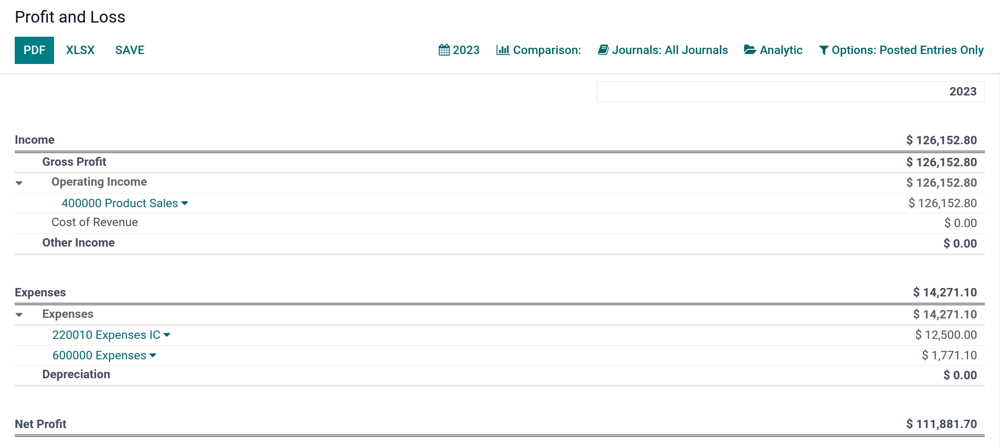
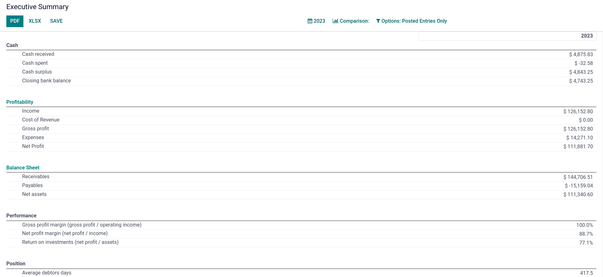
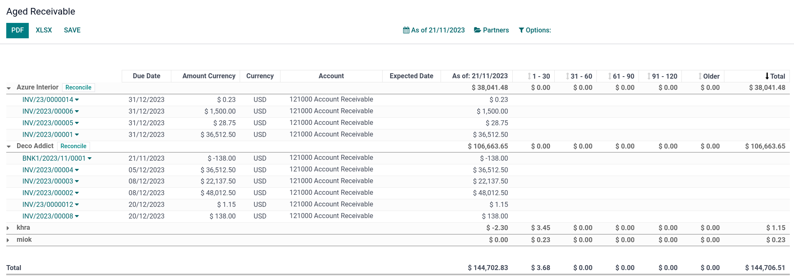
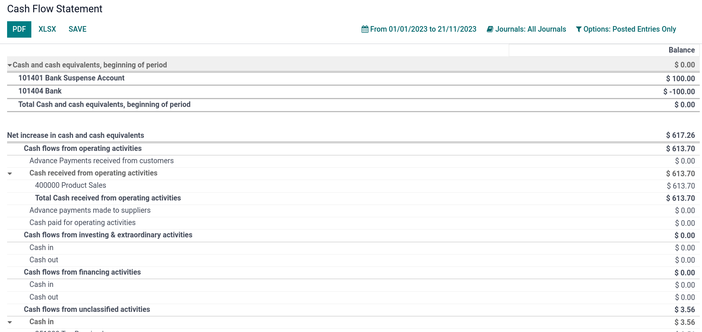

show-content  

# Reporting

## Main reports available

Konvergo ERP includes **generic** and **dynamic** reports available for all
countries, regardless of the
`localization package <../../finance/fiscal_localizations>` installed:

- **Balance Sheet**
- **Profit and Loss**
- **Executive Summary**
- **General Ledger**
- **Aged Payable**
- **Aged Receivable**
- **Cash Flow Statement**
- **Tax Report**

Reports can be **annotated, printed, and drilled down** to see details
(payments, invoices, journal items, etc.) by clicking the **down**
arrow. Reports can also be exported to **PDF** or **XLSX** format by
clicking `PDF` or `XLSX` at the top of the page.

You can compare values across periods by using the `Comparison` menu and
selecting the periods you want to compare.

### Balance Sheet

The **Balance Sheet** shows a snapshot of your organization's assets,
liabilities, and equity at a particular date.

### Profit and Loss

The **Profit and Loss** report (or **Income Statement**) shows your
company's net income by deducting expenses from revenue for the
reporting period.

### Executive Summary

The **Executive Summary** allows a quick look at all the important
figures to run your company.

In basic terms, this is what each item in the following section reports:

- **Performance:**  
  - **Gross profit margin:**  
    The contribution of all sales made by your business **minus** any
    direct costs needed to make those sales (labor, materials, etc.).

  - **Net profit margin:**  
    The contribution of all sales made by your business **minus** any
    direct costs needed to make those sales *and* fixed overheads your
    company has (electricity, rent, taxes to be paid as a result of
    those sales, etc.).

  - **Return on investment (per annum):**  
    The ratio of net profit made to the amount of assets the company
    used to make those profits.

- **Position:**  
  - **Average debtors days:**  
    The average number of days it takes your customers to (fully) pay
    you across all your customer invoices.

  - **Average creditors days:**  
    The average number of days it takes you to (fully) pay your
    suppliers across all your bills.

  - **Short-term cash forecast:**  
    How much cash is expected in or out of your business in the next
    month, i.e., the balance of your **Sales account** for the month
    **minus** the balance of your **Purchases account** for the month.

  - **Current assets to liabilities:**  
    Also referred to as **current ratio**, this is the ratio of current
    assets (`assets
    that could be turned into cash within a year`) to the current
    liabilities (`liabilities
    that will be due in the next year`). It is typically used to measure
    a company's ability to service its debt.

### General Ledger

The **General Ledger Report** shows all transactions from all accounts
for a chosen date range. The initial summary report shows each account's
totals; from here, you can view a detailed transaction report or any
exceptions. This report helps check every transaction that occurred
during a specific period.

### Aged Payable

Run the **Aged Payable Details** report to display information on
individual bills, credit notes, and overpayments you owe and how long
these have gone unpaid.

### Aged Receivable

The **Aged Receivables** report shows the sales invoices awaiting
payment during a selected month and several months prior.

### Cash Flow Statement

The **Cash Flow Statement** shows how changes in balance sheet accounts
and income affect cash and cash equivalents and breaks the analysis down
to operating, investing, and financing activities.

### Tax Report

This report allows you to see the **net** and **tax amounts** for all
the taxes grouped by type (sale/purchase).

reporting/tax_returns reporting/tax_carryover
reporting/analytic_accounting reporting/budget reporting/intrastat
reporting/data_inalterability reporting/silverfin reporting/customize
reporting/year_end

