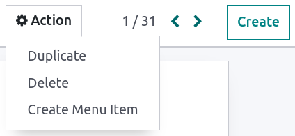

# Custom reports

Konvergo ERP comes with a powerful and easy-to-use reporting framework. The
engine allows you to create new reports, such as **tax reports**, or
**balance sheets** and **income statements** with **specific groupings**
and **layouts**.

> [!IMPORTANT]
> Activate the `developer mode <developer-mode>` to access the
> accounting report creation interface.

To create a new report, go to
`Accounting --> Configuration --> Management:
Accounting Reports`. From here, you can either create a
`root report <customize-reports/root>` or a
`variant <customize-reports/variants>`.

## Root reports

Root reports can be regarded as generic, neutral accounting reports.
They serve as models on which local accounting versions are built. If a
report has no root report, it is considered to be a root report itself.

A tax report for Belgium and the US would both use the same generic
version as a base and adapt it for their domestic regulations.

When creating a new root report, you need to create a **menu item** for
it. To do so, open the report and then, on that same report, click on
`Action --> Create Menu Item`. Refresh the page; the report is now
available under `Accounting --> Reporting`.

> [!NOTE]
> Cases that require creating a new root report are rare, such as when a
> country's tax authorities require a new and specific type of report.

## Variants

Variants are country-specific versions of root reports and, therefore,
always refer to a root report. To create a variant, select a generic
(root) report in the `Root Report` field when creating a new report.

When a root report is opened from one of the accounting app's main
menus, all its variants are displayed in the variant selector in the top
right corner of the view.

In the following image, `VAT Report (BE)` is the variant of the root
`Generic
Tax report`.

## Lines

After having created a report (either root or variant), you need to fill
it with lines. You can either create a new one by clicking on
`Add a line`, or modify an existing line by clicking on it. All lines
*require* a `Name`, and can have an optional additional `Code` (of your
choice) if you wish to use their value in formulas.

## Expressions

Each line can contain one or multiple **expressions**. Expressions can
be seen as **sub-variables** needed by a report line. To create an
expression, click on `Add a line` *within* a line report.

When creating an expression, you must attribute a `label` used to refer
to that expression. Therefore, it has to be **unique** among the
expressions of each line. Both a `Computation Engine` and a `Formula`
must also be indicated. The **engine** defines how your **formula(s)**
and **subformula(s)** are interpreted. It is possible to mix expressions
using different computation engines under the same line if you need to.

> [!NOTE]
> Depending on the engine, `subformulas` may also be required.

### 'Konvergo ERP Domain' engine

With this engine, a formula is interpreted as an
`Konvergo ERP domain <reference/orm/domains>` targeting
account.move.line objects.

The subformula allows you to define how the move lines matching the
domain are used to compute the value of the expression:

sum  
The result is the sum of all the balances of the matched move lines.

sum_if_pos  
The result is the sum of all the balances of the matched move lines if
this amount is positive. Otherwise, it is
0.

sum_if_neg  
The result is the sum of all the balances of the matched move lines if
this amount is negative. Otherwise, it is
0.

count_rows  
The result is the number of sub-lines of this expression. If the parent
line has a group-by value, this will correspond to the number of
distinct grouping keys in the matched move lines. Otherwise, it will be
the number of matched move lines.

You can also put a - sign at the
beginning of the subformula to **reverse** the sign of the result.

### 'Tax Tags' engine

A formula made for this engine consists of a name used to match tax
tags. If such tags do not exist when creating the expression, they will
be created.

When evaluating the expression, the expression computation can roughly
be expressed as: **(amount of the move lines with**
+ **tag)**
- **(amount of the move lines with**
- **tag)**.

If the formula is tag_name, the engine
matches tax tags +tag_name and
-tag_name, creating them if necessary. To
exemplify further: two tags are matched by the formula. If the formula
is A, it will require (and create, if
needed) tags +A and
-A.

### 'Aggregate Other Formulas' engine

Use this engine when you need to perform arithmetic operations on the
amounts obtained for other expressions. Formulas here are composed of
references to expressions separated by one of the four basic arithmetic
operators (addition +, subtraction
-, division
/, and multiplication
\*). To refer to an expression, type in
its parent line's **code** followed by a period
. and the expression's **label** (ex.
**code.label**).

**Subformulas** can be one of the following:

if_above(CUR(amount))  
The value of the arithmetic expression will be returned only if it is
greater than the provided bound. Otherwise, the result will be
0.

if_below(CUR(amount))  
The value of the arithmetic expression will be returned only if it is
lower than the provided bound. Otherwise, the result will be
0.

if_between(CUR1(amount1), CUR2(amount2))  
The value of the arithmetic expression will be returned only if it is
strictly between the provided bounds. Otherwise, it will be brought back
to the closest bound.

if_other_expr_above(LINE_CODE.EXPRESSION_LABEL, CUR(amount))  
The value of the arithmetic expression will be returned only if the
value of the expression denoted by the provided line code and expression
label is greater than the provided bound. Otherwise, the result will be
0.

if_other_expr_below(LINE_CODE.EXPRESSION_LABEL, CUR(amount))  
The value of the arithmetic expression will be returned only if the
value of the expression denoted by the provided line code and expression
label is lower than the provided bound. Otherwise, the result will be
0.

CUR is the currency code in capital
letters, and amount is the amount of the
bound expressed in that currency.

You can also use the cross_report
subformula to match an expression found in another report.

### 'Prefix of Account Codes' engine

This engine is used to match amounts made on accounts using the prefixes
of these accounts' codes as variables in an arithmetic expression.

\| 21 \| Arithmetic expressions can also
be a single prefix, such as here.

\| 21 + 10 - 5 \| This formula adds the
balances of the move lines made on accounts whose codes start with
21 and 10,
and subtracts the balance of the ones on accounts with the prefix
5.

It is also possible to ignore a selection of sub-prefixes.

\| 21 + 10(101, 102) - 5(57) \| This
formula works the same way as the previous example but ignores the
prefixes 101,
102, and
57.

You can apply 'sub-filtering' on **credits and debits** using the
C and D
suffixes. In this case, an account will only be considered if its prefix
matches, *and* if the total balance of the move lines made on this
account is **credit/debit**.

Account 210001 has a balance of -42 and
account 210002 has a balance of 25. The
formula 21D only matches the account
210002, and hence returns 25.
210001 is not matched, as its balance is
*credit*.

Prefix exclusions can be mixed with the C
and D suffixes.

\| 21D + 10(101, 102)C - 5(57) \| This
formula adds the balances of the move lines made on accounts whose code
starts with 21 *if* it is debit
(D) and 10
*if* it is credit (C), but ignores
prefixes 101,
102, and subtracts the balance of the
ones on accounts with the prefix 5,
ignoring the prefix 57.

To match the letter C or
D in a prefix and not use it as a suffix,
use an empty exclusion ().

\| 21D() \| This formula matches accounts
whose code starts with 21D, regardless of
their balance sign.

In addition to using code prefixes to include accounts, you can also
match them with **account tags**. This is especially useful, for
example, if your country lacks a standardized chart of accounts, where
the same prefix might be used for different purposes across companies.

\| tag(25) \| This formula matches
accounts whose associated tags contain the one with id *25*.

If the tag you reference is defined in a data file, an xmlid can be used
instead of the id.

\| tag(my_module.my_tag) \| This formula
matches accounts whose associated tags include the tag denoted by
*my_module.my_tag*.

You can also use arithmetic expressions with tags, possibly combining
them with prefix selections.

\| tag(my_module.my_tag) + tag(42) + 10
\| The balances of accounts tagged as *my_module.my_tag* will be summed
with those of accounts linked to the tag with ID *42* and accounts with
the code prefix 10

C and D
suffixes can be used in the same way with tags.

\| tag(my_module.my_tag)C \| This formula
matches accounts with the tag *my_module.my_tag* and a credit balance.

Prefix exclusion also works with tags.

\| tag(my_module.my_tag)(10) \| This
formula matches accounts with the tag *my_module.my_tag* and a code not
starting with 10.

### 'External Value' engine

The 'external value' engine is used to refer to **manual** and
**carryover values**. Those values are not stored using
account.move.line, but with
account.report.external.value. Each of
these objects directly points to the expression it impacts, so very
little needs to be done about their selection here.

**Formulas** can be one of the following:

sum  
If the result must be the sum of all the external values in the period.

most_recent  
If the result must be the value of the latest external value in the
period.

In addition, **subformulas** can be used in two ways:

rounding=X  
Replacing X with a number instructs to
round the amount to X decimals.

editable  
Indicates this expression can be edited manually, triggering the display
of an icon in the report, allowing the user to perform this action.

> [!NOTE]
> Manual values are created at the
> date_to currently selected in the
> report.

Both subformulas can be mixed by separating them with a
;.

\| editable;rounding=2 \| is a correct
subformula mixing both behaviors.

### 'Custom Python Function' engine

This engine is a means for developers to introduce custom computation of
expressions on a case-by-case basis. The formula is the name of a
**python function** to call, and the subformula is a **key** to fetch in
the **dictionary** returned by this function. Use it only if you are
making a custom module of your own.

## Columns

Reports can have an **indefinite number** of columns to display. Each
column gets its values from the **expressions** declared on the
**lines**. The field `expression_label` of the column gives the label of
the expressions whose value is displayed. If a line has no
**expression** in that field, then nothing is displayed for it in this
column. If multiple columns are required, you must use different
**expression** labels.

When using the **period comparison** feature found under the `Options`
tab of an accounting report, all columns are repeated in and for each
period.
