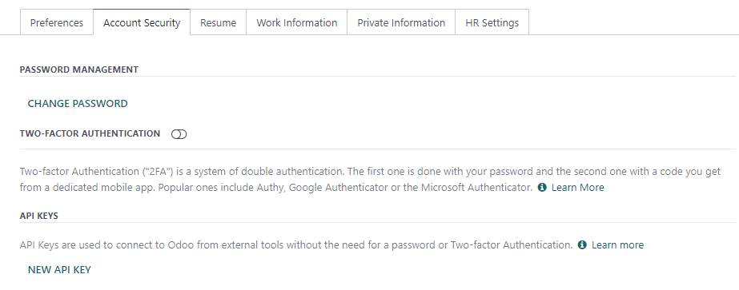

# Silverfin integration

[Silverfin](https://www.silverfin.com) is a third-party service provider
that offers a cloud platform for accountants.

Konvergo ERP and Silverfin provide an integration to automate the
synchronization of data.

## Configuration

To configure this integration, you need to input the following data into
your Silverfin account:

- user's email address
- `Konvergo ERP API key <silverfin/api-key>`
- URL of the Konvergo ERP database
- name of your Konvergo ERP database

### Konvergo ERP API key

You can create Konvergo ERP external API keys either
`for a single database <silverfin/api-singledb>` (hosting: Konvergo ERP Online,
On-premise, and Konvergo ERP.sh) or `for all databases managed by a single user
<silverfin/api-multipledb>` (hosting: Konvergo ERP Online).

> [!IMPORTANT]
> - These API keys are personal and provide full access to your user
> account. Store it securely. - You can copy the API key only at its
> creation. It is not possible to retrieve it later. - If you need it
> again, create a new API key (and delete the old one).

`/developer/reference/external_api`

#### Per database

To add an API key to a **single** database, connect to the database,
enable the `developer
mode <developer-mode>`, click on the user menu, and then `My Profile` /
`Preferences`. Under the `Account Security` tab, click on `New API
Key`, confirm your password, give a descriptive name to your new key,
and copy the API key.

`api/external_api/keys`

#### For all databases (fiduciaries)

To add an API key to **all** databases managed by a single user at the
same time **(the easiest method for fiduciaries)**, navigate to [Konvergo ERP's
website](https://www.odoo.com) and sign in with your administrator
account. Next, open [your account security settings in developer
mode](https://www.odoo.com/my/security?debug=1), click on `New API Key`,
confirm your password, give a descriptive name to your new key, and copy
the new API key.

> [!TIP]
> Open the [database manager](https://www.odoo.com/my/databases) to view
> all databases that will be linked to the single API key.

