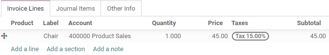
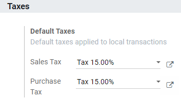
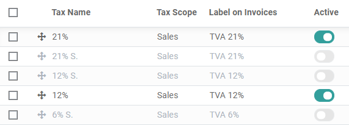
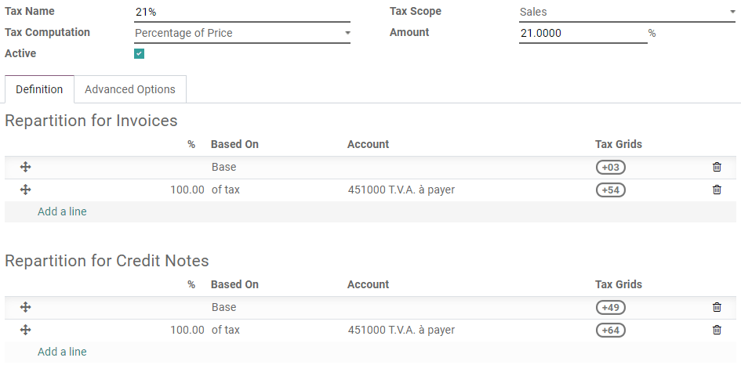
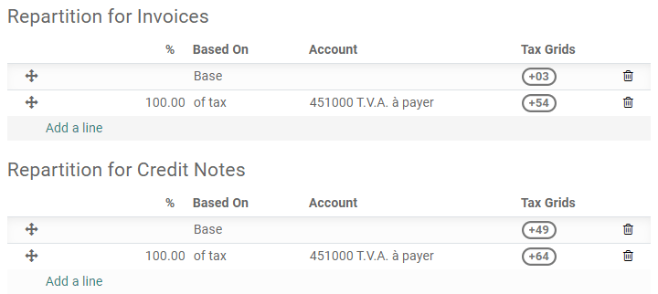
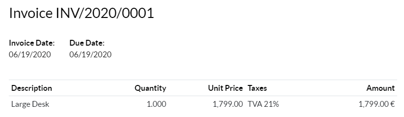
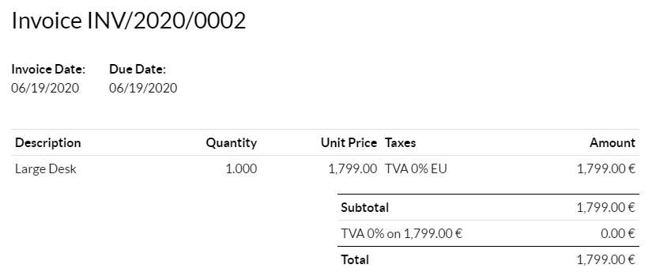
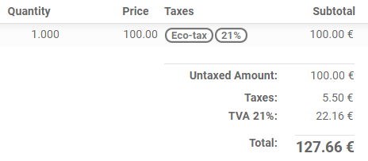

show-content  

# Taxes

There are numerous types of **taxes**, and their application varies
greatly, depending mostly on your company's localization. To make sure
they are recorded with accuracy, Odoo's tax engine supports all kinds of
uses and computations.

## Default taxes

**Default Taxes** define which taxes are automatically selected when
there is no other indication about which tax to use. For example, Odoo
prefills the **Taxes** field with the Default Taxes when you create a
new product or add a new line on an invoice.

To change your **Default Taxes**, go to
`Accounting --> Configuration --> Settings
--> Taxes --> Default Taxes`, select the appropriate taxes for your
default **Sales Tax** and **Purchase Tax**, and click on *Save*.

> [!NOTE]
> **Default Taxes** are automatically set up according to the country
> selected at the creation of your database, or when you set up a
> `fiscal localization package
> <fiscal_localizations/packages>` for your company.

## Activate Sales Taxes from the List view

As part of your
`fiscal localization package <fiscal_localizations/packages>`, most of
your country's sales taxes are already preconfigured on your database.
However, only a few of them are activated by default, so that you can
activate only the ones relevant for your business.

To activate Sale Taxes, go to `Accounting --> Configuration --> Taxes`
and use the *Activate* toggle button to activate or deactivate a tax.

## Configuration

To edit or create a **Tax**, go to
`Accounting --> Configuration --> Taxes` and open a tax or click on
*Create*.

> [!IMPORTANT]
> Taxes have three different labels, each one having a specific use.
> Refer to the following table to see where they are displayed.
>
> | `Tax Name     
>  <taxes/name>`  | `Label on Invoice                   
>                  <taxes/label-invoices>`              | `Tax Group                                  
>                                                        <taxes/tax-group>`                           |
> |---------------|-------------------------------------|---------------------------------------------|
> | Back end      | *Taxes* column on exported invoices | Above the *Total* line on exported invoices |

### Basic Options

#### Tax Name

The **Tax Name** as you want to display it for backend users. This is
the `label
<taxes/labels>` you see while editing Sales Orders, Invoices, Products,
etc.

#### Tax Computation

- **Group of Taxes**

  The tax is a combination of multiple sub-taxes. You can add as many
  taxes you want, in the order you want them to be applied.

  > [!IMPORTANT]
  > Make sure that the tax sequence is correct, as the order in which
  > they are may impact the taxes' amounts computation, especially if
  > one of the taxes `affects the base of the
  > subsequent ones <taxes/base-subsequent>`.

- **Fixed**

  The tax has a fixed amount in the default currency. The amount remains
  the same, regardless of the Sales Price.

  For example, a product has a Sales Price of \$1000, and we apply a
  *\$10 fixed* tax. We then have:

  | Product's Sales Price | Price without tax | Tax | Total    |
  |-----------------------|-------------------|-----|----------|
  | 1,000                 | 1,000             | 10  | 1,010.00 |

- **Percentage of Price**

  The *Sales Price* is the taxable basis: the tax's amount is computed
  by multiplying the Sales Price by the tax's percentage.

  For example, a product has a Sales Price of \$1000, and we apply a
  *10% of Price* tax. We then have:

  | Product's Sales Price | Price without tax | Tax | Total    |
  |-----------------------|-------------------|-----|----------|
  | 1,000                 | 1,000             | 100 | 1,100.00 |

- **Percentage of Price Tax Included**

  The *Total* is the taxable basis: the tax's amount is a percentage of
  the Total.

  For example, a product has a Sales Price of \$1000, and we apply a
  *10% of Price Tax Included* tax. We then have:

  | Product's Sales Price | Price without tax | Tax    | Total    |
  |-----------------------|-------------------|--------|----------|
  | 1,000                 | 1,000             | 111.11 | 1,111.11 |

#### Active

Only **Active** taxes can be added to new documents.

> [!IMPORTANT]
> It is not possible to delete taxes that have already been used.
> Instead, you can deactivate them to prevent future use.

> [!NOTE]
> This field can be modified from the *List View*. See
> `above <taxes/list_activation>` for more information.

#### Tax Scope

The **Tax Scope** determines the tax's application, which also restricts
where it is displayed.

- **Sales**: Customer Invoices, Product's Customer Taxes, etc.
- **Purchase**: Vendor Bills, Product's Vendor Taxes, etc.
- **None**

> [!TIP]
> You can use **None** for taxes that you want to include in a
> `Group of Taxes
> <taxes/computation>` but that you don't want to list along with other
> Sales or Purchase taxes.

### Definition tab

Allocate with precision the amount of the taxable basis or percentages
of the computed tax to multiple accounts and Tax Grids.

- **Based On**:
  - Base: the price on the invoice line
  - % of tax: a percentage of the computed tax.
- **Account**: if defined, an additional Journal Item is recorded.
- **Tax Grids**: used to generate `Tax Reports <reporting/tax_returns>`
  automatically, according to your country's regulations.

### Advanced Options tab

#### Label on Invoices

The label of the tax, as displayed on each invoice line in the **Taxes**
column. This is the `label <taxes/labels>` visible to *front end* users,
on exported invoices, on their Customer Portals, etc.

#### Tax Group

Select to which **Tax Group** the tax belongs. The Tax Group name is the
`label
<taxes/labels>` displayed above the *Total* line on exported invoices,
and the Customer Portals.

Tax groups include different iterations of the same tax. This can be
useful when you must record differently the same tax according to
`Fiscal Positions <taxes/fiscal_positions>`.

In the example above, we see a 0% tax for Intra-Community customers in
Europe. It records amounts on specific accounts and with specific tax
grids. Still, to the customer, it is a 0% tax. That's why the
`Label on the Invoice <taxes/label-invoices>` indicates *0% EU*, and the
Tax Group name, above the *Total* line, indicates *0%*.

#### Include in Analytic Cost

With this option activated, the tax's amount is assigned to the same
**Analytic Account** as the invoice line.

#### Included in Price

With this option activated, the total (including the tax) equals the
**Sales Price**.

`Total = Sales Price = Computed Tax-Excluded price + Tax`

For example, a product has a Sales Price of \$1000, and we apply a *10%
of Price* tax, which is *included in the price*. We then have:

| Product's Sales Price | Price without tax | Tax  | Total    |
|-----------------------|-------------------|------|----------|
| 1,000                 | 900.10            | 90.9 | 1,000.00 |

> [!NOTE]
> If you need to define prices accurately, both tax-included and
> tax-excluded, please refer to the following documentation:
> `taxes/B2B_B2C`.

> [!NOTE]
> - **Invoices**: By default, the Line Subtotals displayed on your
> invoices are *Tax-Excluded*. To display *Tax-Included* Line Subtotals,
> go to `Accounting --> Configuration -->
> Settings --> Customer Invoices`, and select *Tax-Included* in the
> **Line Subtotals Tax Display** field, then click on *Save*. -
> **eCommerce**: By default, the prices displayed on your eCommerce
> website are *Tax-Excluded*. To display *Tax-Included* prices, go to
> `Website --> Configuration --> Settings
> --> Pricing`, and select *Tax-Included* in the **Product Prices**
> field, then click on *Save*.

#### Affect Base of Subsequent Taxes

With this option, the total tax-included becomes the taxable basis for
the other taxes applied to the same product.

You can configure a new `Group of Taxes <taxes/computation>` to include
this tax, or add it directly to a product line.

> [!WARNING]
> The order in which you add the taxes on a product line has no effect
> on how amounts are computed. If you add taxes directly on a product
> line, only the tax sequence determines the order in which they are
> applied.
>
> To reorder the sequence, go to
> `Accounting --> Configuration --> Taxes`, and drag and drop the lines
> with the handles next to the tax names.
>
> 

- `taxes/fiscal_positions`
- `taxes/B2B_B2C`
- `taxes/taxcloud` (decommissioning TaxCloud integration in Odoo 17+)
- `reporting/tax_returns`

taxes/cash_basis taxes/retention taxes/vat_verification
taxes/fiscal_positions taxes/avatax taxes/taxcloud
taxes/eu_distance_selling taxes/B2B_B2C

