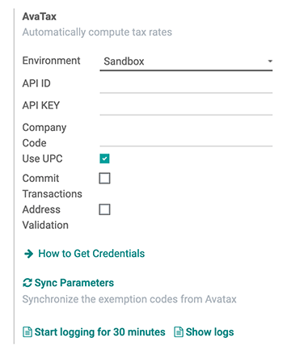
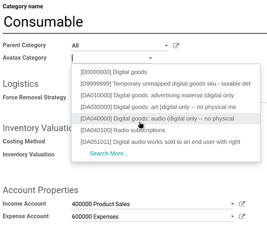

show-content  

# AvaTax integration

Avalara's *AvaTax* is a cloud-based tax software. Integrating *AvaTax*
with Konvergo ERP provides real-time and region-specific tax calculations when
users sell, purchase, and invoice items in Konvergo ERP. *AvaTax* tax
calculation is supported with every United Nations charted country,
including inter-border transactions.

> [!IMPORTANT]
> *AvaTax* is only available for integration with databases/companies
> that have locations in the United States and Canada. This means the
> fiscal position/country of a database can only be set to the United
> States or Canada. For more information, reference this documentation:
> `avatax/fiscal_country`.

*AvaTax* accounts for location-based tax rates for each state, county,
and city. It improves remittance accuracy by paying close attention to
laws, rules, jurisdiction boundaries, and special circumstances (like,
tax holidays, and product exemptions). Companies who integrate with
*AvaTax* can maintain control of tax-calculations in-house with this
simple `API (application
programming interface)` integration.

> [!IMPORTANT]
> Some limitations exist in Konvergo ERP while using *AvaTax* for tax
> calculation:
>
> - *AvaTax* is **not** supported in Konvergo ERP's *Point of Sale* app, because
>   a dynamic tax calculation model is excessive for transactions within
>   a single delivery address, such as stores or restaurants.
> - *AvaTax* and Konvergo ERP use the company address and **not** the warehouse
>   address.
> - Exercise tax is **not** supported. This includes tobacco/vape taxes,
>   fuel taxes, and other specific industries.

Avalara's support documents: [About
AvaTax](https://community.avalara.com/support/s/document-item?language=en_US&bundleId=dqa1657870670369_dqa1657870670369&topicId=About_AvaTax.html&_LANG=enus)

## Set up on AvaTax

To use *AvaTax*, an account with Avalara is required for the setup. If
one has not been set up yet, connect with Avalara to purchase a license:
[Avalara: Let's Talk](https://www.avalara.com/us/en/get-started.html).

> [!TIP]
> Upon account setup, take note of the *AvaTax* `Account ID`. This will
> be needed in the `Konvergo ERP setup <avatax/credentials>`. In Konvergo ERP, this
> number is the `API ID`.

Then, [create a basic company
profile](https://community.avalara.com/support/s/document-item?bundleId=dqa1657870670369_dqa1657870670369&topicId=Create_a_Basic_company_profile.html&_LANG=enus).

### Create basic company profile

Collect essential business details for the next step: locations where
tax is collected, products/services sold (and their sales locations),
and customer tax exemptions, if applicable. Follow the Avalara
documentation for creating a basic company profile:

1.  [Add company
    information](https://community.avalara.com/support/s/document-item?bundleId=dqa1657870670369_dqa1657870670369&topicId=Add_your_company_information.html&_LANG=enus).
2.  [Tell us where the company collects and pays
    tax](https://community.avalara.com/support/s/document-item?bundleId=dqa1657870670369_dqa1657870670369&topicId=Tell_us_where_you_collect_and_pay_tax.html&_LANG=enus).
3.  [Verify jurisdictions and activate the
    company](https://community.avalara.com/support/s/document-item?bundleId=dqa1657870670369_dqa1657870670369&topicId=Verify_your_jurisdictions_and_activate_your_company.html&_LANG=enus).
4.  [Add other company locations for location-based
    filing](https://community.avalara.com/support/s/document-item?bundleId=dqa1657870670369_dqa1657870670369&topicId=Add_other_company_locations_for_location-based_filing.html&_LANG=enus).
5.  [Add a marketplace to the company
    profile](https://community.avalara.com/support/s/document-item?bundleId=dqa1657870670369_dqa1657870670369&topicId=Add_marketplace_transactions_to_your_company_profile.html&_LANG=enus).

### Connect to AvaTax

After creating the basic company profile in Avalara, connect to
*AvaTax*. This step links Konvergo ERP and *AvaTax* bidirectionally.

Navigate to either Avalara's
[sandbox](https://sandbox.admin.avalara.com/) or
[production](https://admin.avalara.com/) environment. This will depend
on which type of Avalara account the company would like to integrate.

[Sandbox vs production environments in
Avalara](https://knowledge.avalara.com/bundle/fzc1692293626742/page/sandbox-vs-production.html).

Log in to create the `License Key`. Go to `Settings --> License and API
Keys`. Click `Generate License Key`.

> [!NOTE]
> A warning appears stating: If your business
> app is connected to Avalara solutions, the connection will be broken
> until you update the app with the new license key. This action cannot
> be undone.
>
> Generating a new license key breaks the connection with existing
> business apps using the *AvaTax* integration. Make sure to update
> these apps with the new license key.

If this will be the first `API (application programming interface)`
integration being made with *AvaTax* and Konvergo ERP, then click
`Generate license key`.

If this is an additional license key, ensure the previous connection can
be broken. There is **only** one license key associated with each of the
Avalara sandbox and production accounts.

> [!IMPORTANT]
> Copy this key to a safe place. It is **strongly encouraged** to backup
> the license key for future reference. This key cannot be retrieved
> after leaving this screen.

## Konvergo ERP configuration

Before using *AvaTax*, there are some additional configurations in Konvergo ERP
to ensure tax calculations are made accurately.

Verify that the Konvergo ERP database contains necessary data. The country
initially set up in the database determines the fiscal position, and
aids *AvaTax* in calculating accurate tax rates.

### Fiscal country

To set the `Fiscal Country`, navigate to
`Accounting app --> Configuration
--> Settings`.

`../../fiscal_localizations`

Under the `Taxes` section, set the `Fiscal Country` feature to `United
States` or `Canada`. Then, click `Save`.

### Company settings

All companies operating under the Konvergo ERP database should have a full and
complete address listed in the settings. Navigate to the `Settings app`,
and under the `Companies` section, ensure there is only one company
operating the Konvergo ERP database. Click `Update Info` to open a separate page
to update company details.

If there are multiple companies operating in the database, click
`Manage Companies` to load a list of companies to select from. Update
company information by clicking into the specific company.

Database administrators should ensure that the `Street...`,
`Street2...`, `City`, `State`, `ZIP`, and `Country` are all updated for
the companies.

This ensures accurate tax calculations and smooth end-of-year accounting
operations.

\- `../../../general/companies` - `../get_started`

### Module installation

Next, ensure that the Konvergo ERP *AvaTax* module is installed. To do so,
navigate to the `Apps application`. In the `Search...` bar, type in
avatax, and press `Enter`. The following
results populate:

| Name                                    | Technical name                                                  | Description                                                                               |
|-----------------------------------------|-----------------------------------------------------------------|-------------------------------------------------------------------------------------------|
| `Avatax`                                | account_avatax                   | Default *AvaTax* module. This module adds the base *AvaTax* features for tax calculation. |
| `Avatax for SO`                         | account_avatax_sale              | Includes the information needed for tax calculation on sales orders in Konvergo ERP.              |
| `Avatax for Subscriptions`              | account_avatax_sale_subscription | This module includes the features required for tax calculation on subscriptions in Konvergo ERP.  |
| `Account Avatax - Ecommerce`            | website_sale_account_avatax      | Includes tax calculation features for the checkout process on Konvergo ERP eCommerce.             |
| `Account AvaTax - Ecommerce - Delivery` | website_sale_delivery_avatax     | Includes tax calculation features for the delivery process on Konvergo ERP eCommerce.             |

Click the `Install` button on the module labeled `Avatax`:
account_avatax. Doing so installs the
following modules:

- `Avatax`: account_avatax
- `Avatax for SO`: account_avatax_sale
- `Account Avatax - Ecommerce`:
  website_sale_account_avatax

Should *AvaTax* be needed for Konvergo ERP *Subscriptions*, or for delivery tax
in Konvergo ERP *eCommerce*, then install those modules individually by clicking
on `Install`.

### Konvergo ERP AvaTax settings

To integrate the *AvaTax* `API (application programming interface)` with
Konvergo ERP, go to `Accounting app --> Configuration --> Settings` section. The
`AvaTax` fields in the `Taxes` section is where the *AvaTax*
configurations are made and the credentials are entered in.

#### Prerequisites

First, select the `Environment` in which the company wishes to use
*AvaTax* in. It can either be `Sandbox` or `Production`.

For help determining which *AvaTax* environment to use (either
`Production` or `Sandbox`), visit: [Sandbox vs Production
environments](https://knowledge.avalara.com/bundle/fzc1692293626742/page/sandbox-vs-production.html).

#### Credentials

Now, the credentials can be entered in. The *AvaTax* `Account ID` should
be entered in the `API ID` field, and the `License Key` should be
entered in the `API
Key` field.

> [!IMPORTANT]
> The `Account ID` can be found by logging into the *AvaTax* portal
> ([sandbox](https://sandbox.admin.avalara.com/) or
> [production](https://admin.avalara.com/)). In the upper-right corner,
> click on the initials of the user and `Account`. The `Account ID` is
> listed first.
>
> To access the `License Key` see this documentation:
> `avatax/create_avalara_credentials`.

For the `Company Code` field, enter the Avalara company code for the
company being configured. Avalara interprets this as
DEFAULT, if it is not set. The
`Company Code` can be accessed in the Avalara management portal.

First, log into the *AvaTax* portal
([sandbox](https://sandbox.admin.avalara.com/) or
[production](https://admin.avalara.com/)). Then, navigate to
`Settings --> Manage Companies`. The `Company Code` value is located in
the row of the `Company` in the `Company Code` column.

#### Transaction options

There are two transactional settings in the Konvergo ERP *AvaTax* settings that
can be configured: `Use UPC` and `Commit Transactions`.

If the checkbox next to `Use UPC` is ticked, the transactions will use
Universal Product Codes (UPC), instead of custom defined codes in
Avalara. Consult a certified public accountant (CPA) for specific
guidance.

Should the `Commit Transactions` checkbox be ticked, then, the
transactions in the Konvergo ERP database will be committed for reporting in
*AvaTax*.

#### Address validation

The *Address Validation* feature ensures that the most up-to-date
address by postal standards is set on a contact in Konvergo ERP. This is
important to provide accurate tax calculations for customers.

> [!IMPORTANT]
> The `Address Validation` feature only works with partners/customers in
> North America.

Additionally, tick the checkbox next to the `Address validation` field.

> [!IMPORTANT]
> For accurate tax calculations, it is best practice to enter a complete
> address for the contacts saved in the database. However, *AvaTax* can
> still function by implementing a best effort attempt using only the
> `Country`, `State`, and `Zip code`. These are the three minimum
> required fields.

`Save` the settings to implement the configuration.

> [!TIP]
> Manually `Validate` the address by navigating to the `Contacts app`,
> and selecting a contact. Now that the *AvaTax* module has been
> configured on the database, a `Validate` button appears directly below
> the `Address`.
>
> Click `Validate`, and a pop-up window appears with a
> `Validated Address` and `Original Address` listed. If the
> `Validated Address` is the correct mailing address for tax purposes,
> click `Save Validated`.
>
>  alt="Validate address pop-up window in Konvergo ERP with &quot;Save Validated&quot; button and &quot;Validated
> Address&quot; highlighted." />

> [!WARNING]
> All previously-entered addresses for contacts in the Konvergo ERP database
> will need to be validated using the manually validate process outlined
> above. Addresses are not automatically validated if they were entered
> previously. This only occurs upon tax calculation.

#### Test connection

After entering all the above information into the *AvaTax* setup on
Konvergo ERP, click `Test
connection`. This ensures the `API ID` and `API KEY` are correct, and a
connection is made between Konvergo ERP and the *AvaTax* application programming
interface (API).

#### Sync parameters

Upon finishing the configuration and settings of the *AvaTax* section,
click the `Sync
Parameters` button. This action synchronizes the exemption codes from
*AvaTax*.

### Fiscal position

Next, navigate to
`Accounting app --> Configuration --> Accounting: Fiscal
Positions`. A `Fiscal Position` is listed named, `Automatic Tax Mapping
(AvaTax)`. Click it to open *AvaTax's* fiscal position configuration
page.

Here, ensure that the `Use AvaTax API` checkbox is ticked.

Optionally, tick the checkbox next to the field labeled:
`Detect Automatically`. Should this option be ticked, then, Konvergo ERP will
automatically apply this `Fiscal Position` for transactions in Konvergo ERP.

Enabling `Detect Automatically` also makes specific parameters, such as
`VAT
required`, `Foreign Tax ID`, `Country Group`, `Country`,
`Federal States`, or `Zip Range` appear. Filling these parameters
filters the `Fiscal Position` usage. Leaving them blank ensures all
calculations are made using this `Fiscal Position`.

> [!WARNING]
> Should the `Detect Automatically` checkbox not be ticked, each
> customer will need to have the `Fiscal Position` set on their
> `Sales and Purchase` tab of the contact record. To do so, navigate to
> `Sales app --> Order --> Customers`, or `Contacts app --> Contacts`.
> Then, select a customer or contact to set the fiscal position on.
>
> Navigate to the `Sales and Purchase` tab, and down to the section
> labeled, `Fiscal Position`. Set the `Fiscal Position` field to the
> fiscal position for the customer.

`fiscal_positions`

#### AvaTax accounts

Upon selecting the checkbox option for `Use AvaTax API` a new `AvaTax`
tab appears. Click into this tab to reveal two different settings.

The first setting is the `AvaTax Invoice Account`, while the second is,
`AvaTax
Refund Account`. Ensure both accounts are set for smooth end-of-year
record keeping. Consult a certified public accountant (CPA) for specific
guidance on setting both accounts.

Click `Save` to implement the changes.

### Tax mapping

The *AvaTax* integration is available on sale orders and invoices with
the included *AvaTax* fiscal position.

#### Product category mapping

Before using the integration, specify an `Avatax Category` on the
product categories. Navigate to
`Inventory app --> Configuration --> Product Categories`. Select the
product category to add the `AvaTax Category` to. In the
`AvaTax Category` field, select a category from the drop-down menu, or
`Search More...` to open the complete list of options.

#### Product mapping

*AvaTax* Categories may be set on individual products, as well. To set
the `Avatax
Category` navigate to `Inventory app --> Products --> Products`. Select
the product to add the `Avatax Category` to. Under the
`General Information` tab, on the far-right, is a selector field
labeled: `Avatax Category`. Finally, click the drop-down menu, and
select a category, or `Search More...` to find one that is not listed.

> [!NOTE]
> If both the product, and its category, have an `AvaTax Category` set,
> the product's `AvaTax Category` takes precedence.

> [!IMPORTANT]
> Mapping an `AvaTax Category` on either the *Product* or *Product
> Category* should be completed for every *Product* or *Product
> Category*, depending the route that is chosen.

\- `fiscal_positions` - `avatax/avatax_use` - `avatax/avalara_portal` -
[US Tax Compliance: Avatax elearning
video](https://www.odoo.com/slides/slide/us-tax-compliance-avatax-2858?fullscreen=1)

avatax/avatax_use avatax/avalara_portal

