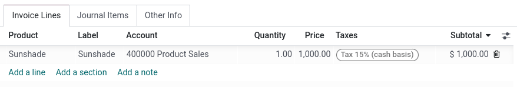

# Cash basis taxes

Cash basis taxes are due when the payment is made, as opposed to
standard taxes that are due when the invoice is confirmed. Reporting
your income and expenses to the government based on the cash basis
method is mandatory in some countries and under some conditions.

You sell a product in the 1st quarter of your fiscal year, and the
payment is received in the 2nd quarter. Based on the cash basis method,
the tax you must pay is for the 2nd quarter.

## Configuration

Go to `Accounting --> Configuration --> Settings` and under the `Taxes`
section, enable `Cash Basis`.

Then, define the `Tax Cash Basis Journal`. Click on the external link
button next to the journal to update its default properties such as the
`Journal Name`, `Type` or `Short Code`.

> [!NOTE]
> By default, the journal entries of the `Cash Basis Taxes` journal are
> named using the `CABA` short code.

Once this is done, go to
`Accounting --> Configuration --> Accounting: Taxes` to configure your
taxes. You can either `Create` a new tax or update an existing one by
clicking on it.

The `Account` column reflects the proper transitional accounts to post
taxes until the payment is registered.

In the `Advanced Options` tab, decide of the `Tax Exigilibity`. Select
`Based on Payment`, so the tax is due when the payment of the invoice is
received. You can then also define the `Cash Basis Transition Account`
where the tax amount is recorded as long as the original invoice has not
been reconciled.

## Impact of cash basis taxes on accounting

To illustrate the impact of cash basis taxes on accounting transactions,
let's take an example with the sales of a product that costs 1,000\$,
with a cash basis tax of 15%.

The following entries are created in your accounting, and the tax report
is currently empty.

| **Customer journal (INV)** |                             |
|----------------------------|-----------------------------|
| **Debit**                  | **Credit**                  |
| Receivable \$1,150         |                             |
|                            | Income \$1,000              |
|                            | Temporary tax account \$150 |

When the payment is then received, it is registered as below :

| **Bank journal (BANK)** |                    |
|-------------------------|--------------------|
| **Debit**               | **Credit**         |
| Bank \$1,150            |                    |
|                         | Receivable \$1,150 |

> [!NOTE]
> Once the payment is registered, you can use the `Cash Basis Entries`
> smart button on the invoice to access them directly.

Finally, upon reconciliation of the invoice with the payment, the below
entry is automatically created:

<table style="width:81%;">
<colgroup>
<col style="width: 40%" />
<col style="width: 40%" />
</colgroup>
<thead>
<tr class="header">
<th colspan="2"><strong>Tax Cash Basis Journal (Caba)</strong></th>
</tr>
</thead>
<tbody>
<tr class="odd">
<td><strong>Debit</strong></td>
<td><strong>Credit</strong></td>
</tr>
<tr class="even">
<td>Income account $1,000</td>
<td></td>
</tr>
<tr class="odd">
<td>Temporary tax account $150</td>
<td></td>
</tr>
<tr class="even">
<td></td>
<td><blockquote>

Income account $1,000

</blockquote></td>
</tr>
<tr class="odd">
<td></td>
<td>Tax Received $150</td>
</tr>
</tbody>
</table>

The journal items `Income account` vs. `Income account` are neutral, but
they are needed to ensure correct tax reports in Odoo with accurate base
tax amounts.

Using a default `Base Tax Received Account` is recommended so your
balance is at zero and your income account is not polluted by
unnecessary accounting movements. To do so, go to
`Configuration --> Settings --> Taxes`, and select a
`Base Tax Received Account` under `Cash Basis`.
