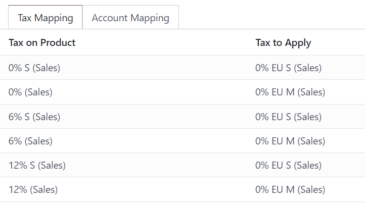
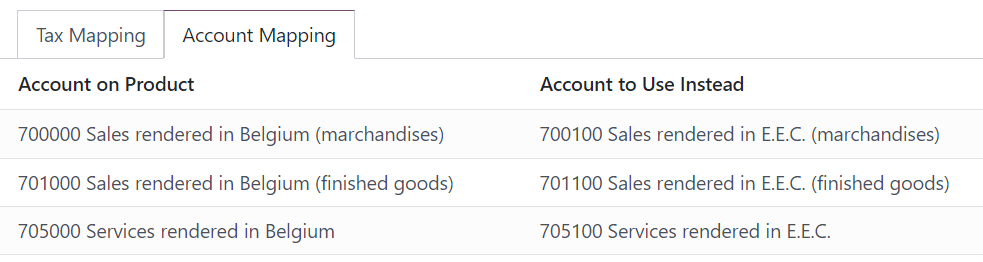
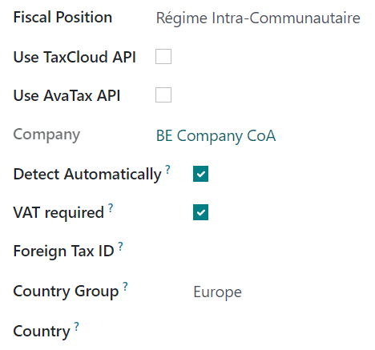
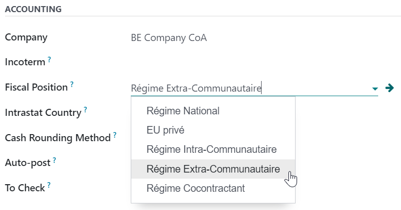
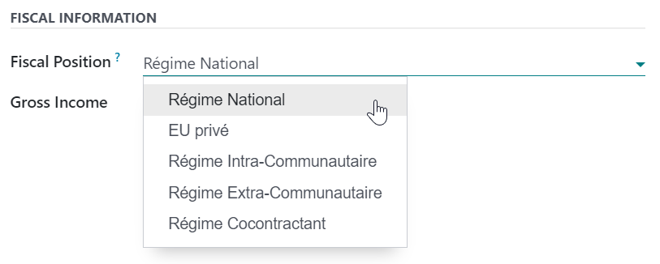

# Fiscal positions (tax and account mapping)

Default taxes and accounts are set on products and customers to create
new transactions on the fly. However, depending on the customers' and
providers' localization and business type, using different taxes and
accounts for a transaction might be necessary.

**Fiscal positions** allow the creation of rules to adapt the taxes and
accounts used for a transaction automatically.

They can be applied `automatically <fiscal_positions/automatic>`,
`manually
<fiscal_positions/manual>`, or
`assigned to a partner <fiscal_positions/partner>`.

> [!NOTE]
> Several default fiscal positions are available as part of your
> `fiscal localization
> package <fiscal_localizations/packages>`.

## Configuration

### Tax and account mapping

To edit or create a fiscal position, go to
`Accounting --> Configuration --> Fiscal
Positions`, and open the entry to modify or click on `New`.

The mapping of taxes and accounts is based on the default taxes and
accounts defined in the product form.

- To map to another tax or account, fill out the right column
  (`Tax to Apply`/ `Account to Use Instead`).

- To remove a tax, leave the field `Tax to Apply` empty.
- To replace a tax with several other taxes, add multiple lines using
  the same `Tax on
  Product`.

> [!NOTE]
> The mapping only works with *active* taxes. Therefore, make sure they
> are active by going to `Accounting --> Configuration --> Taxes`.

## Application

### Automatic application

To automatically apply a fiscal position following a set of conditions,
go to `Accounting --> Configuration --> Fiscal Positions`, open the
fiscal position to modify, and tick `Detect Automatically`.

From there, several conditions can be activated:

- `VAT Required`: the customer's VAT number must be present on their
  contact form.
- `Country Group` and `Country`: the fiscal position is only applied to
  the selected country or country group.

> [!NOTE]
> Taxes on **eCommerce orders** are automatically updated once the
> customer has logged in or filled out their billing details.

> [!IMPORTANT]
> The fiscal positions' **sequence** defines which fiscal position is
> applied if all conditions set on multiple fiscal positions are met
> simultaneously.
>
> For example, suppose the first fiscal position in a sequence targets
> *country A* while the second fiscal position targets a *country group*
> that comprises *country A*. In that case, only the first fiscal
> position will be applied to customers from *country A*.

### Manual application

To manually select a fiscal position, open a sales order, invoice, or
bill, go to the `Other Info` tab and select the desired
`Fiscal Position` before adding product lines.

### Assign to a partner

To define which fiscal position must be used by default for a specific
partner, go to `Accounting --> Customers --> Customers`, select the
partner, open the `Sales & Purchase` tab, and select the
`Fiscal Position`.

- `../taxes`
- `taxcloud` (decommissioning TaxCloud integration in Konvergo ERP 17+)
- `B2B_B2C`

