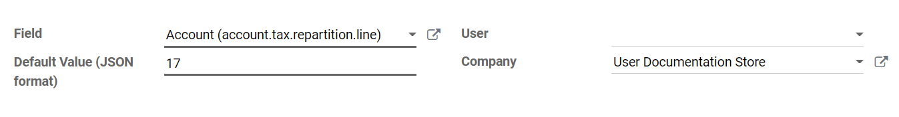
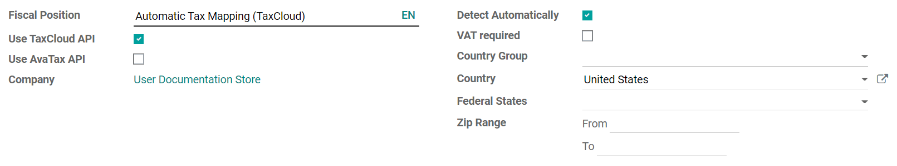

# TaxCloud integration

> [!WARNING]
> The Konvergo ERP TaxCloud integration has begun its decommissioning, starting
> in Konvergo ERP 17. New installations are prohibited in Konvergo ERP 17. In Konvergo ERP 18,
> the TaxCloud module(s) will **not** exist at all. Konvergo ERP recommends the
> use of the Avatax platform, instead.

`avatax`

TaxCloud calculates the sales tax rate in real time for every state,
city, and special jurisdiction in the United States. It keeps track of
which products are exempt from sales tax, and in which states each
exemption applies.

## TaxCloud registration

Register an account on [TaxCloud.com](https://taxcloud.com/register) and
complete the setup. Once you go live, get the `TaxCloud API Keys` by
clicking on `Stores`, then `Get Details`.

## Enable TaxCloud

1.  Go to `Accounting Dashboard --> Configuration --> Settings` and in
    the `Taxes` section enable `TaxCloud`.

2.  Add the store's `Login ID` under `API ID` and the store's `Key`
    under `API KEY`. Click on `Save`.

3.  Click the `Refresh` button (`🗘`) next to `Default Category` to
    import the TIC `Taxability Information Codes` product categories
    from TaxCloud. Some categories may imply specific tax rates or
    exemptions.

4.  Select a `Default Category` and `Save`. The `Default Category` is
    applied when no `TaxCloud Category` is set on your products or
    product categories, or when no product is found on an order/invoice.

    

## Set TaxCloud categories on products

If you need to use more than one TIC category (i.e., the
`Default Category`), go to the product's `General Information` tab and
select a `TaxCloud Category`.

If you want to configure multiple products simultaneously, ensure they
share the same `Product Category` and click on the external link button
(`🡕`) to set a `TaxCloud Category` on the `Product Category` instead.

> [!NOTE]
> If you set a `TaxCloud Category` on a product and another on its
> `Product
> Category`, Konvergo ERP only considers the `TaxCloud Category` found on the
> product itself.
>
> A `TaxCloud Category` set on a **parent product category** does not
> apply to its **child product categories**. For example, if you set
> `TaxCloud Category` on the *All* `Product Category`, it is not applied
> to the *All/Sales* `Product Category`.

> [!IMPORTANT]
> Make sure your company address is complete, including the state and
> the ZIP code. Go to `Settings --> Companies: Update Info` to open and
> edit your company address.

## Automatically post taxes in the correct tax payable account

To make sure the new taxes generated by the TaxCloud integration are
created with the correct **Tax Payable** account, create a
**user-defined default**. This process should be repeated for each one
of your companies that uses TaxCloud.

> [!WARNING]
> A user-defined default impacts all records at creation. It means that
> **every** new tax is set up to record income in the specified Tax
> Payable account unless the tax is manually edited to specify a
> different income account (or if another user-defined default takes
> precedence).

To do so, go to
`Accounting Dashboard --> Configuration --> Accounting: Chart of
Accounts`, find the company's `Tax Payable` account, and click on
`Setup`. Take note of the number after
id= in the URL string; it is the **Tax
Payable account ID** and will be used later.

Activate the `developer mode <developer-mode>`, then go to `Settings -->
Technical --> Actions: User-defined Defaults` and click on `Create`.

Click on `Field` drop-down menu and then on `Search More...`.

Use the search bar to filter for the `Tax Repartition Line` model, and
use it a second time to filter for the `Account` field. Select the line
with `Tax Repartition
Line` under the `Model` column.

Once you are back to the `User-defined Defaults` creation, enter the
**Tax Payable account ID** you took note of earlier under the
`Default Value (JSON format)` field.

Select the company for which this configuration should apply under the
`Company` field and click `Save`.

## Automatically detect the fiscal position

Sales taxes are calculated in Konvergo ERP based on
`fiscal positions <fiscal_positions>`. A fiscal position for the United
States is created when enabling TaxCloud.

You can configure Konvergo ERP to automatically detect to which customers the
fiscal position should be applied. To do so, go to
`Accounting Dashboard --> Configuration --> Accounting:
Fiscal Positions` and select `Automatic Tax Mapping (TaxCloud)`. Enable
`Detect
Automatically` and then `Save`.

Now, this fiscal position is automatically set on any order or invoice
if the customer country is *United States*. This triggers the automated
tax computation.

> [!NOTE]
> To get the sales taxes on a sales order, confirm it or click the
> `Update Taxes` button next to `Add Shipping`.

## Interaction with coupons and promotions

If you use the **Coupon** or **Promotion Programs**, the integration
with TaxCloud might behave unexpectedly. Indeed, as TaxCloud does not
accept lines with negative amounts as part of the tax computation, the
amount of the lines added by the promotion program must be deduced from
the total of the lines it impacts.

> [!IMPORTANT]
> This means, amongst other complications, that orders using coupons or
> promotions with a TaxCloud fiscal position **must** be invoiced
> completely - you cannot create invoices for partial deliveries, etc.

Another unexpected behavior is possible. For example, you sell a product
for which you have a promotion program that provides a 50% discount. If
the product's tax rate is 7%, the tax rate computed from the TaxCloud
integration displays 3.5%. This happens because the discount is included
in the price sent to TaxCloud. However, in Konvergo ERP, the discount is on
another line entirely. Still, the tax computation is correct. Indeed, a
3.5% tax on the full price is the equivalent of a 7% tax on half the
price, but this might be unexpected from a user point of view.

`fiscal_positions`

