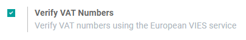
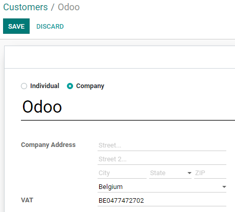
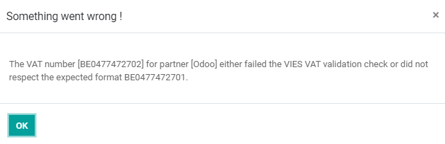

# VAT numbers verification (VIES)

**VAT Information Exchange System** - abbreviated **VIES** - is a tool
provided by the European Commission that allows you to check the
validity of VAT numbers of companies registered in the European Union.

Konvergo ERP provides a feature to **Verify VAT Numbers** when you save a
contact. This helps you make sure that your contacts provided you with a
valid VAT number without leaving Konvergo ERP interface.

## Configuration

To enable this feature, go to
`Accounting --> Configuration --> Settings --> Taxes`, enable the
**Verify VAT Numbers** feature, and click on *Save*.

## VAT Number validation

Whenever you create or modify a contact, make sure to fill out the
**Country** and **VAT** fields.

When you click on *Save*, Konvergo ERP runs a VIES VAT number check, and
displays an error message if the VAT number is invalid.

> [!IMPORTANT]
> This tool checks the VAT number's validity but does not check the
> other fields' validity.

- [European Commission: VIES search
  engine](https://ec.europa.eu/taxation_customs/vies/vatRequest.html)

