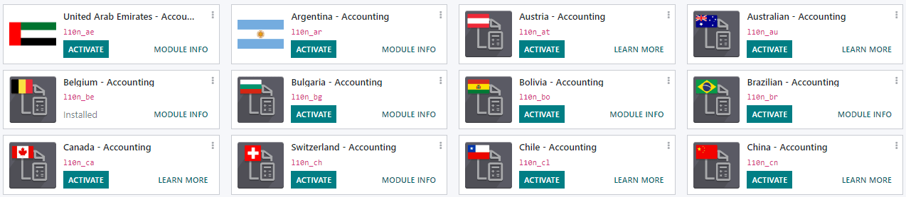
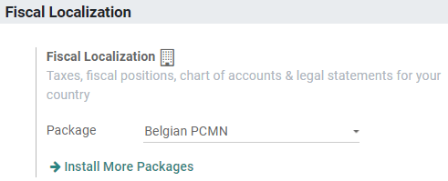

show-content  

# Fiscal localizations

## Fiscal localization packages

**Fiscal Localization Packages** are country-specific modules that
install pre-configured taxes, fiscal positions, chart of accounts, and
legal statements on your database. Some additional features, such as the
configuration of specific certificates, are also added to your
Accounting app, following your fiscal administration requirements.

> [!NOTE]
> Odoo continuously adds new localizations and improves the existing
> packages.

### Configuration

Odoo automatically installs the appropriate package for your company,
according to the country selected at the creation of the database.

> [!IMPORTANT]
> As long as you haven't posted any entry, you can still add and select
> another package.

To install a new package, go to `Accounting --> Configuration --> Fiscal
Localization`, click on **Install More Packages**, and install your
country's module.

Once done, select your country's package, and click on *Save*.

### Use

These packages require you to fine-tune your chart of accounts according
to your needs, activate the taxes you use, and configure your
country-specific statements and certifications.

\- `accounting/get_started/chart_of_accounts` - `accounting/taxes`

## List of supported countries

Odoo Accounting can be used in many countries out of the box by
installing the appropriate module. Here is a list of all
`fiscal localization package <fiscal_localizations/packages>` that are
available on Odoo.

- Algeria - Accounting
- `Argentina - Accounting <fiscal_localizations/argentina>`
- `Australian - Accounting <fiscal_localizations/australia>`
- Austria - Accounting
- `Belgium - Accounting <fiscal_localizations/belgium>`
- Bolivia - Accounting
- `Brazilian - Accounting <fiscal_localizations/brazil>`
- Canada - Accounting
- `Chile - Accounting <fiscal_localizations/chile>`
- China - Accounting
- `Colombia - Accounting <fiscal_localizations/colombia>`
- Costa Rica - Accounting
- Croatia - Accounting (RRIF 2012)
- Czech - Accounting
- Denmark - Accounting
- Dominican Republic - Accounting
- `Ecuadorian - Accounting <fiscal_localizations/ecuador>`
- `Egypt - Accounting <fiscal_localizations/egypt>`
- Ethiopia - Accounting
- Finnish Localization
- `France - Accounting <fiscal_localizations/france>`
- Generic - Accounting
- `Germany <fiscal_localizations/germany>`
  - Germany SKR03 - Accounting
  - Germany SKR04 - Accounting
- Greece - Accounting
- Guatemala - Accounting
- Honduras - Accounting
- Hong Kong - Accounting
- Hungarian - Accounting
- `Indian - Accounting <fiscal_localizations/india>`
- `Indonesian - Accounting <fiscal_localizations/indonesia>`
- Ireland - Accounting
- Israel - Accounting
- `Italy - Accounting <fiscal_localizations/italy>`
- Japan - Accounting
- `Kenya - Accounting <fiscal_localizations/kenya>`
- Lithuania - Accounting
- `Luxembourg - Accounting <fiscal_localizations/luxembourg>`
- Maroc - Accounting
- `Mexico - Accounting <fiscal_localizations/mexico>`
- Mongolia - Accounting
- `Netherlands - Accounting <fiscal_localizations/netherlands>`
- New Zealand - Accounting
- Norway - Accounting
- OHADA - Accounting
- Pakistan - Accounting
- Panama - Accounting
- `Peru - Accounting <fiscal_localizations/peru>`
- `Philippines - Accounting <fiscal_localizations/philippines>`
- Poland - Accounting
- Portugal - Accounting
- `Romania - Accounting <fiscal_localizations/romania>`
- `Saudi Arabia - Accounting <fiscal_localizations/saudi_arabia>`
- Singapore - Accounting
- Slovak - Accounting
- Slovenian - Accounting
- South Africa - Accounting
- `Spain - Accounting (PGCE 2008) <fiscal_localizations/spain>`
- Sweden - Accounting
- `Switzerland - Accounting <fiscal_localizations/switzerland>`
- Taiwan - Accounting
- `Thailand - Accounting <fiscal_localizations/thailand>`
- Turkey - Accounting
- `United Arab Emirates - Accounting <fiscal_localizations/united_arab_emirates>`
- `UK - Accounting <fiscal_localizations/united_kingdom>`
- Ukraine - Accounting
- United States - Accounting
- Uruguay - Accounting
- Venezuela - Accounting
- Vietnam - Accounting

fiscal_localizations/argentina fiscal_localizations/australia
fiscal_localizations/belgium fiscal_localizations/brazil
fiscal_localizations/chile fiscal_localizations/colombia
fiscal_localizations/ecuador fiscal_localizations/egypt
fiscal_localizations/france fiscal_localizations/germany
fiscal_localizations/india fiscal_localizations/indonesia
fiscal_localizations/italy fiscal_localizations/kenya
fiscal_localizations/luxembourg fiscal_localizations/mexico
fiscal_localizations/netherlands fiscal_localizations/romania
fiscal_localizations/peru fiscal_localizations/philippines
fiscal_localizations/saudi_arabia fiscal_localizations/spain
fiscal_localizations/switzerland fiscal_localizations/thailand
fiscal_localizations/united_arab_emirates
fiscal_localizations/united_kingdom

