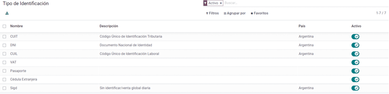
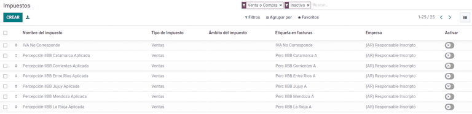
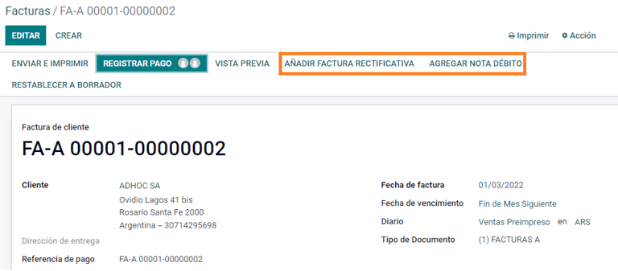
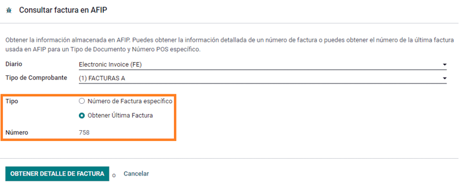
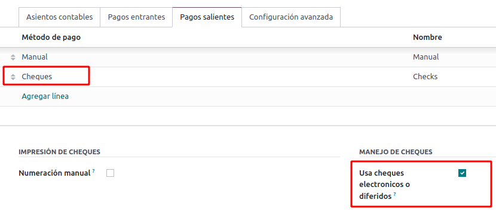
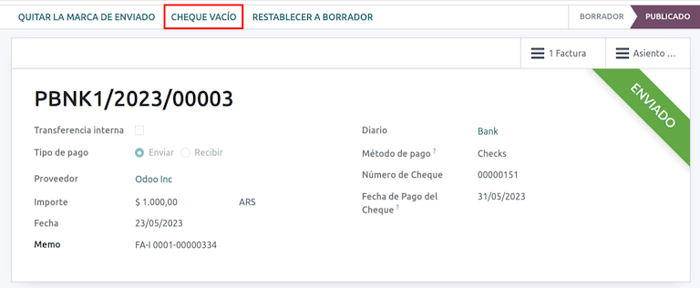
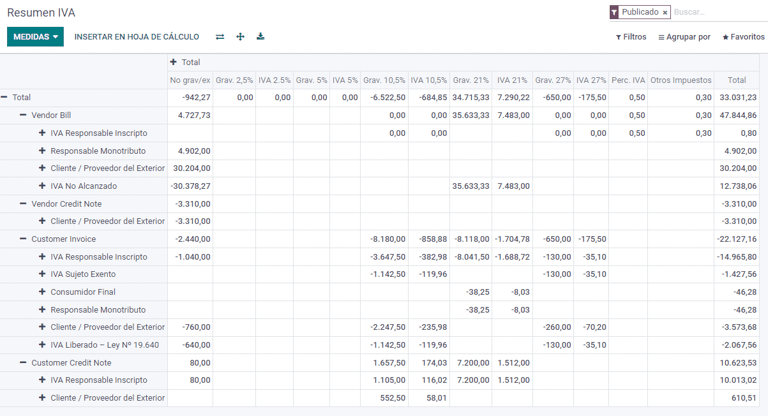
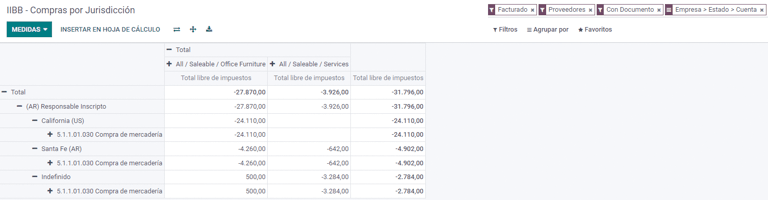

# Argentina

## Webinars

Below you can find videos with a general description of the
localization, and how to configure it.

- [Webinar - Localización de
  Argentina](https://www.youtube.com/watch?v=_H1HbU-wKVg).
- [eCommerce - Localización de
  Argentina](https://www.youtube.com/watch?v=5gUi2WWfRuI).

[Smart Tutorial - Localización de
Argentina](https://www.odoo.com/slides/smart-tutorial-localizacion-de-argentina-130)

## Configuration

### Modules installation

`Install <general/install>` the following modules to get all the
features of the Argentinean localization:

| Name                               | Technical name                                      | Description                                                                                                                                                               |
|------------------------------------|-----------------------------------------------------|---------------------------------------------------------------------------------------------------------------------------------------------------------------------------|
| `Argentina - Accounting`           | l10n_ar              | Default `fiscal localization package <fiscal_localizations/packages>`, which represents the minimal configuration to operate in Argentina under the `AFIP (Administración 
                                                                                            Federal de Ingresos Públicos)` regulations and guidelines.                                                                                                                 |
| `Argentinean Accounting Reports`   | l10n_ar_reports      | VAT Book report and VAT summary report.                                                                                                                                   |
| `Argentinean Electronic Invoicing` | l10n_ar_edi          | Includes all technical and functional requirements to generate electronic invoices via web service, based on the AFIP regulations.                                        |
| `Argentinean eCommerce`            | l10n_ar_website_sale | (optional) Allows the user to see Identification Type and AFIP Responsibility in the eCommerce checkout form in order to create electronic invoices.                      |

### Configure your company

Once the localization modules are installed, the first step is to set up
the company's data. In addition to the basic information, a key field to
fill in is the `AFIP Responsibility
Type`, which represents the fiscal obligation and structure of the
company.

### Chart of account

In Accounting, there are three different `Chart of Accounts` packages to
choose from. They are based on a company's AFIP responsibility type, and
consider the difference between companies that do not require as many
accounts as the companies that have more complex fiscal requirements:

- Monotributista (227 accounts);
- IVA Exento (290 accounts);
- Responsable Inscripto (298 Accounts).

### Configure master data

#### Electronic Invoice Credentials

##### Environment

The AFIP infrastructure is replicated in two separate environments,
**testing** and **production**.

Testing is provided so that the companies can test their databases until
they are ready to move into the **Production** environment. As these two
environments are completely isolated from each other, the digital
certificates of one instance are not valid in the other one.

To select a database environment, go to
`Accounting --> Settings --> Argentinean
Localization` and choose either `Prueba (Testing)` or
`Produccion (Production)`.

##### AFIP certificates

The electronic invoice and other AFIP services work with
`Web Services (WS)` provided by the AFIP.

In order to enable communication with the AFIP, the first step is to
request a `Digital
Certificate` if you do not have one already.

1.  `Generate Certificate Sign Request (Odoo)`. When this option is
    selected, a file with extension .csr
    (certificate signing request) is generated to be used in the AFIP
    portal to request the certificate.

    

2.  `Generate Certificate (AFIP)`. Access the AFIP portal and follow the
    instructions described in [this document
    \<https://drive.google.com/file/d/17OKX2lNWd1bjUt3NxfqcCKBkBh-Xlpo-/
    view\>]() to get a certificate.

3.  `Upload Certificate and Private Key (Odoo)`. Once the certificate is
    generated, upload it to Odoo using the `Pencil` icon next to the
    field `Certificado` and select the corresponding file.

    

> [!TIP]
> In case you need to configure the Homologation Certificate, please
> refer to the AFIP official documentation: [Homologation
> Certificate](http://www.afip.gob.ar/ws/documentacion/certificados.asp).
> Furthermore, Odoo allows the user to test electronic invoicing locally
> without a Homologation Certificate. The following message will be in
> the chatter when testing locally:
>
>  alt="Invoice validated locally because it is in a testing environment without testing
> certificate/keys." />

#### Partner

##### Identification type and VAT

As part of the Argentinean localization, document types defined by the
AFIP are now available in the **Partner form**. Information is essential
for most transactions. There are six `Identification Types` available by
default, as well as 32 inactive types.

> [!NOTE]
> The complete list of `Identification Types` defined by the AFIP is
> included in Odoo, but only the common ones are active.

##### AFIP responsibility type

In Argentina, the document type and corresponding transactions
associated with customers and vendors is defined by the AFIP
Responsibility type. This field should be defined in the **Partner
form**.

#### Taxes

As part of the localization module, the taxes are created automatically
with their related financial account and configuration, e.g., 73 taxes
for `Responsable Inscripto`.

##### Taxes types

Argentina has several tax types, the most common ones are:

- `VAT`: this is the regular VAT and can have various percentages;
- `Perception`: advance payment of a tax that is applied on invoices;
- `Retention`: advance payment of a tax that is applied on payments.

##### Special taxes

Some Argentinean taxes are not commonly used for all companies, and
those less common options are labeled as inactive in Odoo by default.
Before creating a new tax, be sure to check if that tax is not already
included as inactive.

#### Document types

In some Latin American countries, like Argentina, some accounting
transactions such as invoices and vendor bills are classified by
document types defined by the governmental fiscal authorities. In
Argentina, the [AFIP](https://www.afip.gob.ar/) is the governmental
fiscal authority that defines such transactions.

The document type is an essential piece of information that needs to be
clearly displayed in printed reports, invoices, and journal entries that
list account moves.

Each document type can have a unique sequence per journal where it is
assigned. As part of the localization, the document type includes the
country in which the document is applicable (this data is created
automatically when the localization module is installed).

The information required for the `Document Types` is included by default
so the user does not need to fill anything on this view:

> [!NOTE]
> There are several `Document Types` types that are inactive by default,
> but can be activated as needed.

##### Letters

For Argentina, the `Document Types` include a letter that helps indicate
the type of transaction or operation. For example, when an invoice is
related to a(n):

- `B2B transaction`, a document type `A` must be used;
- `B2C transaction`, a document type `B` must be used;
- `Exportation Transaction`, a document type `E` must be used.

The documents included in the localization already have the proper
letter associated with each `Document Type`, so there is no further
configuration necessary.

##### Use on invoices

The `Document Type` on each transaction will be determined by:

- The journal entry related to the invoice (if the journal uses
  documents);
- The onditions applied based on the type of issuer and receiver (e.g.,
  the type of fiscal regime of the buyer and the type of fiscal regime
  of the vendor).

### Journals

In the Argentinean localization, the journal can have a different
approach depending on its usage and internal type. To configure
journals, go to `Accounting --> Configuration -->
Journals`.

For sales and purchase journals, it's possible to activate the option
`Use Documents`, which enables a list of `Document Types` that can be
related to the invoices and vendor bills. For more detail on invoices,
please refer to the section `2.3 document types
<document-types>`.

If the sales or purchase journals do not have the `Use Documents` option
activated, they will not be able to generate fiscal invoices, meaning,
their use case will be mostly limited to monitoring account moves
related to internal control processes.

#### AFIP information (also known as AFIP Point of Sale)

The `AFIP POS System` is a field only visible for the **Sales** journals
and defines the type of AFIP POS that will be used to manage the
transactions for which the journal is created.

The AFIP POS defines the following:

1.  the sequences of document types related to the web service;
2.  the structure and data of the electronic invoice file.

##### Web services

**Web services** help generate invoices for different purposes. Below
are a few options to choose from:

- `wsfev1: Electronic Invoice`: is the most common service, which is
  used to generate invoices for document types A, B, C, M with no detail
  per item;
- `wsbfev1: Electronic Fiscal Bond`: is for those who invoice capital
  goods and wish to access the benefit of the Electronic Tax Bonds
  granted by the Ministry of Economy. For more details go to: [Fiscal
  Bond](https://www.argentina.gob.ar/acceder-un-bono-por-fabricar-bienes-de-capital);
- `wsfexv1: Electronic Exportation Invoice`: is used to generate
  invoices for international customers and transactions that involve
  exportation processes, the document type related is type "E".

Here are some useful fields to know when working with web services:

- `AFIP POS Number`: is the number configured in the AFIP to identify
  the operations related to this AFIP POS;
- `AFIP POS Address`: is the field related to the commercial address
  registered for the POS, which is usually the same address as the
  company. For example, if a company has multiple stores (fiscal
  locations) then the AFIP will require the company to have one AFIP POS
  per location. This location will be printed in the invoice report;
- `Unified Book`: when the AFIP POS System is Preimpresa, then the
  document types (applicable to the journal) with the same letter will
  share the same sequence. For example:
  - Invoice: FA-A 0001-00000002;
  - Credit Note: NC-A 0001-00000003;
  - Debit Note: ND-A 0001-00000004.

#### Sequences

For the first invoice, Odoo synchronizes with the AFIP automatically and
displays the last sequence used.

> [!NOTE]
> When creating `Purchase Journals`, it's possible to define whether
> they are related to document types or not. In the case where the
> option to use documents is selected, there would be no need to
> manually associate the document type sequences, since the document
> number is provided by the vendor.

## Usage and testing

### Invoice

The information below applies to invoice creation once the partners and
journals are created and properly configured.

#### Document type assignation

When the partner is selected, the `Document Type` field will be filled
in automatically based on the AFIP document type:

- **Invoice for a customer IVA Responsable Inscripto, prefix A** is the
  type of document that shows all the taxes in detail along with the
  customer's information.

  

- **Invoice for an end customer, prefix B** is the type of document that
  does not detail the taxes, since the taxes are included in the total
  amount.

  

- **Exportation Invoice, prefix E** is the type of document used when
  exporting goods that shows the incoterm.

  

Even though some invoices use the same journal, the prefix and sequence
are given by the `Document Type` field.

The most common `Document Type` will be defined automatically for the
different combinations of AFIP responsibility type but it can be updated
manually by the user before confirming the invoice.

#### Electronic invoice elements

When using electronic invoices, if all the information is correct then
the invoice is posted in the standard way unless there is an error that
needs to be addressed. When error messages pop up, they indicate both
the issue that needs attention along with a proposed solution. If an
error persists, the invoice remains in draft until the issue is
resolved.

Once the invoice is posted, the information related to the AFIP
validation and status is displayed in the AFIP tab, including:

- `AFIP Autorisation`: CAE number;
- `Expiration Date`: deadline to deliver the invoice to the customers
  (normally 10 days after the CAE is generated);
- `Result:` indicates if the invoice has been `Aceptado en AFIP` and/or
  `Aceptado con Observaciones`.

#### Invoice taxes

Based on the `AFIP Responsibility type`, the VAT tax can apply
differently on the PDF report:

- `A. Tax excluded`: in this case the taxed amount needs to be clearly
  identified in the report. This condition applies when the customer has
  the following AFIP Responsibility type of **Responsable Inscripto**;

  

- `B. Tax amount included`: this means that the taxed amount is included
  as part of the product price, subtotal, and totals. This condition
  applies when the customer has the following AFIP Responsibility types:

  - IVA Sujeto Exento;
  - Consumidor Final;
  - Responsable Monotributo;
  - IVA liberado.

  

#### Special use cases

##### Invoices for services

For electronic invoices that include `Services`, the AFIP requires to
report the service starting and ending date, this information can be
filled in the tab `Other Info`.

If the dates are not selected manually before the invoice is validated,
the values will be filled automatically with the first and last day of
the invoice's month.

##### Exportation invoices

Invoices related to `Exportation Transactions` require that a journal
uses the AFIP POS System **Expo Voucher - Web Service** so that the
proper document type(s) can be associated.

When the customer selected in the invoice is configured with an AFIP
responsibility type `Cliente / Proveedor del Exterior` -
`Ley N° 19.640`, Odoo automatically assigns the:

- Journal related to the exportation Web Service;
- Exportation document type;
- Fiscal position: Compras/Ventas al exterior;
- Concepto AFIP: Products / Definitive export of goods;
- Exempt Taxes.

> [!NOTE]
> The Exportation Documents require Incoterms to be enabled and
> configured, which can be found in `Other Info --> Accounting`.

##### Fiscal bond

The `Electronic Fiscal Bond` is used for those who invoice capital goods
and wish to access the benefit of the Electronic Tax Bonds granted by
the Ministry of Economy.

For these transactions, it is important to consider the following
requirements:

- Currency (according to the parameter table) and invoice quotation;
- Taxes;
- Zone;
- Detail each item;
  - Code according to the Common Nomenclator of Mercosur (NCM);
  - Complete description;
  - Unit Net Price;
  - Quantity;
  - Unit of measurement;
  - Bonus;
  - VAT rate.

##### Electronic credit invoice MiPyme (FCE)

For SME invoices, there are several document types that are classified
as **MiPyME**, which are also known as **Electronic Credit Invoice** (or
**FCE** in Spanish). This classification develops a mechanism that
improves the financing conditions for small and medium-sized businesses,
and allows them to increase their productivity, through the early
collection of credits and receivables issued to their clients and/or
vendors.

For these transactions it's important to consider the following
requirements:

- specific document types (201, 202, 206, etc);
- the emitter should be eligible by the AFIP to MiPyME transactions;
- the amount should be bigger than 100,000 ARS;
- A bank account type CBU must be related to the emisor, otherwise the
  invoice cannot be validated, having an error message such as the
  following.

To set up the `Transmission Mode`, go to settings and select either
`SDC` or `ADC`.

To change the `Transmission Mode` for a specific invoice, go to the
`Other Info` tab and change it before confirming.

> [!NOTE]
> Changing the `Transmission Mode` will not change the mode selected in
> `Settings`.

When creating a `Credit/Debit` note related to a FCE document:

- use the `Credit and Debit Note` buttons, so all the information from
  the invoice is transferred to the new `Credit and Debit Note`;
- the document letter should be the same as than the originator document
  (either A or B);
- the same currency as the source document must be used. When using a
  secondary currency there is an exchange difference if the currency
  rate is different between the emission day and the payment date. It is
  possible to create a credit/debit note to decrease/increase the amount
  to pay in ARS.

When creating a `Credit Note` we can have two scenarios:

1.  the FCE is rejected so the `Credit Note` should have the field
    `FCE, is
    Cancellation?` as *True*; or;
2.  the `Credit Note`, is created to annulate the FCE document, in this
    case the field `FCE, is Cancellation?` must be *empty* (false).

#### Invoice printed report

The `PDF Report` related to electronic invoices that have been validated
by the AFIP includes a barcode at the bottom of the format which
represents the CAE number. The expiration date is also displayed as it
is a legal requirement.

#### Troubleshooting and auditing

For auditing and troubleshooting purposes, it is possible to obtain
detailed information of an invoice number that has been previously sent
to the AFIP. To retrieve this information, activate the
`developer mode <developer-mode>`, then go to the `Accounting` menu and
click on the button `Consult Invoice` button in AFIP.

It is also possible to retrieve the last number used in AFIP for a
specific document type and POS Number as a reference for any possible
issues on the sequence synchronization between Odoo and AFIP.

### Vendor bills

Based on the purchase journal selected for the vendor bill, the
`Document Type` is now a required field. This value is auto-populated
based on the AFIP Responsibility type of Issuer and Customer, but the
value can be changed if necessary.

The `Document Number` field needs to be registered manually and the
format will be validated automatically. However, in case the format is
invalid, a user error will be displayed indicating the correct format
that is expected.

The vendor bill number is structured in the same way as the customer
invoices, excepted that the document sequence is entered by the user
using the following format: *Document Prefix - Letter -Document Number*.

#### Validate vendor bill number in AFIP

As most companies have internal controls to verify that the vendor bill
is related to an AFIP valid document, an automatic validation can be set
in `Accounting --> Settings -->
Argentinean Localization --> Validate document in the AFIP`, considering
the following levels:

- `Not available:` the verification is not done (this is the default
  value);
- `Available:` the verification is done. In case the number is not valid
  it, only displays a warning but still allows the vendor bill to be
  posted;
- `Required:` the verification is done and it does not allow the user to
  post the vendor bill if the document number is not valid.

##### Validate vendor bills in Odoo

With the vendor validation settings enabled, a new button shows up on
the vendor bills inside of Odoo, labeled `Verify on AFIP`, which is
located next to the `AFIP
Authorization code` field.

In case the vendor bill cannot be validated in AFIP, a value of
`Rejected` will be displayed on the dashboard and the details of the
invalidation will be added to the chatter.

#### Special use cases

##### Untaxed concepts

There are some transactions that include items that are not a part of
the VAT base amount, such as fuel and gasoline invoices.

The vendor bill will be registered using one item for each product that
is part of the VAT base amount, and an additional item to register the
amount of the exempt concept.

##### Perception taxes

The vendor bill will be registered using one item for each product that
is part of the VAT base amount, and the perception tax can be added in
any of the product lines. As a result, there will be one tax group for
the VAT and another for the perception. The perception default value is
always `0.10`.

To edit the VAT perception and set the correct amount, you should use
the `Pencil` icon that is the next to the `Perception` amount. After the
VAT perception amount has been set, the invoice can then be validated.

### Check management

To install the *Third Party and Deferred/Electronic Checks Management*
module, go to `Apps` and search for the module by its technical name
l10n_latam_check and click the `Activate`
button.

This module enables the required configuration for journals and payments
to:

- Create, manage, and control your different types of checks
- Optimize the management of *own checks* and *third party checks*
- Have an easy and effective way to manage expiration dates from your
  own and third party checks

Once all the configurations are made for the Argentinian electronic
invoice flow, it is also needed to complete certain configurations for
the own checks and the third party checks flows.

#### Own checks

Configure the bank journal used to create your own checks by going to
`Accounting -->
Configuration --> Journals`, selecting the bank journal, and opening the
`Outgoing
Payments` tab.

- `Checks` should be available as a `Payment Method`. If not, click
  `Add a line` and type Checks under
  `Payment Method` to add them
- Enable the `Use electronic and deferred checks` setting.

> [!NOTE]
> This last configuration **disables** the printing ability but enables
> to:
>
> - Enter check numbers manually
> - Adds a field to allocate the payment date of the check

##### Management of own checks

Own checks can be created directly from the vendor bill. For this
process, click on the `Register Payment` button.

On the payment registration modal, select the bank journal from which
the payment is to be made and set the `Check Cash-In Date`, and the
`Amount`.

> [!NOTE]
> To manage current checks, the `Check Cash-In Date` field must be left
> blank or filled in with the current date. To manage deferred checks,
> the `Check Cash-In Date` must be set in the future.

To manage your existing own checks, navigate to
`Accounting --> Vendors --> Own
Checks`. This window shows critical information such as the dates when
checks need to be paid, the total quantity of checks, and the total
amount paid in checks.

It is important to note that the list is pre-filtered by checks that are
still *not reconciled* with a bank statement - that were not yet debited
from the bank - which can be verified with the
`Is Matched with a Bank Statement` field. If you want to see all of your
own checks, delete the `No Bank Matching` filter by clicking on the `X`
symbol.

##### Cancel an own check

To cancel an own check created in Odoo, navigate to
`Accounting --> Vendors --> Own
Checks` and select the check to be canceled, then click on the
`Void Check` button. This will break the reconciliation with the vendor
bills and the bank statements and leave the check in a **canceled**
state.

#### Third party checks

In order to register payments using third party checks, two specific
journals need to be configured. To do so, navigate to
`Accounting --> Configuration --> Journals` and create two new journals:

- Third Party Checks
- Rejected Third Party Checks

> [!NOTE]
> You can manually create more journals if you have multiple points of
> sale and need journals for those.

To create the *Third Party Checks* journal, click the `New` button and
configure the following:

- Type Third Party Checks as the
  `Journal Name`
- Select `Cash` as `Type`
- In the `Journal Entries` tab, set `Cash Account`: to
  1.1.1.02.010 Cheques de Terceros, input
  a `Short Code` of your choice, and select a `Currency`

The available payment methods are listed in the *payments* tabs:

- For new incoming third party checks, go to
  `Incoming Payments tab --> Add a line` and select
  `New Third Party Checks`. This method is used to create *new* third
  party checks.
- For incoming and outgoing existing third party checks, go to
  `Incoming Payments tab
  --> Add a line` and select `Existing Third Party Checks`. Repeat the
  same step for the `Outgoing Payments` tab. This method is used to
  receive and/or pay vendor bills using already *existing* checks, as
  well as for internal transfers.

> [!TIP]
> You can delete pre-existing payment methods appearing by default when
> configuring the third party checks journals.

The *Rejected Third Party Checks* journal also needs to be created
and/or configured. This journal is used to manage rejected third party
checks and can be utilized to send checks rejected at the moment of
collection or when coming from vendors when rejected.

To create the *Rejected Third Party Checks* journal, click the `New`
button and configure the following:

- Type Rejected Third Party Checks as the
  `Journal Name`
- Select `Cash` as `Type`
- In the `Journal Entries` tab, set `Cash Account`: to
  1.1.1.01.002 Rejected Third Party
  Checks, input a `Short Code` of your choice, and select a
  `Currency`

Use the same payment methods as the *Third Party Checks* journal.

##### New third party checks

To register a *new* third party check for a customer invoice, click the
`Register Payment` button. In the pop-up window, you must select
`Third Party Checks` as journal for the payment registration.

Select `New Third Party Checks` as `Payment Method`, and fill in the
`Check Number`, `Payment Date`, and `Check Bank`. Optionally, you can
manually add the `Check Issuer Vat`, but this is automatically filled by
the customer's VAT number related to the invoice.

##### Existing third party checks

To pay a vendor bill with an *existing* check, click the
`Register Payment` button. In the pop-up window, you must select
`Third Party Checks` as journal for the payment registration.

Select `Existing Third Party Checks` as `Payment Method`, and select a
check from the `Check` field. The field shows all **available existing
checks** to be used as payment for vendor bills.

When an **existing third party check** is used, you can review the
operations related to it. For example, you can see if a third party
check made to pay a customer invoice was later used as an existing third
party check to pay a vendor bill.

To do so, either go to `Accounting --> Customers --> Third Party Checks`
or `Accounting --> Vendors --> Own Checks` depending on the case, and
click on a check. In the `Check Current Journal` field, click on
`=> Check Operations` to bring up the check's history and movements.

The menu also displays critical information related to these operations,
such as:

- The `Payment Type`, allowing to classify whether it is a payment
  *sent* to a vendor or a payment *received* from a customer
- The `Journal` in which the check is currently registered
- The **partner** associated with the operation (either customer or
  vendor).

## Reports

As part of the localization installation, financial reporting for
Argentina was added to the `Accounting` dashboard. Access these reports
by navigating to `Accounting
--> Reporting --> Argentinean Reports`

### VAT reports

#### Sales VAT book

In this report, all the sales are recorded, which are taken as the basis
for the accounting records to determine the VAT (Tax Debit).

The `Sales VAT` book report can be exported in a
.zip file `VAT BOOK (ZIP)` button in the
top left, which contains .txt files to
upload in the AFIP portal.

#### Purchases VAT book

The `Purchases VAT` book report can be exported in a
.zip file `VAT BOOK
(ZIP)` button in the top left, which contains
.txt files to upload in the AFIP portal.

#### VAT summary

Pivot table designed to check the monthly VAT totals. This report is for
internal usage, it is not sent to the AFIP.

### IIBB - Reports

#### IIBB - Sales by jurisdiction

Pivot table where you can validate the gross income in each
jurisdiction. Affidavit for the corresponding taxes to pay, therefore it
is not sent to the AFIP.

#### IIBB - Purchases by jurisdiction

Pivot table where you can validate the gross purchases in each
jurisdiction. Affidavit for the corresponding taxes to pay, therefore it
is not sent to the AFIP.

