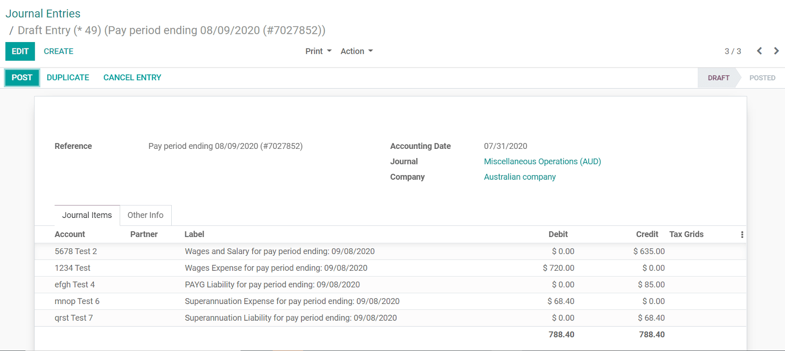

# Australia

## Employment Hero Australian Payroll

The Employment Hero module synchronizes payslip accounting entries
(e.g., expenses, social charges, liabilities, taxes) from Employment
Hero to Konvergo ERP automatically. Payroll administration is still done in
Employment Hero. We only record the journal entries in Konvergo ERP.

> [!IMPORTANT]
> KeyPay was rebranded as **Employment Hero** in March 2023.

### Configuration

1.  `Activate <general/install>` the
    `Employment Hero Australian Payroll` module (technical name:
    l10n_au_keypay).

2.  Configure the **Employment Hero API** by going to
    `Accounting --> Configuration -->
    Settings`. More fields become visible after clicking on
    `Enable Employment Hero
    Integration`.

    

    - You can find the API Key in the `My Account` section of the
      Employment Hero platform.

      

    - The **Payroll URL** is pre-filled with
      https://keypay.yourpayroll.com.au.
      *Please do not change it.*

    - You can find the **Business ID** in the Employment Hero URL.
      (i.e., 189241)

      

    - You can choose any Konvergo ERP journal to post the payslip entries.

### How does the API work?

The API syncs the journal entries from Employment Hero to Konvergo ERP and
leaves them in draft mode. The reference includes the Employment Hero
payslip entry ID in brackets for the user to easily retrieve the same
record in Employment Hero and Konvergo ERP.

By default, the synchronization happens once per week. You can fetch the
records manually by going to `Accounting --> Configuration --> Settings`
and, in the `Enable
Employment Hero Integration` option, click on `Fetch Payruns Manually`.

Employment Hero payslip entries also work based on double-entry
bookkeeping.

The accounts used by Employment Hero are defined in the section
`Payroll settings`.

For the API to work, you need to create the same accounts as the default
accounts of your Employment Hero business (**same name and same code**)
in Konvergo ERP. You also need to choose the correct account types in Konvergo ERP to
generate accurate financial reports.
