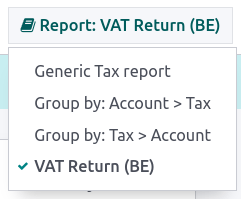
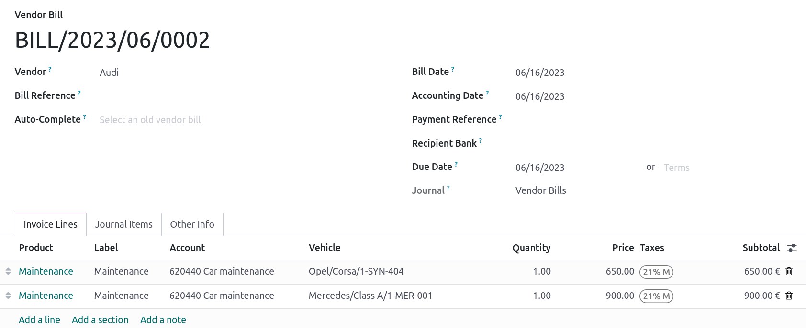
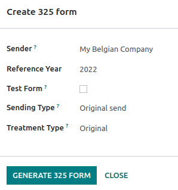
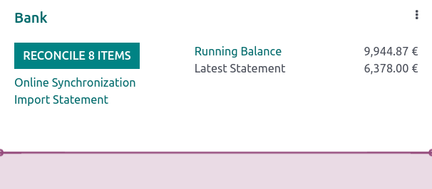
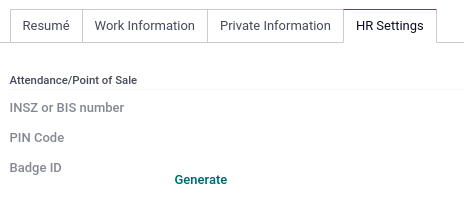

# Belgium

## Configuration

`Install <general/install>` the following modules to get all the
features of the Belgian localization, following the
`IFRS(International Financial Reporting Standards)` rules.

| Name                                         | Technical name                                             | Description                                                            |
|----------------------------------------------|------------------------------------------------------------|------------------------------------------------------------------------|
| `Belgium - Accounting`                       | l10n_be                     | Default `fiscal localization package <fiscal_localizations/packages>`. |
| `Belgium - Accounting Reports`               | l10n_be_reports             | Access to specific accounting reports for Belgium.                     |
| `Belgium - Accounting Reports (post wizard)` | l10n_be_reports_post_wizard | Enables the VAT wizard when posting a tax return journal entry.        |
| `Belgium - Import Bank CODA Statements`      | l10n_be_coda                | Import CODA bank statements.                                           |
| `Belgium - Import SODA files`                | l10n_be_soda                | Import SODA files.                                                     |
| `Belgium - Disallowed Expenses Data`         | l10n_be_disallowed_expenses | Access to the use of disallowed expenses features.                     |
| `Belgium - Payroll`                          | l10n_be_hr_payroll          | Access to the basic payroll features for Belgium.                      |
| `Belgium - Payroll with Accounting`          | l10n_be_hr_payroll_account  | Integration of accounting data with payroll.                           |
| `Belgium - Payroll - Dimona`                 | l10n_be_hr_payroll_dimona   | Access to Dimona features for payroll.                                 |
| `Belgium - Payroll - Fleet`                  | l10n_be_hr_payroll_fleet    | Fleet features for payroll.                                            |
| `Salary Configurator (Belgium)`              | l10n_be_hr_contract_salary  | Access to the salary configurator feature.                             |

## Chart of accounts

You can reach the `Chart of accounts` by going to `Accounting -->
Configuration --> Accounting: Chart of Accounts`.

The Belgian chart of accounts includes pre-configured accounts as
described in the `PCMN(Plan
Comptable Minimum Normalisé)`. To add a new account, click `New`. A new
line appears. Fill it in, click `Save`, and then `Setup` to configure it
further.

`../accounting/get_started/chart_of_accounts`

## Taxes

Default Belgian taxes are created automatically when the
`Belgium - Accounting` and the `Belgium - Accounting Reports` modules
are installed. Each tax impacts the Belgian `Tax Report`, available by
going to `Accounting --> Reporting -->
Statements Reports: Tax Report`.

In Belgium, the standard VAT rate is **21%**, but there are lower rates
for some categories of goods and services. An intermediate rate of
**12%** is applied on social housing and food served in restaurants,
while a reduced rate of **6%** applies to most basic goods, such as
food, water supply, books, and medicine. A **0%** rate applies to some
exceptional goods and services, such as some daily and weekly
publications, as well as recycled goods.

### Non-deductible taxes

In Belgium, some taxes are not fully deductible, such as taxes on the
maintenance of cars. This means a part of these taxes is considered as
an expense.

In Konvergo ERP, you can configure non-deductible taxes by creating tax rules
for these taxes and linking them to the corresponding accounts. This
way, the system automatically calculates the taxes and allocates them to
the appropriate accounts.

To configure a new non-deductible tax, go to
`Accounting --> Configuration -->
Accounting: Taxes`, and click `New`:

1.  `Add a line` and select `Base` in the `Based On` column;
2.  `Add a line`, then select `on tax` in the `Based on` column and
    enter the **non-deductible** percentage in the `%` column;
3.  On the `of tax` line, select the `Tax Grid(s)` related to your tax;
4.  `Add a line` with the **deductible** percentage in the `%` column;
5.  Set `of tax` in `Based On`;
6.  Select `411000 VAT recoverable` as account, and select the related
    tax grid.

Once you have created a non-deductible tax, you can apply it to your
transactions by selecting the appropriate tax during the encoding of
bills and credit notes. The system automatically calculates the tax
amount and allocates it to the corresponding accounts based on the tax
rules configured.

With the Belgian localization, the **21% car** tax is created by default
(50% non-deductible).

\- `Taxes <../accounting/taxes>` - `../accounting/reporting/tax_returns`

## Reports

Here is the list of Belgian-specific reports available:

- Balance sheet;
- Profit & loss;
- Tax report;
- Partner VAT Listing;
- EC Sales List;
- Intrastat.

You can access Belgian-specific versions of reports by clicking on the
**book** icon when on a report and selecting its Belgian version:
**(BE)**.

`../accounting/reporting`

### Disallowed expenses report

**Disallowed expenses** are expenses that can be deducted from your
accounting result but not from your fiscal result.

The **disallowed expenses report** is available by going to
`Accounting --> Reporting
--> Management: Disallowed Expenses`. It allows financial results in
real-time, and periodic changes. This report is generated based on the
**disallowed expenses categories** that you can reach by going to
`Accounting --> Configuration --> Management: Disallowed Expenses
Categories`. Some categories already exist by default but do not have
any rates. Click on `Set Rates` to update a specific category.

> [!TIP]
> - You can add multiple rates for various dates. In that case, the rate
> used to calculate the expense depends on the date at which it is
> calculated, and the rate set for that date. - If you have the
> **Fleet** app installed, tick the `Car Category` box when applicable.
> This makes the vehicle mandatory while booking a vendor bill.

To link a disallowed expenses category with a specific account, go to
`Accounting -->
Configuration --> Acounting: Chart of Accounts`. Find the account you
want, and click on `Setup`. Add the `Disallowed Expense category` in the
`Disallowed
Expenses` field. From now, when an expense is created with this account,
the disallowed expense is calculated based on the rate mentioned in the
`Disallowed Expense category`.

Let's take an example reflecting **restaurant** and **car expenses**.

#### Restaurant expenses

In Belgium, 31% of **restaurant** expenses are non-deductible. Create a
new **disallowed expenses category** and set both `Related Account(s)`
and `Current Rate`.

#### Car expenses: vehicle split

In Belgium, the deductible percentage varies from car to car and,
therefore, should be indicated for each vehicle. To do so, open `Fleet`
and select a vehicle. In the `Tax
info` tab, go to the `Disallowed Expenses Rate` section and click on
`Add a
line`. Add a `Start Date` and a `%`. The amounts go in the same account
for all car expenses.

When you create a bill for car expenses, you can link each expense to a
specific car by filling the `Vehicle` column, so the right percentage is
applied.

The `vehicle split` option available in the disallowed expenses report
allows you to see the rate and disallowed amount for each car.

## Fee form 281.50 and form 325

### Fee form 281.50

Annually, a **281.50 fee form** must be reported to the fiscal
authorities. To do so, the tag 281.50
must be added on the **contact form** of the entities concerned by the
**281.50** fee. To add the tag, open `Contacts`, select the person or
company you want to create a **281.50 fee form** for, and add the
281.50 tag in the `Tags` field.

> [!NOTE]
> Make sure the **street, zip code, country**, and **VAT number** are
> also informed on the **Contact form**.

Then, depending on the nature of the expense, add the corresponding
281.50 tag on the impact accounts. To do
so, go to `Accounting --> Configuration --> Accounting: Chart of
Accounts`, and click on `Setup` to add the corresponding
281.50 tag on the impacted accounts,
i.e., `281.50 - Commissions`, depending on the nature of the expense.

### Form 325

You can create a **325 form** by going to
`Accounting --> Reporting --> Belgium:
Create 325 form`. A new page pops up: select the right options and click
`Generate 325
form`. To open an already generated **325 form**, go to
`Accounting --> Reporting -->
Belgium: Open 325 forms`.

## CODA and SODA statements

### CODA

**CODA** is an electronic XML format used to import Belgian bank
statements. You can download CODA files from your bank and import them
directly into Konvergo ERP by clicking `Import Statement` from your `Bank`
journal on your dashboard.

> [!NOTE]
> The `Belgium - Import Bank CODA Statements` module is installed by
> default when the `Belgium - Accounting` and the
> `Belgium - Accounting Reports` modules are installed.

`Import bank statements files <transactions/import>`

### SODA

**SODA** is an electronic XML format used to import accounting entries
related to salaries. SODA files can be imported into the journal you use
to record salaries by going to your Accounting **dashboard** and
clicking `Upload` in the related journal card form.

Once your **SODA** files are imported, the entries are created
automatically in your 'salary' journal.

## Electronic invoicing

Konvergo ERP supports the **E-FFF** and **Peppol BIS Billing 3.0 (UBL)**
electronic invoicing formats. To enable them, go to
`Accounting --> Configuration --> Journals --> Customer Invoices
--> Advanced Settings --> Electronic Invoicing`, and tick `E-FFF (BE)`
and `Peppol BIS Billing 3.0`.

`../accounting/customer_invoices/electronic_invoicing`

## Cash discount

In Belgium, if an early payment discount is offered on an invoice, the
tax is calculated based on the discounted total amount, whether the
customer benefits from the discount or not.

To apply the right tax amount and report it correctly in your VAT
return, set the tax reduction as `Always (upon invoice)`.

`../accounting/customer_invoices/cash_discounts`

## Fiscal certification: POS restaurant

In Belgium, the owner of a cooking business such as a restaurant or food
truck is required by law to use a government-certified **Cash Register
System** for their receipts. This applies if their yearly earnings
(excluding VAT, drinks, and take-away food) exceed 25,000 euros.

This government-certified system entails the use of a
`certified POS system
<belgium/certified-pos>`, along with a device called a
`Fiscal Data Module <belgium/fdm>` (or **black box**) and a
`VAT Signing Card <belgium/vat>`.

> [!IMPORTANT]
> Do not forget to register as *foodservice industry manager* on the
> [Federal Public Service Finance registration
> form](https://www.systemedecaisseenregistreuse.be/fr/enregistrement).

### Certified POS system

The Konvergo ERP POS system is certified for the major versions of databases
hosted on **Konvergo ERP Online** and **Konvergo ERP.sh**. Please refer to the following
table to ensure that your POS system is certified.

|           | Konvergo ERP Online   | Konvergo ERP.sh       | On-Premise    |
|-----------|---------------|---------------|---------------|
| Konvergo ERP 16.0 | Certified     | Certified     | Not certified |
| Konvergo ERP 15.2 | Not certified | Not certified | Not certified |
| Konvergo ERP 15.0 | Certified     | Certified     | Not certified |
| Konvergo ERP 14.0 | Certified     | Certified     | Not certified |

`/administration/supported_versions`

A [certified POS
system](https://www.systemedecaisseenregistreuse.be/systemes-certifies)
must adhere to rigorous government regulations, which means it operates
differently from a non-certified POS.

- On a certified POS, you cannot:
  - Set up and use the **global discounts** feature (the
    pos_discount module is blacklisted
    and cannot be activated).
  - Set up and use the **loyalty programs** feature (the
    pos_loyalty module is blacklisted and
    cannot be activated).
  - Reprint receipts (the pos_reprint
    module is blacklisted and cannot be activated).
  - Modify prices in order lines.
  - Modify or delete order lines in POS orders.
  - Sell products without a valid VAT number.
  - Use a POS that is not connected to an IoT box.
- The `cash rounding <../../sales/point_of_sale/pricing/cash_rounding>`
  feature must be activated and set to a `Rounding Precision` of
  0,05 and a `Rounding Method` set as
  `Half-Up`.
- Taxes must be set as included in the price. To set it up, go to
  `Point of Sale -->
  Configuration --> Settings`, and from the `Accounting` section, open
  the `Default Sales Tax` form by clicking the arrow next to the default
  sales tax field. There, click `Advanced Options` and enable
  `Included in Price`.
- At the start of a POS session, users must click `Work in` to clock in.
  Doing so allows the registration of POS orders. If users are not
  clocked in, they cannot make POS orders. Likewise, they must click
  `Work Out` to clock out at the end of the session.

> [!WARNING]
> If you configure a POS to work with a `FDM (Fiscal Data Module)`, you
> cannot use it again without it.

### Fiscal Data Module (FDM)

An FDM, or **black box**, is a government-certified device that works
together with the Point of Sale application and saves your POS orders
information. Concretely, a **hash** (`unique code`) is generated for
each POS order and added to its receipt. This allows the government to
verify that all revenue is declared.

> [!WARNING]
> Only the FDM from **Boîtenoire.be** with the [FDM certificate number
> BMC04](https://www.systemedecaisseenregistreuse.be/fr/systemes-certifies#FDM%20certifiés)
> is supported by Konvergo ERP. [Contact the manufacturer (GCV
> BMC)](https://www.boîtenoire.be/contact) to order one.

#### Configuration

Before setting up your database to work with an FDM, ensure you have the
following hardware:

- a **Boîtenoire.be** (certificate number BMC04) FDM;
- an RS-232 serial null modem cable per FDM;
- an RS-232 serial-to-USB adapter per FDM;
- an `IoT Box <belgium/iotbox>` (one IoT box per FDM); and
- a receipt printer.

##### Black box module

As a pre-requisite, `activate <general/install>` the
Belgian Registered Cash Register module
(technical name: pos_blackbox_be).

Once the module is activated, add your VAT number to your company
information. To set it up, go to
`Settings --> Companies --> Update Info`, and fill in the `VAT` field.
Then, enter a national registration number for every staff member who
operates the POS system. To do so, go to the `Employees` app and open an
employee form. There, go to `HR
settings tab --> Attendance/Point of Sale`, and fill in the
`INSZ or BIS number` field.

> [!TIP]
> To input your information, click on your avatar, go to
> `My Profile --> Preference
> tab`, and enter your INSZ or BIS number in the designated field.

> [!WARNING]
> You must configure the `FDM (Fiscal Data Module)` directly in the
> production database. Utilizing it in a testing environment may result
> in incorrect data being stored within the FDM.

##### IoT Box

In order to use an `FDM (Fiscal Data Module)`, you need a registered IoT
Box. To register your IoT box, you must contact us through our [support
contact form](https://www.odoo.com/help) and provide the following
information:

- your VAT number;
- your company's name, address, and legal structure; and
- the Mac address of your IoT Box.

Once your IoT box is certified,
`connect <../../general/iot/config/connect>` it to your database. To
verify that the IoT Box recognizes the FDM, go to the IoT homepage and
scroll down the `IOT Device` section, which should display the FDM.

Then, add the IoT to your POS. To do so, go to
`Point of Sale --> Configuration -->
Point of Sale`, select your POS, scroll down to the `Connected Device`
section, and enable `IoT Box`. Lastly, add the FMD in the
`Fiscal Data Module` field.

> [!NOTE]
> To be able to use an FDM, you must at least connect one
> `Receipt Printer`.

### VAT signing card

When you open a POS session and make your initial transaction, you are
prompted to enter the PIN provided with your `VSC (VAT signing card)`.
The card is delivered by the `FPS (Service
Public Federal Finances)` upon
[registration](https://www.systemedecaisseenregistreuse.be/fr/enregistrement).
