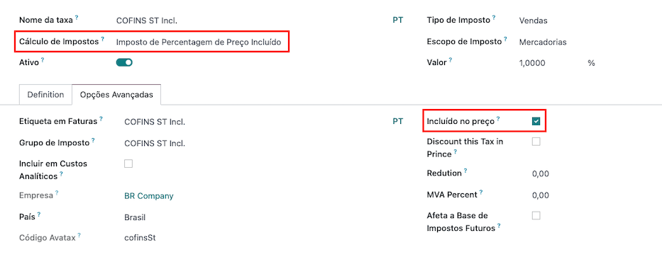
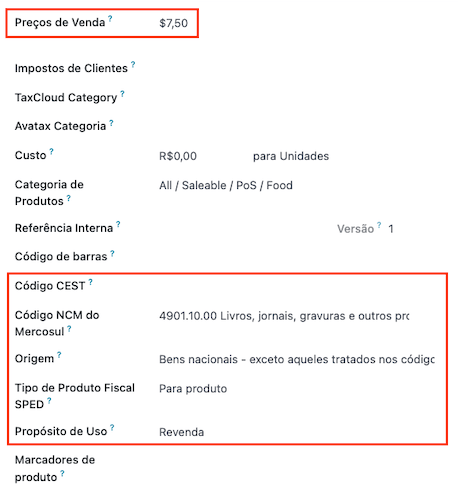

# Brazil

## Introduction

With the Brazilian localization you can automatically compute sales
taxes for goods using AvaTax (Avalara) through API calls, also configure
taxes for services.

For the goods tax computation part, you need to configure the
`contacts <brazil/contacts>`, `company <brazil/company>`,
`products <brazil/products>`, and `create an account in
Avatax <brazil/avatax-account>` from the Konvergo ERP general settings.

For the services taxes, you can create and configure them from Konvergo ERP
directly without computing them with AvaTax.

The localization also includes taxes and a chart of accounts template
that can be modified if needed.

## Configuration

### Modules installation

`Install <general/install>` the following modules to get all the
features of the Brazilian localization:

| Name                          | Technical name                                     | Description                                                                                                                                                                                                                                                                                                                                                        |
|-------------------------------|----------------------------------------------------|--------------------------------------------------------------------------------------------------------------------------------------------------------------------------------------------------------------------------------------------------------------------------------------------------------------------------------------------------------------------|
| `Brazilian - Accounting`      | l10n_br             | Default `fiscal localization package <fiscal_localizations/packages>` - adds accounting characteristics for the Brazilian localization, which represent the minimum configuration required for a company to operate in Brazil. The module's installation automatically loads: the chart of accounts, taxes, and required fields to properly configure the contact. |
| `Brazil - Accounting Reports` | l10n_br_reports     | Adds a simple tax report that helps check the tax amount per tax group in a given period of time. Also adds the P&L and BS adapted for the Brazilian market.                                                                                                                                                                                                       |
| `Avatax Brazil`               | l10n_br_avatax      | Add Brazilian tax calculation via Avatax and all necessary fields needed to configure Konvergo ERP in order to properly use Avatax and send the needed fiscal information to retrieve the correct taxes.                                                                                                                                                                   |
| `Avatax for SOs in Brazil`    | l10n_br_avatax_sale | Same as the l10n_br_avatax module with the extension to the sales order module.                                                                                                                                                                                                                                                     |

### Configure your company

To configure your company information, go to the `Contacts` app and
search the name given to your company.

1.  Select the `Company` option at the top of the page. Then, configure
    the following fields:

    - `Name`
    - `Address` (add `City`, `State`, `Zip Code`, `Country`)
    - Tax ID (`CNPJ`)
    - `IE` (State Registration)
    - `IM` (Municipal Registration)
    - `SUFRAMA code` (Superintendence of the Manaus Free Trade Zone -
      add if applicable)
    - `Phone`
    - `Email`

    

2.  Configure the `Fiscal Information` within the `Sales and Purchase`
    tab:

    - Add the `Fiscal Position` for
      `Avatax Brazil <brazil/fiscal-positions>`.
    - `Tax Regime` (Federal Tax Regime)
    - `ICMS Taxpayer Type` (indicates ICMS regime, Exempt status, or
      Non-Taxpayer.)
    - `Main Activity Sector`

    

3.  Finally, upload a company logo and save the contact.

> [!NOTE]
> If you are a simplified regime, you need to configure the ICMS rate
> under
> `Accounting --> Configuration --> Settings --> Taxes --> Avatax Brazil`.

### Configure AvaTax integration

Avalara AvaTax is a tax calculation provider that can be integrated in
Konvergo ERP to automatically compute taxes by taking into account the company,
contact (customer), product, and transaction information to retrieve the
correct tax to be used.

Konvergo ERP is a certified partner of Avalara Brazil, which means that Avalara
experts reviewed workflows covered within the scope of the integration.

Using this integration requires `In-App-Purchases (IAPs)
</applications/essentials/in_app_purchase>` to compute taxes. Every time
you compute taxes, an API call is made, using credits from your
`IAP (In-app-purchase)` credits balance.

#### Credential configuration

To activate AvaTax in Konvergo ERP, you need to create an account. To do so, go
to `Accounting --> Configuration --> Settings --> Taxes`, and, in the
`AvaTax
Brazil` section, add the email address you want to use to log in to the
AvaTax portal, and click on `Create account`. This email is used as the
administrator email address in AvaTax.

After you create the account from Konvergo ERP, you need to go to the Avalara
Portal to set up your password:

1.  Access the [Avalara
    portal](https://portal.avalarabrasil.com.br/Login)
2.  Click on `Meu primeiro acesso`
3.  Add the email address you used in Konvergo ERP to create the Avalara/Avatax
    account, and then click `Solicitar Senha`
4.  You will receive an email with a token and a link to create your
    password. Click on this link and copy-paste the token to allocate
    your desired password.

> [!WARNING]
> If you intend first to try the integration on a testing or sandbox
> database, using an alternate email address is recommended, as you
> won't be able to re-use the same email address on your production
> database.

> [!TIP]
> You can start using AvaTax in Konvergo ERP without creating a password and
> accessing the Avalara Portal; for Konvergo ERP, the only requirement to start
> using the Avalara Tax Computation Engine is to create an account from
> the settings page.

> [!NOTE]
> You can transfer API credentials. Use this only when you have already
> created an account in another Konvergo ERP instance and wish to reuse it.

### Configure master data

#### Chart of accounts

The
`chart of accounts </applications/finance/accounting/get_started/chart_of_accounts>`
is installed by default as part of the data set included in the
localization module. The accounts are mapped automatically in their
corresponding taxes, and the default account payable and account
receivable fields.

> [!NOTE]
> The chart of accounts for Brazil is based on the SPED CoA, which gives
> a baseline of the accounts needed in Brazil.
>
> You can add or delete accounts according to the company's needs.

#### Taxes

Taxes are automatically created when installing the Brazilian
localization. Taxes are already configured, and some of them are used by
Avalara when computing taxes on the sales order or invoice.

Taxes can be edited, or more taxes can be added. For example, some taxes
used for services need to be manually added and configured, as the rate
may differ depending on the city where you are offering the service.

> [!IMPORTANT]
> Taxes attached to services are not computed by AvaTax. Only goods
> taxes are computed.

When configuring a tax used for a service that is included in the final
price (when the tax is not added or subtracted on top of the product
price), set the `Tax Computation` to `Percentage of Price Tax Included`,
and, on the `Advanced Options` tab, check the `Included in Price`
option.

For more information on configuring taxes to fit your needs better,
please go to the `taxes
functional documentation </applications/finance/accounting/taxes>`.

> [!WARNING]
> Do not delete taxes, as they are used for the AvaTax tax computation.
> If deleted, Konvergo ERP creates them again when used in an `SO (Sales order)`
> or invoice and computing taxes with AvaTax, but the account used to
> register the tax needs to be re-configured in the tax's `Definition`
> tab, under the `Distribution for invoices` and
> `Distribution for refunds` sections.

#### Products

To use the AvaTax integration on sale orders and invoices, first specify
the following information on the product:

- `CEST Code` (Code for products subject to ICMS tax substitution)
- `Mercosul NCM Code` (Mercosur Common Nomenclature Product Code)
- `Source of Origin` (Indicates the origin of the product, which can be
  foreign or domestic, among other possible options depending on the
  specific use case)
- `SPED Fiscal Product Type` (Fiscal product type according to SPED list
  table)
- `Purpose of Use` (Specify the intended purpose of use for this
  product)

> [!NOTE]
> Konvergo ERP automatically creates three products to be used for
> transportation costs associated with sales. These are named
> Freight,
> Insurance, and
> Other Costs. They are already
> configured, if more need to be created, duplicate and use the same
> configuration (configuration needed: `Product Type`
> Service, `Transportation Cost Type`
> Insurance,
> Freight, or
> Other Costs)

#### Contacts

Before using the integration, specify the following information on the
contact:

1.  General information about the contact:

    - Select the `Company` option for a contact with a tax ID (CNPJ), or
      check `Individual` for a contact with a CPF.
    - `Name`
    - `Address`: `Zip Code` is a required field to compute taxes
      properly.
    - `Tax ID` or `CPF`: Use CPF for individuals and Tax ID (CNPJ) for
      companies
    - `IE`: state tax identification number
    - `IM`: municipa tax identification number
    - `SUFRAMA code`: SUFRAMA registration number
    - `Phone`
    - `Email`

    

    > [!NOTE]
    > The `CPF`, `IE`, `IM`, and `SUFRAMA code` fields are are hidden
    > until the `Country` is set to
    > Brazil.

2.  Fiscal information about the contact under the `Sales & Purchase`
    tab:

    - `Fiscal Position`: add the AvaTax fiscal position to automatically
      compute taxes on sale orders and invoices automatically.
    - `Tax Regime`: federal tax regime
    - `ICMS Taxpayer Type`: taxpayer type determines if the contact is
      within the ICMS regime, if it is exempt, or if it is a
      non-taxpayer.
    - `Main Activity Sector`: list of main activity sectors of the
      contact

    

#### Fiscal positions

To compute taxes on sale orders and invoices, it is necessary to have a
`Fiscal Position` with the `Detect Automatically` and the
`Use AvaTax API` options enabled.

The `Fiscal Position` can be configured on the contact or selected when
creating a sales order or an invoice.

## Workflows

This section provides an overview of the actions that trigger API calls
for tax computation.

> [!WARNING]
> Please note that each API call incurs a cost. Be mindful of the
> actions that trigger these calls to manage costs effectively.

### Tax calculations on quotation / sales orders

Trigger an API call to calculate taxes on a quotation or sales order
automatically with AvaTax in any of the following ways:

- **Quotation confirmation**  
  Confirm a quotation into a sales order.

- **Manual trigger**  
  Click on `Compute Taxes Using Avatax`.

- **Preview**  
  Click on the `Preview` button.

- **Email a quotation / sales order**  
  Send a quotation or sales order to a customer via email.

- **Online quotation access**  
  When a customer accesses the quotation online (via the portal view),
  the API call is triggered.

### Tax calculations on invoices

Trigger an API call to calculate taxes on a customer invoice
automatically with AvaTax any of the following ways:

- **Manual trigger**  
  Click on `Compute Taxes Using AvaTax`.

- **Preview**  
  Click on the `Preview` button.

- **Online invoice access**  
  When a customer accesses the invoice online (via the portal view), the
  API call is triggered.

> [!NOTE]
> The `Fiscal Position` must be set to Automatic
> Tax Mapping (Avalara Brazil) for any of these actions to
> compute taxes automatically.

`Fiscal positions (tax and account mapping)
</applications/finance/accounting/taxes/fiscal_positions>`

