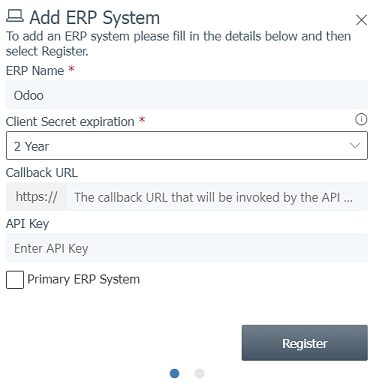
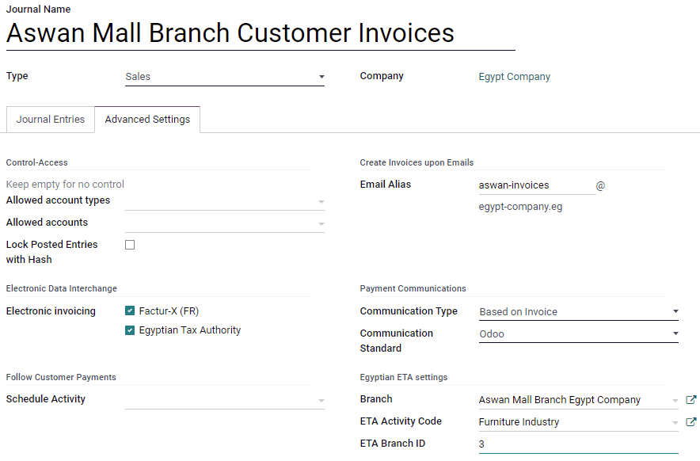
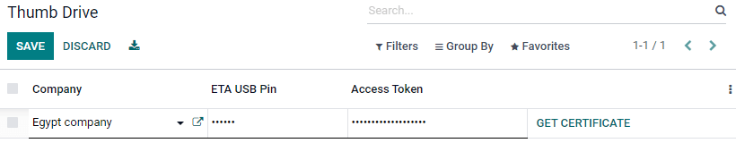

# Egypt

## Installation

`Install <general/install>` the following modules to get all the
features of the Egyptian localization:

| Name                             | Technical name    | Description                                                                |
|----------------------------------|-------------------|----------------------------------------------------------------------------|
| `Egypt - Accounting`             | `l10n_eg`         | Default `fiscal localization package <fiscal_localizations/packages>`      |
| `Egyptian E-invoice Integration` | `l10n_eg_edi_eta` | `Egyptian Tax Authority (ETA) e-invoicing integration <egypt/e-invoicing>` |

## Egyptian e-invoicing

Odoo is compliant with the **Egyptian Tax Authority (ETA) e-invoicing**
requirements.

> [!IMPORTANT]
> Egyptian e-invoicing is available from Odoo 15.0. If needed, `upgrade
> </administration/upgrade>` your database.

\- [Video: Egypt
E-invoicing](https://www.youtube.com/watch?v=NXuBPLR4pVw) -
`/administration/upgrade`

### Register Odoo on your ETA portal

You must register your Odoo ERP system on your ETA portal to get your
API credentials. You need these codes to
`configure your Odoo Accounting app <egypt/e-invoicing-configuration>`.

Access your company profile on the ETA portal by clicking on
`View Taxpayer Profile`.

Next, go to the `Representatives` section and then click on
`Register ERP`. Fill out the `ERP Name` (e.g., `Odoo`) and leave the
other fields empty.

Once successfully registered, the website displays your API credentials:

- Client ID
- Client Secret 1
- Client Secret 2

> [!NOTE]
> - ETA should give you a username and a password to access their online
> portal. - Ask ETA to provide you with preproduction portal access as
> well. - These codes are confidential and should be stored safely.

### Configuration on Odoo

To connect your Odoo database to your ETA portal account, go to
`Accounting -->
Configuration --> Settings --> ETA E-Invoicing Settings`, and set the
`ETA Client ID` and `ETA Secret` that you retrieved when you
`registered Odoo on your ETA portal
<egypt/e-invoicing-eta-portal>`. Set an invoicing threshold if needed.

> [!IMPORTANT]
> - **Test on your preproduction portal** before starting to issue real
> invoices on the production ETA portal. - **Credentials** for
> preproduction and production environments are different. Make sure to
> update them on Odoo when you move from one environment to another. -
> If not done yet, fill out your company details with your company's
> full address, country, and Tax ID.

#### ETA codes

E-invoicing works with a set of codes provided by the ETA. You can use
the [ETA documentation](https://sdk.preprod.invoicing.eta.gov.eg/codes/)
to code your business attributes.

Most of these codes are handled automatically by Odoo, provided that
your `branches
<egypt/e-invoicing-branches>`,
`customers <egypt/e-invoicing-customers>`, and `products
<egypt/e-invoicing-products>` are correctly configured.

- Company Information:
  - Company Tax ID

  - Branch ID  
    If you have only one branch, use `0` as the branch code.

  - Activity type Code
- Other Information:
  - Product Codes  
    Your company's products should be coded and matched with their
    **GS1** or **EGS** codes.

  - Tax Codes  
    Most of the taxes codes are already configured on Odoo in the
    `ETA Code (Egypt)` field. We advise you to make sure these codes
    match your company's taxes.

\- [Egyptian eInvoicing & eReceipt SDK - Code
Tables](https://sdk.preprod.invoicing.eta.gov.eg/codes/) -
`../accounting/taxes`

#### Branches

Create a contact and a journal for each branch of your company and
configure its ETA settings.

To do so, go to `Accounting --> Configuration --> Journals`, then click
on `Create`.

Name the journal according to your company's branch and set the `Type`
as `Sales`. Next, open the `Advanced Settings` tab and fill out the
`Egyptian ETA settings` section:

- In the `Branch` field, select the branch's contact or create it.
- Set the `ETA Activity Code`.
- Set the `ETA Branch ID` (use `0` if you have one branch only).

> [!IMPORTANT]
> The contact selected in the `Branch` field must be set as a `Company`
> (**not** as an `Individual`), and the `Address` and `Tax ID` fields
> must be filled out.

#### Customers

Make sure your customers' contact forms are correctly filled out so your
e-invoices are valid:

- contact type: `Individual`: or `Company`:
- `Country`:
- `Tax ID`: Tax ID or Company registry for companies. National ID for
  individuals.

> [!NOTE]
> You can edit your customers' contact forms by going to
> `Accounting --> Customers
> --> Customers`.

#### Products

Make sure your products are correctly configured so your e-invoices are
valid:

- `Product Type`: storable products, consumables, or services.
- `Unit of Measure`: if you also use Odoo Inventory and have enabled
  `Units of
  Measure <../../inventory_and_mrp/inventory/product_management/product_replenishment/uom>`.
- `Barcode`: **GS1** or **EGS** barcode
- `ETA Item code` (under the `Accounting` tab): if the barcode doesn't
  match your ETA item code.

> [!NOTE]
> You can edit your products by going to
> `Accounting --> Customers --> Products`.

### USB authentication

Each person who needs to electronically sign invoices needs a specific
USB key to authenticate and send invoices to the ETA portal through an
ERP.

> [!NOTE]
> You can contact the `ETA (Egyptian Tax Authority)` or [Egypt
> Trust](https://www.egypttrust.com/) to get these USB keys.

#### Install Odoo as a local proxy on your computer

An Odoo local server works as a bridge between your computer and your
Odoo database hosted online.

Download the Odoo Community installer from the page
<https://www.odoo.com/page/download> and start the installation on your
computer.

Select `Local Proxy Mode` as the type of install.

> [!NOTE]
> This installation of Odoo only works as a server and does not install
> any Odoo apps on your computer.

Once the installation is complete, the installer displays your **access
token** for the Odoo Local Proxy. Copy the token and save it in a safe
place for later use.

\- [Odoo: Download Odoo](https://www.odoo.com/page/download) -
`../../../administration/on_premise`

#### Configure the USB key

Once the local proxy server is installed on your computer, you can link
it with your Odoo database.

1.  Go to `Accounting --> Configurations --> Thumb Drive` and click on
    `Create`.
2.  Input a `Company` name, the `ETA USB Pin` given to you by your USB
    key provider, and the `Access Token` provided at the end of the
    `local proxy
    installation <egypt/e-invoicing-local-proxy>`, then click on `Save`.
3.  Click on `Get certificate`.

