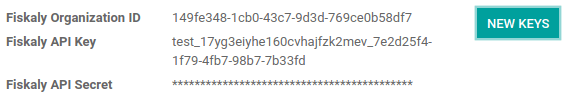

# Germany

## German Chart of Accounts

The chart of accounts SKR03 and SKR04 are both supported in Konvergo ERP. You
can choose the one you want by going in `Accounting --> Configuration`
then choose the package you want in the Fiscal Localization section.

Be careful, you can only change the accounting package as long as you
have not created any accounting entry.

> [!TIP]
> When you create a new Konvergo ERP Online database, the SKR03 is installed by
> default.

## German Accounting Reports

Here is the list of German-specific reports available on Konvergo ERP
Enterprise:

- Balance Sheet
- Profit & Loss
- Tax Report (Umsatzsteuervoranmeldung)
- Partner VAT Intra

## Export from Konvergo ERP to Datev

It is possible to export your accounting entries from Konvergo ERP to Datev. To
be able to use this feature, the german accounting localization needs to
be installed on your Konvergo ERP Enterprise database. Then you can go in
`Accounting --> Reporting --> General Ledger` then click on the **Export
Datev (csv)** button.

## Point of Sale in Germany: Technical Security System

The **Kassensicherungsverordnung** (The Act on Protection against
Manipulation of Digital Records) requires that electronic record-keeping
systems - including the `point of sale
</applications/sales/point_of_sale>` systems - must be equipped with a
**Technical Security System** (also called **TSS** or **TSE**).

Konvergo ERP offers a service that is compliant with the help of
[fiskaly](https://fiskaly.com), a *cloud-based solution*.

> [!IMPORTANT]
> Since this solution is cloud-based, a working internet connection is
> required.

> [!NOTE]
> The only VAT rates allowed are given by fiskaly. You can check these
> rates by consulting: [fiskaly DSFinV-K API: VAT
> Definition](https://developer.fiskaly.com/api/dsfinvk/v0/#tag/VAT-Definition).

### Configuration

#### Modules installation

1.  If your database was created before June 2021,
    `upgrade <general/upgrade>` your **Point of Sale** app
    (point_of_sale) and the
    **Restaurant** module
    (pos_restaurant).

2.  `Install <general/install>` the **Germany - Certification for Point
    of Sale** (l10n_de_pos_cert) and
    **Germany - Certification for Point of Sale of type restaurant**
    (l10n_de_pos_res_cert) modules.

    > [!TIP]
    > If these modules are not listed,
    > `update the app list <general/install>`.

#### Register your company at the financial authority

To register your company, go to
`Settings --> General Settings --> Companies -->
Update Info`, fill out the following fields and *Save*.

- **Company name**
- Valid **address**
- **VAT** number
- **St.-Nr** (Steuernummer): this number is assigned by the tax office
  to every taxable natural or legal person. (e.g.,
  2893081508152)
- **W-IdNr** (Wirtschafts-Identifikationsnummer): this number is used as
  a permanent identification number for economically active persons.

You can then **register your company through fiskaly** by opening the
*fiskaly* tab and clicking on the *fiskaly Registration* button.

> [!TIP]
> If you do not see the *fiskaly Registration* button, make sure that
> you *saved* your company details and are not in *editing mode*
> anymore.

Once the registration has been finalized, new fields appear:

- **fiskaly organization ID** refers to the ID of your company at the
  fiskaly side.
- **fiskaly API key** and **secret** are the credentials the system uses
  to access the services offered by fiskaly.

> [!NOTE]
> It is possible to request new credentials if there is any issue with
> the current ones.

#### Create and link a Technical Security System to your PoS

To use your point of sale in Germany, you first have to create a
`TSS (Technical Security
System)` for it.

To do so, go to `Point of Sale --> Configuration --> Point of Sale`,
open the point of sale you want to edit, then check the box next to
**Create TSS** and *Save*.

Once the creation of the TSS is successful, you can find your **TSS ID**
and **Client ID** under the *fiskaly API* section.

- **TSS ID** refers to the ID of your TSS at fiskaly's side.
- **Client ID** refers to your PoS but at fiskaly's side.

### DSFinV-K

Whenever you close a PoS session, the orders' details are sent to the
`DSFinV-K (Digitale
Schnittstelle der Finanzverwaltung für Kassensysteme)` service of
fiskaly.

In case of an audit, you can export the data sent to DSFinV-K by going
to `Point of
Sale --> Orders --> DSFinV-k exports`.

These fields are mandatory:

- **Name**
- **Start Datetime** (export data with dates larger than or equal to the
  given start date)
- **End Datetime** (export data with dates smaller than or equal to the
  given end date)

Leave the **Point of Sale** field blank if you want to export the data
of all your points of sale. Specify a Point of Sale if you want to
export this specific PoS' data only.

The creation of a DSFinV-K export triggers on export at fiskaly's side.

As you can see, the **State** is *Pending*. This means that the export
has been successfully triggered and is being processed. You have to
click on *Refresh State* to check if it is ready.

## German Tax Accounting Standards: Konvergo ERP's guide to GoBD Compliance

**GoBD** stands for [Grundsätze zur ordnungsmäßigen Führung und
Aufbewahrung von Büchern, Aufzeichnungen und Unterlagen in
elektronischer Form sowie zum
Datenzugriff](https://www.bundesfinanzministerium.de/Content/DE/Downloads/BMF_Schreiben/Weitere_Steuerthemen/Abgabenordnung/2019-11-28-GoBD.pdf).
In short, it is a **guideline for the proper management and storage of
books, records, and documents in electronic form, as well as for data
access**, that is relevant for the German tax authority, tax
declaration, and balance sheet.

These principles have been written and published by the Federal Ministry
of Finance (BMF) in November 2014. Since January 2015, **they have
become the norm** and replace previously accepted practices linked to
computer-based accounting. Several changes have been made by the BMF in
2019 and January 2020 to specify some of the content and due to the
development of digital solutions (cloud hosting, paperless companies,
etc.).

> [!IMPORTANT]
> Konvergo ERP gives you **the means to be compliant with GoBD**.

### What do you need to know about GoBD when relying on accounting software?

> [!NOTE]
> If you can, the best way to understand GoBD is to Read the [Official
> GoBD
> text](https://www.bundesfinanzministerium.de/Content/DE/Downloads/BMF_Schreiben/Weitere_Steuerthemen/Abgabenordnung/2019-11-28-GoBD.pdf).
> It is a bit long but quite readable for non-experts. But in short,
> here is what to expect:

The **GoBD is binding for companies that have to present accounts, which
includes SMEs, freelancers, and entrepreneurs, to the financial
authorities**. As such, **the taxpayer himself is the sole responsible**
for the complete and exhaustive keeping of fiscal-relevant data
(above-mentioned financial and related data).

Apart from software requirements, the user is required to ensure
Internal control systems (*in accordance with sec. 146 of the Fiscal
Code*):

- Access rights control;
- Segregation of Duties, Functional separating;
- Entry controls (error notifications, plausibility checks);
- Reconciliation checks at data entry;
- Processing controls;
- Measures to prevent intentional or unintentional manipulation of
  software, data, or documents.

The user must distribute tasks within its organization to the relevant
positions (*control*) and verify that the tasks are properly and
completely performed (*supervision*). The result of these controls must
be recorded (*documentation*), and should errors be found during these
controls, appropriate measures to correct the situation should be put
into place (*prevention*).

### What about data security?

**The taxpayer must secure the system against any data loss due to
deletion, removal, or theft of any data**. If the entries are not
sufficiently secured, the bookkeeping will be regarded as not in
accordance with the GoBD guidelines.

Once bookings have been finally posted, they can no longer be changed or
deleted via the application.

- If Konvergo ERP is used in the cloud, regular backups are part of the Konvergo ERP
  Online service. In addition, regular backups can be downloaded and
  backed up on external systems.

  

  [Konvergo ERP Cloud Hosting - Service Level
  Agreement](https://www.odooo.com/cloud-sla)

  

- If the server is operated locally, it is the responsibility of the
  user to create the necessary backup infrastructure.

> [!IMPORTANT]
> In some cases, data has to be kept for ten years or more, so always
> have backups saved. It is even more important if you decide to change
> software provider.

### Responsibility of the software editor

Considering GoBD only applies between the taxpayer and the financial
authority, **the software editor can by no means be held responsible for
the accurate and compliant documentation of financial transactional data
of their users**. It can merely provide the necessary tools for the user
to respect the software related guidelines described in the GoBD.

### How can Konvergo ERP help you achieve Compliance?

The key words, when it comes to GoBD, are: **traceable, verifiable,
true, clear, and continuous**. In short, you need to have audit-proof
archiving in place and Konvergo ERP provides you with the means to achieve all
of these objectives:

1.  **Traceability and verifiability**  
    Each record in Konvergo ERP is stamped with the creator of the document, the
    creation date, the modification date, and who modified it. In
    addition, relevant fields are tracked thus it can be seen which
    value was changed by whom in the chatter of the relevant object.

2.  **Completeness**  
    All financial data must be recorded in the system, and there can be
    no gaps. Konvergo ERP ensures that there is no gap in the numbering of the
    financial transactions. It is the responsibility of the user to
    encode all financial data in the system. As most financial data in
    Konvergo ERP is generated automatically, it remains the responsibility of
    the user to encode all vendor bills and miscellaneous operations
    completely.

3.  **Accuracy**  
    Konvergo ERP ensures with the correct configuration that the correct
    accounts are used. In addition, the control mechanisms between
    purchase orders and sales orders and their respective invoices
    reflect the business reality. It is the responsibility of the user
    to scan and attach the paper-based vendor bill to the respective
    record in Konvergo ERP. *Konvergo ERP Document helps you automate this task*.

4.  **Timely booking and record-keeping**  
    As most financial data in Konvergo ERP is generated by the transactional
    objects (for example, the invoice is booked at confirmation), Konvergo ERP
    ensures out-of-the-box timely record-keeping. It is the
    responsibility of the user to encode all incoming vendor bills in a
    timely manner, as well as the miscellaneous operations.

5.  **Order**  
    Financial data stored in Konvergo ERP is per definition ordered and can be
    reordered according to most fields present in the model. A specific
    ordering is not enforced by the GoBD, but the system must ensure
    that a given financial transaction can be quickly found by a
    third-party expert. Konvergo ERP ensures this out-of-the-box.

6.  **Inalterability**  
    With the German Konvergo ERP localization, Konvergo ERP is in standard configured in
    such a way that the inalterability clause can be adhered to without
    any further customization.

### Do you need a GoBD-Export?

In the case of fiscal control, the fiscal authority can request three
levels of access to the accounting system (Z1, Z2, Z3). These levels
vary from direct access to the interface to the handover of the
financial data on a storage device.

In case of a handover of the financial data on a storage device, the
format is **not** enforced by the GoBD. It can be, for example, in XLS,
CSV, XML, Lotus 123, SAP-format, AS/400-format, or else. Konvergo ERP supports
the CSV and XLS-export of financial data out-of-the-box. The GoBD
**recommends** the export in a specific XML-based GoBD-format (see
"Ergänzende Informationen zur Datenntträgerüberlassung" §3) but it is
not binding.

### What is the role and meaning of the compliance certification?

The GoBD clearly states that due to the nature of a state of the art
accounting software, their configuration possibilities, changing nature,
and various forms of use, **no legally binding certification can be
given**, nor can the software be made liable towards a public authority.
Third-party certificates can indeed have **an informative value** for
customers to make software buying decisions but are by no means legally
binding or of any other legal value (A. 12, § 181).

A GoBD certificate states nothing more than that if you use the software
according to its guidelines, the software will not refrain you from
respecting the GoBD. These certifications are very expensive in terms of
time and cost, and their value is very relative. Thus we focus our
efforts on ensuring GoBD compliance rather than pay for a marketing tool
which does not, however, offer our customer any legal certainty.

> [!IMPORTANT]
> The BMF actually states the following in the [Official GoBD
> text](https://www.bundesfinanzministerium.de/Content/DE/Downloads/BMF_Schreiben/Weitere_Steuerthemen/Abgabenordnung/2019-11-28-GoBD.pdf):
>
> - 180\. Positive attestations on the correctness of the bookkeeping -
>   and thus on the correctness of IT-based bookkeeping systems - are
>   not issued either in the context of a tax field audit or in the
>   context of binding information.
> - 181\. "Certificates" or "attestations" from third parties can serve
>   as a decision criterion for the company when selecting a software
>   product, but develop from the in margin no. 179 is not binding on
>   the tax authorities.
>
> > [!NOTE]
> > The previous content was [automatically translated from German with
> > Google
> > Translate](https://translate.google.com/?sl=de&tl=en&text=180.%0APositivtestate%20zur%20Ordnungsm%C3%A4%C3%9Figkeit%20der%20Buchf%C3%BChrung%20-%20und%20damit%20zur%20Ordnungsm%C3%A4%C3%9Figkeit%20DV-gest%C3%BCtzter%20Buchf%C3%BChrungssysteme%20-%20werden%20weder%20im%20Rahmen%20einer%20steuerlichen%20Au%C3%9Fenpr%C3%BCfung%20noch%20im%20Rahmen%20einer%20verbindlichen%20Auskunft%20erteilt.%0A%0A181.%0A%E2%80%9EZertifikate%E2%80%9C%20oder%20%E2%80%9ETestate%E2%80%9C%20Dritter%20k%C3%B6nnen%20bei%20der%20Auswahl%20eines%20Softwareproduktes%20dem%20Unternehmen%20als%20Entscheidungskriterium%20dienen%2C%20entfalten%20jedoch%20aus%20den%20in%20Rz.%20179%20genannten%20Gr%C3%BCnden%20gegen%C3%BCber%20der%20Finanzbeh%C3%B6rde%20keine%20Bindungswirkung.%20&op=translate).

### What happens if you are not compliant?

In the event of an infringement, you can expect a fine but also a court
order demanding the implementation of specific measures.
