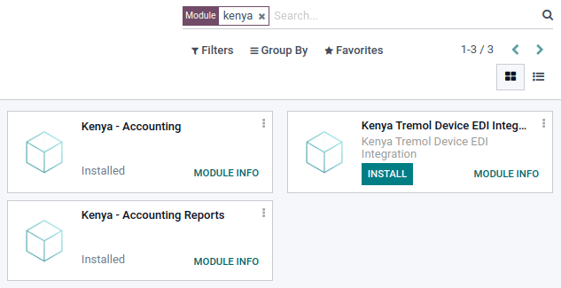
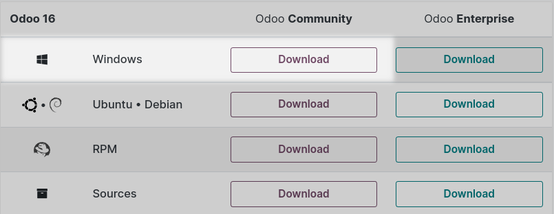

# Kenya

## Configuration

`Install <general/install>` the following modules to get all the
features of the Kenyan localization:

| Name                          | Technical name                                 | Description                                                                                                                       |
|-------------------------------|------------------------------------------------|-----------------------------------------------------------------------------------------------------------------------------------|
| `Kenyan - Accounting`         | l10n_ke         | Installing this module grants you access to the list of accounts used in the local GAAP and the list of common taxes (VAT, etc.). |
| `Kenyan - Accounting Reports` | l10n_ke_reports | Installing this module grants you access to improved accounting reports for Kenya, such as Profit and Loss and Balance Sheets.    |

You also have to install the **Kenya Tremol Device EDI Integration**
package to be able to report your taxes to the **Kenya Revenue Authority
(KRA)** using the Tremol G03 Control Unit:

| Name                                  | Technical name                                    | Description                                                                                                           |
|---------------------------------------|---------------------------------------------------|-----------------------------------------------------------------------------------------------------------------------|
| `Kenya Tremol Device EDI Integration` | l10n_ke_edi_tremol | Installing this module integrates with the Kenyan G03 Tremol control unit device to report taxes to KRA through TIMS. |

## Kenyan TIMS integration

The Kenya Revenue Authority (KRA) has decided to go digital for tax
collection through the **Tax Invoice Management System (TIMS)**. As of
December 1st, 2022, all VAT-registered persons should comply with TIMS.
The goal is to reduce VAT fraud, increase tax revenue, and increase VAT
compliance through standardization, validation, and transmission of
invoices to KRA on a real-time or near real-time basis.

All VAT-registered taxpayers should use a **compliant tax register**.
Konvergo ERP decided to develop the integration of the **Tremol G03 Control Unit
(type C)**, which can be run locally through USB. This device validates
invoices to ensure financial documents meet the new regulations and send
the validated tax invoices directly to KRA. Installing a proxy server
that provides a gateway between users and the internet is required.

### Installing the proxy server on a Windows device

Go to [odoo.com/download](https://www.odoo.com/page/download), fill out
the required information and click `Download`.

Once it is loaded on your computer, a wizard opens. You have to read and
agree with the terms of the agreement. On the next page, select the
`type of install: Konvergo ERP IoT`. Then, click `Next` and `Install`. Once
completed, click `Next`. Check the `Start Konvergo ERP` box to be redirected to
Konvergo ERP automatically, and then click `Finish`.

A new page opens, confirming your
`IoT Box <../../general/iot/config/connect>` is up and running. Connect
your physical device **Tremol G03 Control Unit (type C)** to your laptop
via USB. In the `IoT Device` section, check that your Tremol G03 Control
Unit (type C) appears, confirming the connection between the device and
your computer.

> [!NOTE]
> If the device is not detected, try to plug it in again or click on the
> `Restart` button in the top right corner.

`Connect an IoT box to your database <../../general/iot/config/connect>`

### Sending the data to KRA using the Tremol G03 Control Unit

As a pre-requisite, check out that the `Kenyan Accounting modules
<localization/kenya/configuration>` are installed on your database.
Then, go to
`Accounting --> Configuration --> Settings --> Kenya TIMS Integration section`,
and check that the `control Unit Proxy Address` matches the address of
the IoT box.

To send data to KRA, create a new invoice by going to
`Accounting Dashboard -->
Customer Invoice card` and clicking `New Invoice`. Upon confirmation of
a new invoice, the `Send invoice to Fiscal Device` button appears.
Clicking on it sends the invoice details to the device and from the
device to the government. The `CU Invoice Number` field is now completed
in your invoice, confirming the information has been sent.

The `Tremol G03 Fiscal Device` tab contains fields that are
automatically completed once the invoice is sent to the government:

- `CU QR Code`: Url from the KRA portal which reflects a QR code.
- `CU Serial Number`: reflects the serial number of the device.
- `CU Signing Date and Time`: The date and time when the invoice has
  been sent to KRA.

If you click on `Send and Print`, a .pdf of the invoice is generated.
The `Kenyan Fiscal Device Info` is mentioned on the document.

> [!NOTE]
> To verify KRA has received the invoice information, take the
> `CU Invoice Number` and enter it in the `Invoice Number Checker`
> section on [Kenya Revenue Authority
> website](https://itax.kra.go.ke/KRA-Portal). Click `Validate` and find
> the invoice details.
