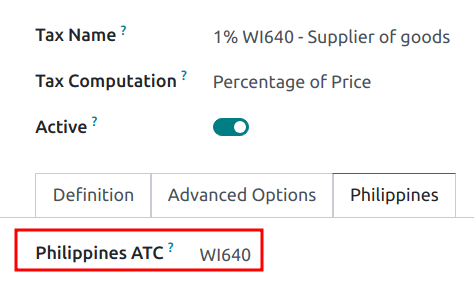

# Philippines

## Configuration

`Install <general/install>` the `🇵🇭 Philippines`
`fiscal localization package
<fiscal_localizations/packages>` to get all the default accounting
features of the Philippine localization, such as a chart of accounts,
taxes, and the BIR 2307 report. These provide a base template to get
started with using Philippine accounting.

> [!NOTE]
> - When creating a new database and selecting the
> Philippines as a country, the fiscal
> localization module **Philippines - Accounting** is automatically
> installed. - If the module is installed in an existing company, the
> **chart of accounts** and **taxes** will *not* be replaced if there
> are already posted journal entries. - The BIR 2307 report is
> installed, but the withholding taxes may need to be manually created.

### Chart of accounts and taxes

A minimum configuration default chart of accounts is installed, and the
following types of taxes are installed and linked to the relevant
account:

- VAT 12%
- VAT Exempt
- Withholding taxes

For the withholding taxes (`Configuration --> Taxes`), there is an
additional `Philippines ATC` field under the `Philippines` tab.

> [!NOTE]
> Taxes' ATC codes are used for the BIR 2307 report. If a tax is created
> manually, its ATC code must be added.

### Contacts

When a company or an individual (not belonging to a company) contact is
located in the Philippines, fill in the `Tax ID` field with their
Taxpayer Identification Number (TIN).

For individuals not belonging to a company, identify them by using the
following additional fields:

- `First Name`
- `Middle Name`
- `Last Name`

> [!NOTE]
> For both `Company` and `Individual`, the TIN should follow the
> NNN-NNN-NNN-NNNNN format. The branch
> code should follow the last digits of the TIN, or else it can be left
> as 00000.

## BIR 2307 report

**BIR 2307** report data, also known as [Certificate of Creditable Tax
Withheld at
Source](https://www.bir.gov.ph/index.php/bir-forms/certificates.html),
can be generated for purchase orders and vendor payments with the
applicable withholding taxes.

To generate a BIR 2307 report, select one or multiple vendor bills from
the list view, and click `Action --> Download BIR 2307 XLS`.

> [!TIP]
> The same action can be performed on a vendor bill from the form view.

A pop-up appears to review the selection, then click on `Generate`.

This generates the Form_2307.xls file
that lists all the vendor bill lines with the applicable withholding
tax.

The process above can also be used for a *single* vendor
`payment <../accounting/payments>` if it is linked to one or more
`vendor bills <../accounting/payments>` with applied withholding taxes.

> [!NOTE]
> - If no withholding tax is applied, then the XLS file will not
> generate records for those vendor bill lines. - When grouping payments
> for multiple bills, Konvergo ERP splits the payments based on the contact.
> From a payment, clicking `Action --> Download BIR 2307 XLS` generates
> a report that only includes vendor bills related to that contact.

> [!IMPORTANT]
> Konvergo ERP cannot generate the BIR 2307 PDF report or DAT files directly.
> The generated `Form_2307.xls` file can be exported to an *external*
> tool to convert it to BIR DAT or PDF format.
