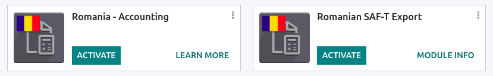
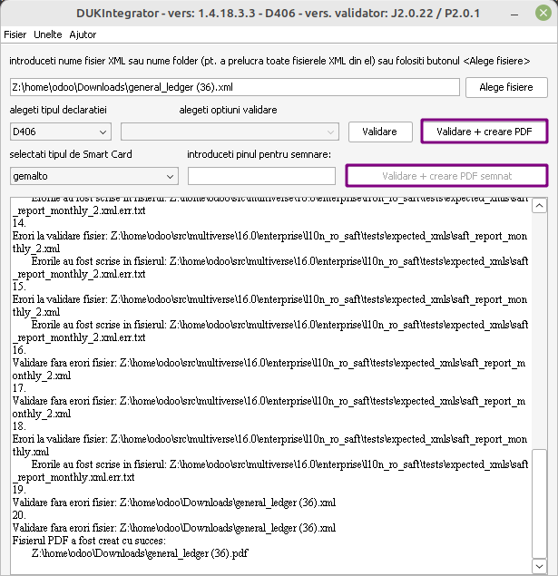

# Romania

## Configuration

`Install <general/install>` the following modules to get all the
features of the Romanian localization.

| Name                    | Technical name                              | Description                                                            |
|-------------------------|---------------------------------------------|------------------------------------------------------------------------|
| `Romania - Accounting`  | l10n_ro      | Default `fiscal localization package <fiscal_localizations/packages>`. |
| `Romanian SAF-T Export` | l10n_ro_saft | Module to generate the **D.406 declaration** in the SAF-T format.      |

## D.406 declaration

Starting January 1, 2023, companies registered for tax purposes in
Romania must report their accounting data to the Romanian Tax Agency
monthly or quarterly in the D.406 declaration.

Konvergo ERP provides all you need to export the data of this declaration in the
SAF-T XML format, which you can validate and sign using the software
provided by the Romanian Tax Agency.

> [!NOTE]
> Currently, Konvergo ERP only supports the generation of the monthly/quarterly
> D.406 declaration (containing journal entries, invoices, vendor bills,
> and payments). The yearly declaration (including assets) and the
> on-demand declaration (including inventory) are not yet supported.

### Configuration

#### Company

- Under `Settings --> General Settings`, in the **Companies** section,
  click `Update Info` and fill in the company's `Country`, `City`, and
  `Telephone Number`.
- Provide your company's `CUI (Codul Unic de Inregistrare)` number or
  `CIF (*Codul de
  identificare fiscală*)` number (for foreign companies) in the
  `Company ID` field, without the RO
  prefix (e.g., 18547290).
- If your company is **registered** for VAT in Romania, fill in the
  `Tax ID` field number, including the RO
  prefix (e.g., RO18547290). If the
  company is **not** registered for VAT in Romania, you **must not**
  fill in the `Tax ID` field.
- Open the **Contacts** app and search for your company. Open your
  company's profile, and in the `Accounting` tab, click `Add a line` and
  add your **bank account number** if not informed already. Make sure
  the profile is set as `Company` above the **name**.
  - You must have at least one **contact person** linked to your company
    in the **Contacts** app. If no **contact person** is linked, create
    a new one by clicking `New`, set it as `Individual`, and select your
    company in the `Company name` field.

#### Chart of accounts

To generate a file receivable by the Romanian Tax Agency, the chart of
accounts must not deviate from an official chart of accounts, such as:

- the chart of accounts for commercial companies
  (*PlanConturiBalSocCom*), which is installed by default when creating
  a company with the Romanian localization or;
- the chart of accounts for companies following
  [IFRS](https://www.ifrs.org/) (*PlanConturiIFRS*).

Under `Settings --> Accounting`, in the **Romanian localization**
section, set the `Tax Accounting Basis` to reflect the accounting
regulations and Chart of Accounts used by the company.

`../accounting/get_started/chart_of_accounts`

#### Customer and supplier

Fill in the `Country`, `City`, and `Zip Code` of each partner that
appears in your invoices, vendor bills, or payments through the
**Contacts** app.

For partners that are companies, you must fill in the VAT number
(including the country prefix) in the `Tax ID` field. If the partner is
a company based in Romania, you may instead fill in the CUI number
(without the 'RO' prefix) in the `Company ID` field.

#### Tax

You must indicate the `Romanian SAF-T Tax Type` (3-digit number) and
`Romanian
SAF-T Tax Code` (6-digit number) on each of the taxes you use. This is
already done for the taxes that exist by default in Konvergo ERP. To do so, go
to `Accounting --> Configuration -->
Taxes`, select the tax you wish to modify, click the `Advanced Options`
tab, and fill in the **tax type** and **tax code** fields.

> [!NOTE]
> The **tax type** and **tax code** are codes defined by the Romanian
> Tax Agency for the **D.406 declaration**. These can be found in the
> Excel spreadsheet published as guidance for completing the
> declaration, which you can find on the [website of the Romanian Tax
> Agency](https://www.anaf.ro/anaf/internet/ANAF/despre_anaf/strategii_anaf/proiecte_digitalizare/saf_t/).

`../accounting/taxes`

#### Product

For some types of goods transactions, the `Intrastat Code` (Cod NC) must
be configured on the product, as it is required by Romanian law:

- import / export transactions;
- acquisitions / supplies of food products subjected to reduced VAT
  rate;
- intra-community movements subjected to intrastat reporting;
- acquisitions / supplies subjected to local reversed VAT charge
  (depending on Cod NC); and
- transactions with excisable products for which excise duties are
  determined based on the Cod NC.

If the Intrastat Code is not specified on a non-service product, the
default code '0' will be used.

To configure the `Intrastat Codes`, go to
`Accounting --> Customers --> Products`, select a product, and in the
`Accounting` tab, set a `Commodity Code`.

`../accounting/reporting/intrastat`

#### Vendor bill

You must check the `Is self-invoice (RO)?` checkbox in the `Other Info`
tab for any vendor bill that is a self-invoice (i.e. a vendor bill that
you issued yourself in the absence of an invoice document received from
a supplier).

### Generating the declaration

#### Exporting your data

To export the XML for the D.406 declaration, go to
`Accounting --> Reports -->
General Ledger` and click on `SAF-T`.

You can then validate and sign the XML file using the Romanian Tax
Agency's validation software, *DUKIntegrator*.

#### Signing the report

Download and install the *DUKIntegrator* validation software found on
the [website of the Romanian Tax
Agency](https://www.anaf.ro/anaf/internet/ANAF/despre_anaf/strategii_anaf/proiecte_digitalizare/saf_t/).

Once you have generated the XML, open 'DUKIntegrator' and select the
file you have just generated.

Click on `Validare + creare PDF` to create an **unsigned** PDF
containing your report, or `Validare + creare PDF semnat` to create a
**signed** PDF containing your report.

If the *DUKIntegrator* validator detects errors or inconsistencies in
your data, it generates a file that explains the errors. In this case,
you need to correct those inconsistencies in your data before you can
submit the report to the Romanian Tax Agency.
