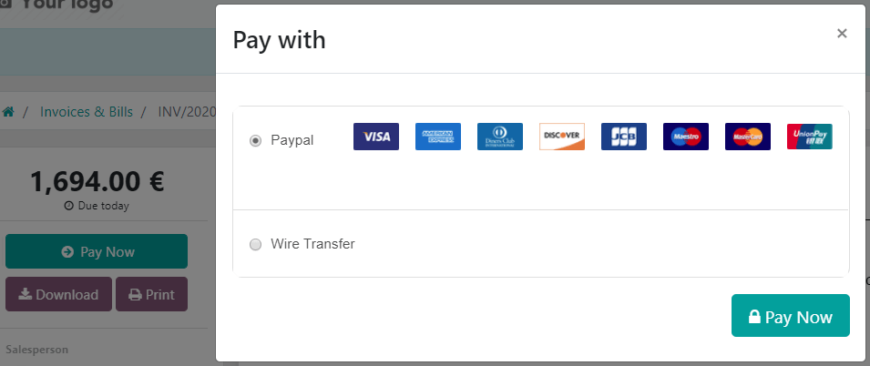

show-content  

# Online payments

payment_providers/wire_transfer payment_providers/adyen
payment_providers/alipay payment_providers/amazon_payment_services
payment_providers/asiapay payment_providers/authorize
payment_providers/buckaroo payment_providers/demo
payment_providers/flutterwave payment_providers/mercado_pago
payment_providers/mollie payment_providers/ogone
payment_providers/paypal payment_providers/razorpay
payment_providers/sips payment_providers/stripe

Konvergo ERP embeds several **payment providers** that allow your customers to
pay online, on their *customer portals*, or on your *eCommerce website*.
They can pay sales orders, invoices, or subscriptions with recurring
payments using their favorite payment methods, such as **credit cards**.

> [!NOTE]
> Konvergo ERP apps delegate the handling of sensitive information to the
> certified payment provider so that you don't ever have to worry about
> PCI compliance. No sensitive information (such as credit card numbers)
> is stored on Konvergo ERP servers or Konvergo ERP databases hosted elsewhere. Instead,
> Konvergo ERP apps use a unique reference number for the data stored safely in
> the payment providers' systems.

## Supported payment providers

To access the supported payment providers, go to
`Accounting --> Configuration -->
Payment Providers` or `Website --> Configuration --> Payment Providers`.

### Online payment providers

|                                                                       | Payment flow from      | `Tokenization <payment_providers/tokenization>` | `Manual capture <payment_providers/manual_capture>` | `Refunds <payment_providers/refunds>` | `Express checkout <payment_providers/express_checkout>` | `Extra fees <payment_providers/extra_fees>` |
|-----------------------------------------------------------------------|------------------------|-------------------------------------------------|-----------------------------------------------------|---------------------------------------|---------------------------------------------------------|---------------------------------------------|
| `Adyen <payment_providers/adyen>`                                     | Konvergo ERP                   | ✔                                               | Full only                                           | Full and partial                      |                                                         |                                             |
| `Amazon Payment Services <payment_providers/amazon_payment_services>` | The provider's website |                                                 |                                                     |                                       |                                                         |                                             |
| `AsiaPay <payment_providers/asiapay>`                                 | The provider's website |                                                 |                                                     |                                       |                                                         |                                             |
| `Authorize.Net <payment_providers/authorize>`                         | Konvergo ERP                   | ✔                                               | Full only                                           | Full only                             |                                                         |                                             |
| `Buckaroo <payment_providers/buckaroo>`                               | The provider's website |                                                 |                                                     |                                       |                                                         |                                             |
| `Flutterwave <payment_providers/flutterwave>`                         | The provider's website | ✔                                               |                                                     |                                       |                                                         |                                             |
| `Mercado Pago <payment_providers/mercado_pago>`                       | The provider's website |                                                 |                                                     |                                       |                                                         |                                             |
| `Mollie <payment_providers/mollie>`                                   | The provider's website |                                                 |                                                     |                                       |                                                         |                                             |
| `PayPal <payment_providers/paypal>`                                   | The provider's website |                                                 |                                                     |                                       |                                                         | ✔                                           |
| `Razorpay <payment_providers/razorpay>`                               | The provider's website |                                                 | Full only                                           | Full and partial                      |                                                         |                                             |
| `SIPS <payment_providers/sips>`                                       | The provider's website |                                                 |                                                     |                                       |                                                         |                                             |
| `Stripe <payment_providers/stripe>`                                   | The provider's website | ✔                                               | Full only                                           | Full and partial                      | ✔                                                       |                                             |

> [!NOTE]
> - Each provider has its own specific configuration flow, depending on
> which feature is available. - Some of these online payment providers
> can also be added as `bank accounts
> <../finance/accounting/bank>`, but this is **not** the same process as
> adding them as payment providers. Payment providers allow customers to
> pay online, and bank accounts are added and configured in the
> Accounting app to do a `bank reconciliation
> <accounting/bank/reconciliation>`.

> [!TIP]
> In addition to the regular payment providers that integrate with an
> API, such as Stripe, PayPal, or Adyen, Konvergo ERP bundles the
> `Demo payment provider <payment_providers/demo>`. This payment
> provider allows you to test business flows involving online payments.
> No credentials are required as the demo payments are dummy payments.

### Bank payments

- `Wire Transfer <payment_providers/wire_transfer>`  
  When selected, Konvergo ERP displays your payment information with a payment
  reference. You have to approve the payment manually once you have
  received it in your bank account.

- `SEPA Direct Debit <../finance/accounting/payments/batch_sdd>`  
  Your customers can make a bank transfer to register a SEPA Direct
  Debit mandate and get their bank account charged directly.

## Enable a payment provider

To add a new payment provider and make its related payment methods
available to your customers, proceed as follows:

1.  Go to the payment provider's website, create an account, and make
    sure you have the API credentials requested for third-party use.
    These are necessary for Konvergo ERP to communicate with the payment
    provider.
2.  In Konvergo ERP, navigate to the `Payment providers` by going to
    `Accounting -->
    Configuration --> Payment Providers` or
    `Website --> Configuration --> Payment
    Providers`.
3.  Select the provider and configure the `Credentials` tab.
4.  Set the `State` field to `Enabled`.
5.  Select a `payment journal <payment_providers/journal>`.

> [!NOTE]
> - The fields available in the `Credentials` tab depend on the payment
> provider. Refer to the
> `related documentation <payment_providers/supported_providers>` for
> more information. - Once you have enabled the payment provider, it is
> automatically published on your website. If you wish to unpublish it,
> click the `Published` button. Customers cannot make payments through
> an unpublished provider, but they can still manage
> `(delete and assign to a subscription)` their existing tokens linked
> to such a provider.

### Test mode

If you wish to try the payment provider as a test, set the `State` field
in the payment provider form to `Test mode`, then enter your provider's
test/sandbox credentials in the `Credentials` tab.

> [!NOTE]
> By default, the payment provider remains **unpublished** in test mode
> so that it's not visible to visitors.

> [!WARNING]
> We recommend using the test mode on a duplicate or a test database to
> avoid potential issues with your invoice numbering.

## Payment form

You can change the payment provider’s appearance on your website in the
`Configuration` tab of the selected payment provider. Modify its name in
the `Displayed as` field and adapt the `Supported Payment Icons` if
necessary.

## Tokenization

`If the payment provider supports this feature <payment_providers/online_providers>`,
customers can save their payment method details for later. To enable
this feature, go to the `Configuration` tab of the selected payment
provider and enable `Allow Saving
Payment Methods`.

In this case, a **payment token** is created in Konvergo ERP to be used as a
payment method for subsequent payments without the customer having to
enter their payment method details again. This is particularly useful
for the eCommerce conversion rate and subscriptions that use recurring
payments.

> [!NOTE]
> You remain fully PCI-compliant when you enable this feature because
> Konvergo ERP does not store the card details directly. Instead, it creates a
> payment token that only references the card details stored on the
> payment provider's server.

## Manual capture

`If the payment provider supports this feature <payment_providers/online_providers>`,
you can authorize and capture payments in two steps instead of one. To
enable this feature, go to the `Configuration` tab of the selected
payment provider and enable `Capture Amount
Manually`.

When you authorize a payment, the funds are reserved on the customer's
payment method but not immediately charged. They are charged when you
manually capture the payment later on. You can also void the
authorization to cancel it and release the reserved funds. Capturing
payments manually is helpful in many situations:

- Receive the payment confirmation and wait until the order is shipped
  to capture the payment.
- Review and verify that orders are legitimate before the payment is
  completed and the fulfillment process starts.
- Avoid potentially high refund fees for refunded payments: payment
  providers will not charge you for voiding an authorization.
- Hold a security deposit to return later, minus any deductions (e.g.,
  in case of damages).

To capture the payment after it was authorized, go to the related sales
order or invoice and click the `Capture Transaction` button. To release
the funds, click the `Void
Transaction` button.

> [!NOTE]
> - Some payment providers support capturing only part of the authorized
> amount. The remaining amount can then be either captured or voided.
> These providers have the value **Full and partial** in the
> `table above <payment_providers/online_providers>`. The providers that
> only support capturing or voiding the total amount have the value
> **Full only**. - The funds are likely not reserved forever. After a
> certain time, they may be automatically released back to the
> customer's payment method. Refer to your payment provider's
> documentation for the exact reservation duration. - Konvergo ERP does not
> support this feature for all payment providers, but some allow the
> manual capture from their website interface.

## Refunds

If your payment provider supports this feature, you can refund payments
directly from Konvergo ERP. It does not need to be enabled first. To refund a
customer payment, navigate to it and click the `Refund` button.

> [!NOTE]
> - Some payment providers support refunding only part of the amount.
> The remaining amount can then optionally be refunded, too. These
> providers have the value **Full and partial** in the
> `table above <payment_providers/online_providers>`. The providers that
> only support refunding the total amount have the value **Full
> only**. - Konvergo ERP does not support this feature for all payment
> providers, but some allow to refund payments from their website
> interface.

## Express checkout

`If the payment provider supports this feature <payment_providers/online_providers>`,
you can allow customers to use the `Google Pay` and `Apple Pay` buttons
and pay their eCommerce orders in one click. When they use one of these
buttons, customers go straight from the cart to the confirmation page
without filling out the contact form. They just have to validate the
payment on Google's or Apple's payment form.

To enable this feature, go to the `Configuration` tab of the selected
payment provider and enable `Allow Express Checkout`.

> [!NOTE]
> All prices shown on the express checkout payment form always include
> taxes.

## Extra Fees

`If the payment provider supports this feature <payment_providers/online_providers>`,
you can add extra fees to online transactions. Fees can be configured
either as **fixed** amounts and percentages, **variable** amounts and
percentages, or both simultaneously. They can also differ based on
whether the transaction is **domestic** or **international**.

To enable this feature, go to the `Fees` tab of the selected payment
provider, enable `Add Extra Fees`, and configure the settings to your
liking.

> [!NOTE]
> Fees are calculated on the tax-included price.

## Availability

You can adapt the payment provider's availability by specifying the
`Maximum Amount` allowed and modifying the `Currencies` and `Countries`
in the `Configuration` tab.

### Currencies and countries

All payment providers have a different list of available currencies and
countries. They serve as a first filter during payment operations, i.e.,
the payment methods linked to the payment provider are not available for
selection if the customer's currency or country is not in the supported
list. As there might be errors, updates, and unknowns in the lists of
available currencies and countries, adding or removing a payment
provider's supported currencies or countries is possible.

Note

- `Payment methods <payment_providers/payment_methods>` also have their
  own list of available currencies and countries that serves as another
  filter during payment operations.
- If the list of supported currencies or countries is empty, it means
  the list is too long to be displayed, or Konvergo ERP does not have
  information on that payment provider. The payment provider remains
  available, even though it is possible the payment will be refused at a
  later stage should the country or currency not be supported.

### Maximum amount

You can restrict the `Maximum Amount` that can be paid with the selected
provider. Leave the field to 0.00 to make
the payment provider available regardless of the payment amount.

> [!IMPORTANT]
> This feature is not intended to work on pages that allow the customer
> to update the payment amount, e.g., the **Donation** snippet and the
> **Checkout** page when paid `shipping methods
> <../websites/ecommerce/checkout_payment_shipping/shipping>` are
> enabled.

## Payment journal

A `payment journal <accounting/bank>` must be defined for the payment
provider to record the payments on an **outstanding account**. To do so,
go to the `Configuration` tab of the selected payment provider and
select a `Payment Journal`.

> [!NOTE]
> - The payment journal must be a `Bank` journal. - The same journal can
> be used for several payment providers.

### Accounting perspective

From an accounting perspective, there are two types of online payment
workflows: the payments that are directly deposited into your bank
account and follow the usual `reconciliation
<accounting/bank/reconciliation>` workflow, and those coming from
third-party `online payment
providers <payment_providers/online_providers>` and require you to
follow another accounting workflow. For these payments, you need to
consider how you want to record your payments' journal entries. We
recommend you ask your accountant for advice.

By default, the `Bank Account` defined for the `payment journal
<payment_providers/journal>` is used, but you can also specify an
`outstanding account
<bank/outstanding-accounts>` for each payment provider to separate the
provider's payments from other payments.

\- `payment_providers/wire_transfer` - `payment_providers/adyen` -
`payment_providers/alipay` - `payment_providers/authorize` -
`payment_providers/asiapay` - `payment_providers/buckaroo` -
`payment_providers/demo` - `payment_providers/mercado_pago` -
`payment_providers/mollie` - `payment_providers/ogone` -
`payment_providers/paypal` - `payment_providers/razorpay` -
`payment_providers/sips` - `payment_providers/stripe` -
`../websites/ecommerce/checkout_payment_shipping/payments` -
`accounting/bank`

