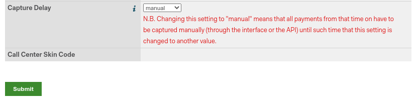

# Adyen

[Adyen](https://www.adyen.com/) is a Dutch company that offers several
online payment possibilities.

\- `payment_providers/add_new` - `../payment_providers`

> [!NOTE]
> Adyen works only with customers processing **more** than **10 million
> annually** or invoicing a **minimum** of **1.000** transactions **per
> month**.

## Configuration

`payment_providers/add_new`

### Credentials tab

Konvergo ERP needs your **API Credentials** to connect with your Adyen account,
which comprise:

- **Merchant Account**: The code of the merchant account to use with
  Adyen.
- `API Key <adyen/api_and_client_keys>`: The API key of the webservice
  user.
- `Client Key <adyen/api_and_client_keys>`: The client key of the
  webservice user.
- `HMAC Key <adyen/hmac_key>`: The HMAC key of the webhook.
- `Checkout API URL <adyen/urls>`: The base URL for the Checkout API
  endpoints.
- `Recurring API URL <adyen/urls>`: The base URL for the Recurring API
  endpoints.

You can copy your credentials from your Adyen account, and paste them in
the related fields under the **Credentials** tab.

> [!IMPORTANT]
> If you are trying Adyen as a test, with an Adyen *test account*, head
> to `Accounting --> Configuration --> Payment Providers`. There, click
> on `Adyen`, enable `Test Mode` and enter your credentials in the
> `Credentials` tab.

#### API Key and Client Key

In order to retrieve the API Key and the Client Key, log into your Adyen
account, go to `Developers --> API Credentials`.

- If you already have an API user, open it.
- If you don't have an API user yet, click on **Create new credential**.

Go to `Server settings --> Authentification` and copy or generate your
**API Key**. Be careful to copy your API key as you'll not be allowed to
get it later without generating a new one.

Now, head to `Client settings --> Authentification` and cody or generate
your **Client Key**. This is also the place where you can
`allow payments to be made from your
website <adyen/allowed_origins>`.

#### HMAC key

In order to retrieve the HMAC Key, you'll need to configure a
Standard Notification webhook. For this,
log into your Adyen account then go to
`Developers --> Webhooks --> Add webhook
--> Add Standard notification`.

There, in `General --> Server configuration --> URL`, enter your server
address followed by
/payment/adyen/notification.

Then enter `Security --> HMAC Key --> Generate`. Be careful to copy the
key as you will not be allowed to do it later without generating a new
one.

You have to save the webhook to finalize its creation.

#### API URLs

All Adyen API URLs include a customer area-specific prefix generated by
Adyen. To configure the URLs, proceed as follows:

1.  Log into your Adyen account, then go to `Developers --> API URLs`.

2.  Copy the `Prefix` for your live Customer area (i.e., **data
    center**) and save it for later.

    

3.  In Konvergo ERP,
    `navigate to the payment provider Adyen <payment_providers/add_new>`.

4.  In the `Checkout API URL` field, enter the following URL and replace
    yourprefix with the prefix you
    previously saved:
    https://yourprefix-checkout-live.adyenpayments.com/checkout

5.  In the `Recurring API URL` field, enter the following URL and
    replace yourprefix with the prefix
    you previously saved:
    https://yourprefix-pal-live.adyenpayments.com/pal/servlet/Recurring.

> [!NOTE]
> If you are trying Adyen as a test, you can use the following URLs
> instead:
>
> - `Checkout API URL`:
>   https://checkout-test.adyen.com
> - `Recurring API URL`:
>   https://pal-test.adyen.com/pal/servlet/Recurring

### Adyen Account

#### Allow payments from a specific origin

To allow payment originated from your website, follow the steps in
`adyen/api_and_client_keys` to navigate to your API user and go to
`Add allowed origins`, then add the URLs from where payments will be
made (the URLs of the servers hosting your Konvergo ERP instances).

### Place a hold on a card

Adyen allows you to capture an amount manually instead of having an
immediate capture.

To set it up, enable the **Capture Amount Manually** option on Konvergo ERP, as
explained in the
`payment providers documentation <payment_providers/manual_capture>`.

Then, open your Adyen Merchant Account, go to `Account --> Settings`,
and set the **Capture Delay** to **manual**.

> [!CAUTION]
> - If you configure Konvergo ERP to capture amounts manually, make sure to set
> the **Capture Delay** to **manual** on Adyen. Otherwise, the
> transaction will be blocked in the authorized state in Konvergo ERP. - Konvergo ERP
> doesn't support the partial capture yet. Be aware that if you make a
> partial capture from Adyen's interface, Konvergo ERP will manage it as if it
> was a full capture.

> [!NOTE]
> After **7 days**, if the transaction hasn't been captured yet, the
> customer has the right to **revoke** it.

`../payment_providers`

