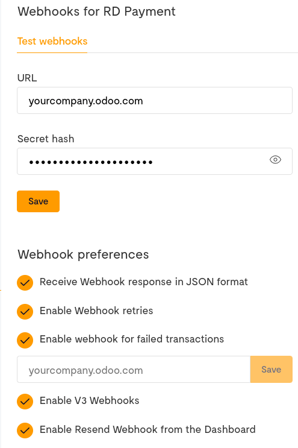

# Flutterwave

[Flutterwave](https://flutterwave.com/) is an online payments provider
established in Nigeria and covering several African countries and
payment methods.

## Configuration on Flutterwave Dashboard

1.  Log into [Flutterwave Dashboard](https://dashboard.flutterwave.com/)
    and go to `Settings --> API`. Copy the values of the `Public Key`
    and `Secret Key` fields and save them for later.

2.  Go to `Settings --> Webhooks` and enter your Konvergo ERP database URL
    followed by
    /payment/flutterwave/webhook in the
    `URL` text field.  
    For example:
    https://yourcompany.odoo.com/payment/flutterwave/webhook.

3.  Fill the `Secret hash` with a password that you generate and save
    its value for later.

4.  Make sure *all* the remaining checkboxes are ticked.

5.  Click on **Save** to finalize the configuration.

## Configuration on Konvergo ERP

1.  `Navigate to the payment provider Flutterwave <payment_providers/add_new>`
    and change its state to `Enabled`.

2.  In the `Credentials` tab, fill the `Public Key`, `Secret Key`, and
    `Webhook Secret` with the values you saved at the step
    `payment_providers/flutterwave/configure_dashboard`.

3.  Configure the rest of the options to your liking.

    > [!IMPORTANT]
    > If you choose to allow saving payment methods, it is recommended
    > to only enable card payments from Flutterwave dashboard, as only
    > cards can be saved as payment tokens. To do so, go to your
    > Flutterwave Dashboard and then to `Settings --> Account Settings`.

\- `../payment_providers`

