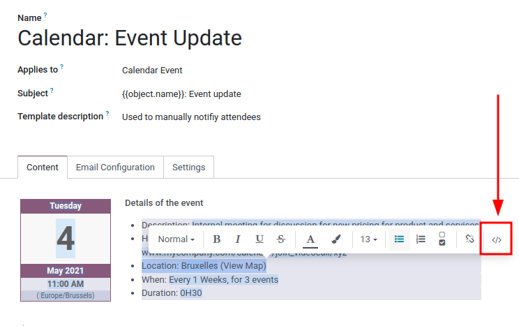
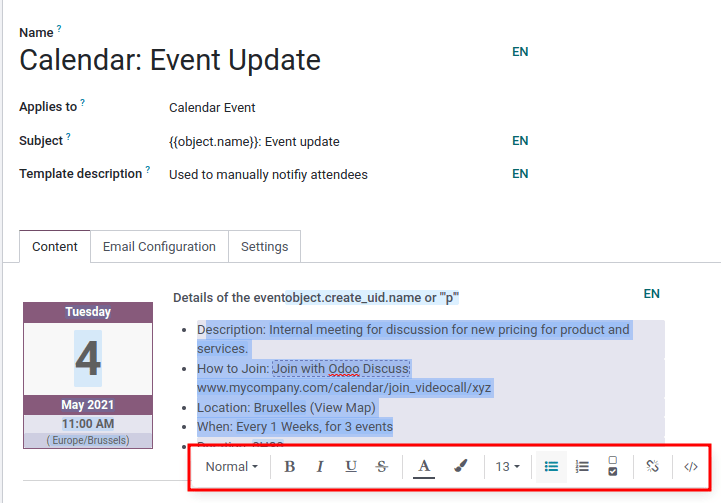

# Email templates

Email templates are saved emails that are used repeatedly to send emails
from the database. They allow users to send quality communications,
without having to compose the same text repeatedly.

Creating different templates that are tailored to specific situations
lets users choose the right message for the right audience. This
increases the quality of the message and the overall engagement rate
with the customer.

> [!NOTE]
> Email templates in Konvergo ERP use QWeb or XML, which allows for editing
> emails in their final rendering, making customizations more robust,
> without having to edit any code whatsoever. This means that Konvergo ERP can
> use a Graphical User Interface (GUI) to edit emails, which edits the
> backend code. When the received email is read by the end user's
> program, different formatting and graphics will appear in the final
> form of it.

Access email templates in `developer mode <developer-mode>` by
navigating to
`Settings app --> Technical menu --> Email --> Email Templates`.

## Editing email templates

The *powerbox* feature can be used when working with email templates.
This feature provides the ability to directly edit the formatting and
text in an email template, as well as the ability to add links, buttons,
appointment options, or images.

Additionally, the XML/HTML code of the email template can be edited
directly, via the `</>` icon. Dynamic placeholders (referencing fields
within Konvergo ERP) are also available for use in the email template.

### Powerbox

The *powerbox* feature is an enriched text editor with various
formatting, layout, and text options. It can also be used to add
XML/HTML features in an email template. The powerbox feature is
activated by typing a forward slash / in
the body of the email template.

When a forward slash / is typed in the
body of an email template, a drop-down menu appears with the following
options:

`Structure`

- `Bulleted list`: Create a simple bulleted list.
- `Numbered list`: Create a list with numbering.
- `Checklist`: Track tasks with a checklist.
- `Table`: Insert a table.
- `Separator`: Insert a horizontal rule separator.
- `Quote`: Add a blockquote section.
- `Code`: Add a code section.
- `2 columns`: Convert into two columns.
- `3 columns`: Convert into three columns.
- `4 columns`: Convert into four columns.

`Format`

- `Heading 1`: Big section heading.
- `Heading 2`: Medium section heading.
- `Heading 3`: Small section heading.
- `Switch direction`: Switch the text's direction.
- `Text`: Paragraph block.

`Media`

- `Image`: Insert an image.
- `Article`: Link an article.

`Navigation`

- `Link`: Add a link.
- `Button`: Add a button.
- `Appointment`: Add a specific appointment.
- `Calendar`: Schedule an appointment.

`Widgets`

- `3 Stars`: Insert a rating over three stars.
- `5 Stars`: Insert a rating over five stars.

`Basic Blocks`

- `Signature`: Insert your signature.

`Marketing Tools`

- `Dynamic Placeholders`: Insert personalized content.

> [!TIP]
> To use any of these options, click on the desired feature from the
> powerbox drop-down menu. To format existing text with a text-related
> option (e.g. `Heading 1`, `Switch
> direction`, etc.), highlight the text, then type in the activator key
> (forward slash) /, and select the
> desired option from the drop-down menu.
>
>  alt="Powerbox feature in the email template." />

`Using dynamic placeholders <email_template/dynamic-placeholders>`

### XML/HTML code editor

To access the XML/HTML editor for an email template, first enter
`developer mode
<developer-mode>`. Then, click the `</>` icon in the upper-right corner
of the template, and proceed to edit the XML/HTML. To return to the
standard text editor, click the `</>` icon again.

> [!WARNING]
> The XML/HTML editor should be accessed with caution as this is the
> backend code of the template. Editing the code can cause the email
> template to break immediately or when upgrading the database.

### Dynamic placeholders

*Dynamic placeholders* reference certain fields within the Konvergo ERP database
to produce unique data in the email template.

Many companies like to customize their emails with a personalized piece
of customer information to grab attention. This can be accomplished in
Konvergo ERP by referencing a field within a model by inserting a dynamic
placeholder. For example, a customer's name can be referenced in the
email from the `Customer` field on the `Sales Order` model. The dynamic
placeholder for this field is: {{
object.partner_id }}.

Dynamic placeholders are encoded to display fields from within the
database. Dynamic placeholders can be used in the `Body` (`Content` Tab)
of the email template. They can also be used in the fields present in
the `Email Configuration` tab, the `Subject` of the email, and the
`Language`.

To use the dynamic placeholders in the `Body` of an email open the
**powerbox** feature by typing in / into
the body of the email template under the `Content` tab. Scroll to the
bottom of the options list, to `Marketing Tools`. Next, select `Dynamic
Placeholder`. Then select the dynamic placeholder from a list of
available options and follow the prompts to configure it with the
desired corresponding Konvergo ERP field. Each dynamic placeholder will vary in
configuration.

> [!NOTE]
> Each unique combination of `Fields`, `Sub-models` and `Sub-fields`
> creates a different dynamic placeholder. Imagine it as a combination
> to the field that is being created.
>
> To search the available fields, simply type in the front-end name (on
> user-interface) of the field in the search. This will find a result
> from all of the available fields for the model that the email template
> is created for.

> [!WARNING]
> Customizing email templates are out of the scope of Konvergo ERP Support.

### Rich text editor

A rich text editor toolbar can be accessed by highlighting text in the
email template. This can be used to change the heading, font size/style,
color, add a list type, or a link.

### Resetting email templates

Should the email template not work because the code has been altered it
can be reset to restore it back to the out-of-box default template.
Simply click on the `Reset Template` button in the upper left-hand of
the screen and the template will be reset.

### Default reply on email templates

Under the `Email Configuration` tab on an email template, there is a
`Reply To` field. In this field, add email addresses to which replies
are redirected when sending emails en masse using this template.

> [!TIP]
> Add multiple email addresses by adding a comma
> , between the addresses or dynamic
> placeholders.

The `Reply To` field is **only** used for mass mailing (sending emails
in bulk). Bulk emails can be sent in almost every Konvergo ERP application that
has a list view option.

To send mass mails, while in `list` view, check the boxes next to the
desired records where the emails are to be sent, click the `Action`
button (represented by a `⚙️
(gear)` icon), and select the desired email option from the `Action`
drop-down menu. Email options can vary by the particular list view and
application.

If it is possible to send an email, a mail composer pop-up window
appears, with values that can be defined and customized. This option
will be available on the `Action` button on pages where emails can be
sent in bulk---for example, on the `Customers` page of the CRM app. This
action occurs throughout the Konvergo ERP database.

## Transactional emails and corresponding URLs

In Konvergo ERP, multiple events can trigger the sending of automated emails.
These emails are known as *transactional emails*, and sometimes contain
links redirecting to the Konvergo ERP database.

By default, links generated by the database use the dynamic
web.base.url key defined in the system
parameters. For more information about this, see `system parameters
<domain-name/web-base-url>`.

If the *Website* application is not installed, the
web.base.url key will always be the
default parameter used to generate all the links.

> [!IMPORTANT]
> The web.base.url key can only have a
> single value, meaning that, in a multi-website or multi-company
> database environment, even if there is a specific domain name for each
> website, the links generated to share a document (or the links within
> a transactional email) may remain the same, regardless of which
> website/company is related to the sending of the email/document.
>
> 

>
> If the `Value` of the `web.base.url` system parameter is equal to
> https://www.mycompany.com and there are
> two separate companies in Konvergo ERP with different website URLs:
> https://www.mycompany2.com and
> https://www.mycompany1.com, the links
> created by Konvergo ERP to share a document, or send a transactional email,
> come from the domain:
> https://www.mycompany.com, regardless
> of which company sends the document or email.
>
> 

>
> This is not always the case, as some Konvergo ERP applications (*eCommerce*,
> for example) have a link established in the database with the
> *Website* application. In that case, if a specific domain is defined
> for the website, the URL generated in the email template uses the
> domain defined on the corresponding website of the company.
>
> 

>
> When a customer makes a purchase on an Konvergo ERP *eCommerce* website, the
> order has an established link with that website. As a result, the
> links in the confirmation email sent to the customer use the domain
> name for that specific website.
>
> 

> [!NOTE]
> A document shared using the *Documents* application will **always**
> use the web.base.url key, as the
> document shared is not associated with any particular website. This
> means that the URL will always be the same (the
> web.base.url key value), no matter what
> company it's shared from. This is a known limitation.

For more information about how to configure domains, check out the
`domain name documentation
</applications/websites/website/configuration/domain_names>`.

### Updating translations within email templates

In Konvergo ERP, email templates are automatically translated for all users in
the database for all of the languages installed. Changing the
translations shouldn't be necessary. However, if for a specific reason,
some of the translations need to be changed, it can be done.

> [!WARNING]
> Like any modification in the code, if translation changes are not done
> correctly (for example, modifications leading to bad syntax), it can
> break the template, and as a result, the template will appear blank.

In order to edit translations, first enter
`developer mode <developer-mode>`. Then, on the email template, click on
the `Edit` button, and then click on the language button, represented by
the initials of the language currently being used (e.g. `EN` for
English).

> [!NOTE]
> If there aren't multiple languages installed and activated in the
> database, or if the user does not have administration access rights,
> the language button will not appear.

A pop-up window with the different languages installed on the database
appears. From this pop-up, editing of translations is possible. When the
desired changes have been made, click the `Save` button to save the
changes.

> [!NOTE]
> When editing the translations, the default language set in the
> database appears in **bold**.
