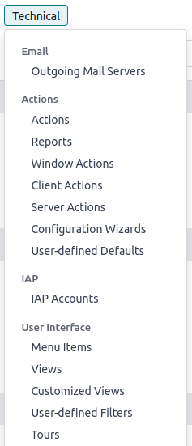

# Developer mode (debug mode)

The developer mode, also known as debug mode, unlocks access to advanced
`tools and settings
<developer-mode/tools>` in Konvergo ERP.

> [!WARNING]
> Proceed with caution, as some developer tools and technical settings
> are considered advanced and may have associated risks. Only use them
> if you understand the implications and are confident in your actions.

> [!NOTE]
> The developer mode is also available with
> `assets <frontend/framework/assets_debug_mode>`, which are used to
> debug JavaScript code, and with `tests assets
> <frontend/framework/tests_debug_mode>`, which are used to run test
> tours.

## Activation

To activate it, open the `Settings` app, scroll down to the
`Developer Tools` section, and click `Activate the developer mode`.

Once activated, the `Deactivate the developer mode` option becomes
available.

To activate the developer mode **from anywhere in the database**, add
?debug=1 to the URL after
/web (e.g.,
https://example.odoo.com/web?debug=1#action=menu&cids=1).
To deactivate it, use ?debug=0 instead.

Use ?debug=assets to activate the
developer mode with assets and
?debug=tests to activate it with tests
assets.

> [!TIP]
> Open the **command palette** by pressing
> Ctrl + K or Cmd
> ⌘ + K, then type debug to
> activate the developer mode with assets or deactivate it.

Browser extension

The [Konvergo ERP Debug](https://github.com/Droggol/Konvergo ERPDebug) browser extension
adds an icon to toggle developer mode on or off from the browser's
toolbar. It is available on the [Chrome Web
Store](https://chromewebstore.google.com/detail/odoo-debug/hmdmhilocobgohohpdpolmibjklfgkbi)
and [Firefox
Add-ons](https://addons.mozilla.org/firefox/addon/odoo-debug/).

## Developer tools and technical menu

Once the developer mode is activated, the developer tools can be
accessed by clicking the `fa-bug` `(bug)` icon. The menu contains tools
useful for understanding or editing technical data, such as a view's
field, filters, or actions. The options available depend on where the
menu is accessed from.

Database administrators can access the technical menu from the
`Settings` app. It contains advanced database settings, such as ones
related to the database structure, security, actions, etc.

