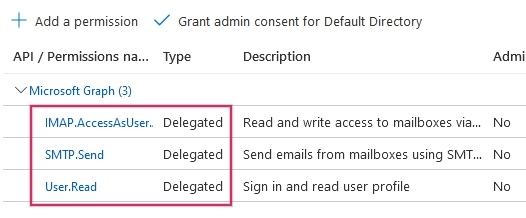
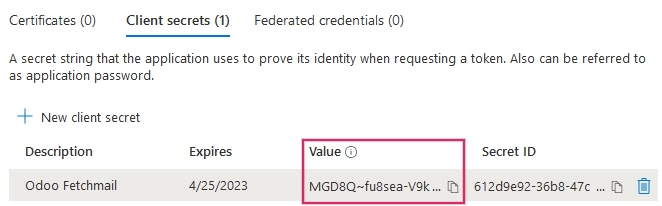
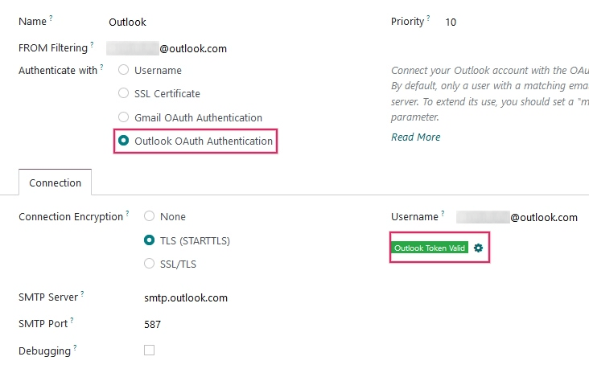

# Connect Microsoft Outlook 365 to Konvergo ERP using Azure OAuth

Konvergo ERP is compatible with Microsoft's Azure OAuth for Microsoft 365. In
order to send and receive secure emails from a custom domain, all that
is required is to configure a few settings on the Azure platform and on
the back end of the Konvergo ERP database. This configuration works with either
a personal email address or an address created by a custom domain.

[Microsoft Learn: Register an application with the Microsoft identity
platform](https://learn.microsoft.com/azure/active-directory/develop/quickstart-register-app)

\- `/applications/general/users/azure` -
`/applications/productivity/calendar/outlook`

## Setup in Microsoft Azure Portal

### Create a new application

To get started, go to [Microsoft's Azure
Portal](https://portal.azure.com/). Log in with the
`Microsoft Outlook Office 365` account if there is one, otherwise log in
with the personal `Microsoft account`. A user with administrative access
to the Azure Settings will need to connect and perform the following
configuration. Next, navigate to the section labeled
`Manage Microsoft Entra ID` (formally *Azure Active Directory*).

Now, click on `Add (+)`, located in the top menu, and then select `App
registration`. On the `Register an application` screen, rename the
`Name` to Konvergo ERP or something recognizable.
Under the `Supported account types` section select
`Accounts in any organizational directory (Any Microsoft Entra ID directory - Multitenant)
and personal Microsoft accounts (e.g. Skype, Xbox)`.

Under the `Redirect URL` section, select `Web` as the platform, and then
input https://\<odoo base
url\>/microsoft_outlook/confirm in the `URL` field. The Konvergo ERP base
URL is the canonical domain at which your Konvergo ERP instance can be reached
in the URL field.

*mydatabase.odoo.com*, where *mydatabase* is the actual prefix of the
database's subdomain, assuming it's hosted on Konvergo ERP.com

After the URL has been added to the field, `Register` the application so
it is created.

### API permissions

The `API permissions` should be set next. Konvergo ERP will need specific API
permissions to be able to read (IMAP) and send (SMTP) emails in the
Microsoft 365 setup. First, click the `API permissions` link, located in
the left menu bar. Next, click on the `(+)
Add a Permission` button and select `Microsoft Graph` under
`Commonly Used
Microsoft APIs`. After, select the `Delegated Permissions` option.

In the search bar, search for the following `Delegated permissions` and
click `Add permissions` for each one:

- `SMTP.Send`
- `IMAP.AccessAsUser.All`

> [!NOTE]
> The `User.Read` permission will be added by default.

## Assign users and groups

After adding the API permissions, navigate back to the `Overview` of the
`Application` in the top of the left sidebar menu.

Now, add users to this application. Under the `Essentials` overview
table, click on the link labeled
`Managed Application in Local Directory`, or the last option on the
bottom right-hand side of the table.

In the left sidebar menu, select `Users and Groups`. Next, click on
`(+) Add
User/Group`. Depending on the account, either a `Group` and a `User` can
be added, or only `Users`. Personal accounts will only allow for `Users`
to be added.

Under `Users` or `Groups`, click on `None Selected` and add the users or
group of users that will be sending emails from the `Microsoft account`
in Konvergo ERP. `Add` the users/groups, click `Select`, and then `Assign` them
to the application.

### Create credentials

Now that the Microsoft Azure app is set up, credentials need to be
created for the Konvergo ERP setup. These include the `Client ID` and
`Client Secret`. To start, the `Client ID` can be copied from the
`Overview` page of the app. The `Client ID` or `Application ID` is
located under the `Display Name` in the `Essentials` overview of the
app.

Next, the `Client Secret Value` needs to be retrieved. To get this
value, click on `Certificates & Secrets` in the left sidebar menu. Then,
a `Client Secret` needs to be produced. In order to do this, click on
the `(+) New Client Secret` button.

A window on the right will populate with a button labeled
`Add a client secret`. Under `Description`, type in
Konvergo ERP Fetchmail or something recognizable,
and then set the `expiration date`.

> [!IMPORTANT]
> A new `Client Secret` will need to be produced and configured if the
> first one expires. In this event, there could be an interruption of
> service, so the expiration date should be noted and set to the
> furthest possible date.

Next, click on `Add` when these two values are entered. A
`Client Secret Value` and `Secret ID` will be created. It is important
to copy the `Value` or `Client Secret Value` into a notepad as it will
become encrypted after leaving this page. The `Secret ID` is not needed.

After these steps, the following items should be ready to be set up in
Konvergo ERP:

- A client ID (`Client ID` or `Application ID`)
- A client secret (`Value` or `Client Secret Value`)

This completes the setup on the `Microsoft Azure Portal` side.

## Setup in Konvergo ERP

### Enter Microsoft Outlook credentials

First, open the Konvergo ERP database and navigate to the `Apps` module. Then,
remove the `Apps` filter from the search bar and type in
Outlook. After that, install the module
called `Microsoft Outlook`.

Next, navigate to `Settings --> General Settings`, and under the
`Discuss` section, ensure that the checkbox for `Custom Email Servers`
is checked. This populates a new option for `Outlook Credentials`.

`Save` the progress.

Then, copy and paste the `Client ID` (Application ID) and `Client Secret
(Client Secret Value)` into the respective fields and `Save` the
settings.

### Configure outgoing email server

On the `General Settings` page, under the `Custom Email Servers`
setting, click the `Outgoing Email Servers` link to configure the
Microsoft account.

Then, create a new email server and check the box for `Outlook`. Next,
fill in the `Name` (it can be anything) and the Microsoft Outlook email
`Username`.

If the `From Filter` field is empty, enter either a
`domain or email address
<email_communication/default>`.

Then, click on `Connect your Outlook account`.

A new window from Microsoft opens to complete the
`authorization process`. Select the appropriate email address that is
being configured in Konvergo ERP.

Then, allow Konvergo ERP to access the Microsoft account by clicking on `Yes`.
After this, the page will navigate back to the newly configured
`Outgoing Mail Server` in Konvergo ERP. The configuration automatically loads
the `token` in Konvergo ERP, and a tag stating `Outlook Token Valid` appears in
green.

Finally, click `Test Connection`. A confirmation message should appear.
The Konvergo ERP database can now send safe, secure emails through Microsoft
Outlook using OAuth authentication.

#### Configuration with a single outgoing mail server

Configuring a single outgoing server is the simplest configuration
available for Microsoft Azure and it doesn't require extensive access
rights for the users in the database.

A generic email address would be used to send emails for all users
within the database. For example it could be structured with a
notifications alias
(notifications@example.com) or
contact alias
(contact@example.com). This address must
be set as the `FROM Filtering` on the server. This address must also
match the
{mail.default.from}@{mail.catchall.domain}
key combination in the system parameters.

For more information on the from filter visit:
`email_communication/default`.

> [!NOTE]
> The `System Parameters` can be accessed by activating `developer-mode`
> in the `Settings --> Technical --> Parameters --> System Parameters`
> menu.

When using this configuration, every email that is sent from the
database will use the address of the configured
notification mailbox. However it should
be noted that the name of the sender will appear but their email address
will change:

Single outgoing mail server configuration:

- Outgoing mail server **username** (login) =
  notifications@example.com
- Outgoing mail server `FROM Filtering` =
  notifications@example.com
- mail.catchall.domain in system
  parameters = example.com
- mail.default.from in system parameters
  = notifications

#### User-specific (multiple user) configuration

In addition to a generic email server, individual email servers can be
set up for users in a database. These email addresses must be set as the
`FROM Filtering` on each individual server for this configuration to
work.

This configuration is the more difficult of the two Microsoft Azure
configurations, in that it requires all users configured with email
servers to have access rights to settings in order to establish a
connection to the email server.

##### Setup

Each user should have a separate email server set up. The
`FROM Filtering` should be set so that only the user's email is sent
from that server. In other words, only a user with an email address that
matches the set `FROM Filtering` is able to use this server.

For more information on the from filter visit:
`email_communication/default`.

A `fallback server <azure_oauth/notifications>` must be setup to allow
for the sending of `notifications`. The `FROM Filtering` for this server
should have the value of the
{mail.default.from}@{mail.catchall.domain}.

> [!NOTE]
> The `System Parameters` can be accessed by activating `developer-mode`
> in the `Settings --> Technical --> Parameters --> System Parameters`
> menu.

> [!IMPORTANT]
> The configuration for this transactional email server can work
> alongside an outgoing mass-mailing email server. The `FROM Filtering`
> for the mass-mailing email server can remain empty, but it's require
> to be added in the settings of the *Email Marketing* application.
>
> 

>
> For more information on setting the mass-mailing email server visit
> `email_communication/mass_mails`.
>
> 

Multiple user outgoing mail server configuration:

- User \#1 mailbox  
  - Outgoing mail server \#1 **username** (login) =
    john@example.com
  - Outgoing mail server \#1 `FROM Filtering` =
    john@example.com

- User \#2 mailbox  
  - Outgoing mail server \#2 **username** (login) =
    jane@example.com
  - Outgoing mail server \#2 `FROM Filtering` =
    jane@example.com

- Notifications mailbox  
  - Outgoing mail server \#3 **username** (login) =
    notifications@example.com
  - Outgoing mail server \#3 `FROM Filtering` =
    notifications@example.com

- System Parameters  
  - mail.catchall.domain in system
    parameters = example.com
  - mail.default.from in system
    parameters = notifications

### Configure incoming email server

The incoming account should be configured in a similar way to the
outgoing email account. Navigate to the `Incoming Mail Servers` in the
`Technical Menu` and `Create` a new configuration. Check or Select the
button next to `Outlook Oauth Authentication` and enter the
`Microsoft Outlook username`. Click on `Connect your Outlook
account`. Konvergo ERP will state: `Outlook Token Valid` Now `Test and Confirm`
the account. The account should be ready to receive email to the Konvergo ERP
database.

`email_servers`

