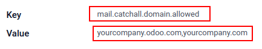

# Send and receive emails in Odoo with an email server

## Odoo Online or Odoo.sh users

Since **Odoo sets up its own mail servers for the database**, outgoing
and incoming emails already work out-of-the-box. So for **Odoo Online**
and **Odoo.sh** customers, nothing needs to be configured!

Unless an external mail server is required to send large batches of mass
emails, simply use the standard online Odoo database normally since it
has already been pre-configured to send email.

> [!IMPORTANT]
> The Odoo server is subject to a daily email limit to prevent abuse.
> The default limit is 200 emails sent per day for databases with an
> **Enterprise** subscription. This limit can be increased under certain
> conditions. See the `FAQ <faq>` or contact support for more
> information.

## Scope of this documentation

This document is **mainly dedicated to Odoo on-premise databases** that
do not benefit from an out-of-the-box solution to send and receive
emails in Odoo, unlike [Odoo Online \<https://www.odoo. com/trial\>]()
and [Odoo.sh](https://www.odoo.sh). Incoming and outgoing servers must
be configured for on-premise databases.

The following sections below contain information on how to integrate an
external email server with Odoo.

> [!WARNING]
> If no one in the company is employed to manage email servers, Odoo
> Online and Odoo.sh are strongly recommended. In these Odoo hosting
> types email sending and receiving works instantly and is monitored by
> professionals. Nevertheless, a company can use their own email server
> if they want to manage the email server's reputation themselves. For
> more information see
> `Configure DNS records to send emails in Odoo <email_domain>`

## Default notifications system

Documents in Odoo (such as a CRM opportunity, a sales order, an invoice,
etc.) have a discussion thread, called *chatter*.

When a database user posts a message in the chatter, this message is
sent by email to the followers of the document as a notification (except
to the sender). If a follower replies to the message, the reply updates
the chatter, and Odoo relays another reply to the followers as a
notification. Messages sent back to the chatter from users or external
users will appear in the chatter from their respective email, or as the
name listed in their *Contacts* record.

These notifications are sent using a default from address. For more
information see
`Use a default email address <email_communication/default>`.

## Manage outbound messages

As a system administrator, go to
`Settings --> General Settings --> Discuss` in Odoo, and enable the
`Custom Email Servers` option. Then, click `Save`. Next, click
`Outgoing Email Servers` and click `Create` to create a new outgoing
mail server record in Odoo. Reference the SMTP data of the external
email server. Once all the information has been filled out, click
`Test Connection`.

\- `google_oauth` - `azure_oauth`

> [!NOTE]
> Ensuring the outgoing domain has `SPF (Sender Policy Framework)`,
> `DKIM (DomainKeys
> Identified Mail)` and
> `DMARC (Domain-based Message Authentication, Reporting, &
> Conformance)` set up on the `DNS (Domain Name System)` will improve
> deliverability. For more information see `email_domain`.

### Port restriction

Note that port 25 is blocked for security reasons on the Odoo Online and
Odoo.sh platforms. Try using ports 465, 587, or 2525 instead.

### Use a default "From" email address

Sometimes, an email's "From" (outgoing) address can belong to a
different domain, and that can be a problem.

For example, if a customer with the email address
mary@customer.example.com responds to a
message, Odoo will try to redistribute that same email to the other
subscribers in the thread. However, if the domain
customer.example.com forbids that kind of
usage for security, the email that Odoo is trying to redistribute would
get rejected by some recipients' email servers.

To avoid that problem, Odoo sends all emails using a "From" address from
the same authorized domain.

Access the `System Parameters` by activating
`developer mode <developer-mode>` and going to
`Settings --> Technical --> Parameters --> System Parameters` menu.

To force the email address from which emails are sent, a combination of
the following keys needs to be set in the system parameters of the
database:

- \`mail.default.from\`: accepts the local part or a complete email
  address as value
- \`mail.default.from_filter\`: accepts a domain name or a full email
  address as value

> [!NOTE]
> The mail.default.from_filter works only
> for odoo-bin configurations or the
> default Odoo email server, otherwise this parameter can be set using
> the from_filter field on
> ir.mail_server.

The field can be a domain name or an entire email address, or it can
remain empty. If the sender's email address does not match this set
filter, then the email will be encapsulated using a combination of the
two system parameters: mail.default.from
and mail.catchall.domain.

In the following example, the from email address is replaced with the
combination of the the two system parameters
(mail.default.from and
mail.catchall.domain). This is the
defaultnotifications configuration in Odoo:
`“Admin” <admin@example.com>` =\>
`“Admin” <notifications@mycompany.com>`.

In other words if the email address of the author does not match
mail.default.from_filter, the email
address is replaced by mail.default.from
(if it contains a full email address) or a combination of
mail.default.from and
mail.catchall.domain.

If the from_filter contains a full email
address, and if the mail.default.from is
the same as this address, then all of the email addresses that are
different from mail.default.from will be
encapsulated in mail.default.from.

### Utilizing the "From" filter on an outgoing email server

The `FROM Filtering` field allows for the use of a specific outgoing
email server depending on the `From` email address or domain that Odoo
is sending on behalf of. This setting can be used to improve the
deliverability or sending success rate of emails sent from the database.
Setting the `FROM Filtering` field can also be used to send from
different domains in a multi-company environment. Access this field in
Odoo by navigating to
`Settings --> Discuss --> Custom Mail Servers --> Outgoing Mail Servers --> New`.

When an email is sent from Odoo while the `FROM Filtering` field is set,
an email server is chosen in the following sequence:

1.  First, Odoo searches for an email server that has the same
    `FROM Filtering` value as the `From` value (email address) defined
    in the outgoing email. For example, if the `From` value (email
    address) is test@example.com, only
    the email servers that have the `FROM Filtering` value equal to
    test@example.com are returned.
2.  However, if no email servers are found that use the `From` value,
    then Odoo searches for an email server that has the same *domain* as
    the `From` value (email address) defined in the outgoing email. For
    example, if the `From` email address is
    test@example.com, only the email
    servers that have the `FROM Filtering` value equal to
    example.com are returned.

If no email servers are found after checking for the domain, then Odoo
returns all email servers that do not have any `FROM Filtering` value(s)
set.

Should this query return no results, then Odoo performs a search for an
email server using the system parameter:
mail.default.from. First, the email
address listed attempts to match an email server, and then the domain
attempts to find a match. If no email server is found, Odoo returns the
first outgoing email server (sorted by priority).

> [!NOTE]
> If several email servers are found, then Odoo uses the first one
> according to its priority. For example, if there are two email
> servers, one with a priority of 10 and
> the other with a priority of 20, then
> the email server with a priority of 10
> is used first.

### Set up different dedicated servers for transactional and mass emails

In Odoo a separate email server can be used for transactional emails and
mass mailings. Example: Use Postmark or SendinBlue for transactional
emails, and Amazon SES, Mailgun, Sendgrid or `Mailjet <mailjet_api>` for
mass mailings.

> [!IMPORTANT]
> A default outgoing email server is already configured. Do not create
> an alternative one unless a specific external outgoing email server is
> needed for technical reasons.

To do this, first activate the `developer mode <developer-mode>`, and
then go to `Settings --> Technical --> Outgoing` email servers. There,
create two outgoing email server settings; one for the transactional
emails and one for the mass mailing server. Make sure to give priority
to the transactional server over the mass mailing server by providing a
lower priority number for the transactional email server.

Now, go to `Email Marketing --> Settings` and enable `Dedicated Server`.
Choose the appropriate email server. With these settings, Odoo uses the
server with the lower priority for transactional emails, and the server
here selected for mass mails. Note that in this case, the domain's
Sender Policy Framework (SPF) records must be set to include both
transactional and mass mail servers.

\- `email_domain`

## Manage inbound messages

Odoo relies on generic email aliases to fetch incoming messages.

- **Reply messages** of messages sent from Odoo are routed to their
  original discussion thread (and to the inbox of all its followers) by
  the alias of the model if there is any or by the catchall alias
  (**catchall@**). Replies to messages of models that do not have a
  custom alias will use the catchall alias
  (catchall@mycompany.odoo.com). The
  catchall address, however, does not have another action attached to it
  like other aliases might, it is only used to collect replies.

- **Bounced messages** are used as a Return-Path. One example this is
  especially useful for is in [Odoo Email
  Marketing](https://www.odoo.com/page/email-marketing). In this case
  bounces are opt-out based on if the email bounced too many times (5)
  in the last month and the bounces are separated by one week. This is
  done to avoid blacklisting someone because of a mail server error. If
  these circumstances are met then the email is considered invalid and
  is blacklisted. A log note is added on the contact under
  `Blacklisted Email Addresses` on the
  `Email Marketing Configuration Menu`.

  Messages that bounce in the chatter (outside of Email Marketing) will
  populate a red envelope indicating the failed delivery. This can be
  helpful to know that a Sales Order or an Invoice did not reach its
  final destination.

- **Original messages**: several business objects have their own alias
  to create new records in Odoo from incoming emails:

  > - Sales channel (to create *Leads* or *Opportunities* in [Odoo CRM
  >   \<https://www.odoo.com/page/ crm\>]())
  > - Support channel (to create *Tickets* in [Odoo
  >   Helpdesk](https://www.odoo.com/page/helpdesk))
  > - Projects (to create new *Tasks* in [Odoo Project
  >   \<https://www.odoo.com/page /project-management\>]())
  > - Job positions (to create *Applicants* in [Odoo Recruitment
  >   \<https://www.odoo.com/page /recruitment\>]())

Depending on the mail server, there might be several methods to fetch
emails. The easiest and most recommended method is to manage one email
address per Odoo alias in the mail server.

- Create the corresponding email addresses in the mail server
  (**catchall@**, **bounce@**, **sales@**, etc.).

- Set the `Alias Domain` name in `Settings --> General Settings -->
  Discuss`. Changing the `Alias Domain` will change the catchall's
  domain for the database.

- If the database's hosting type is Odoo on-premise, create an
  `Incoming Mail Server` in Odoo for each alias. To create a new
  incoming server go to: `Settings --> Discuss
  --> Custom Mail Servers --> Incoming Mail Servers --> New` Fill out
  the form according to the email provider's settings. Leave the
  `Actions to Perform on Incoming Mails` field blank. Once all the
  information has been filled out, click on `TEST & CONFIRM`.

  

- If the database's hosting type is Odoo Online or Odoo.sh, redirecting
  or forwarding incoming messages to Odoo's domain name instead of the
  external email server is recommended. That way, incoming messages can
  be received without delay. Redirections for all email addresses should
  be set to Odoo's domain name in the email server (e.g.
  catchall@mydomain.ext to
  catchall@mycompany.odoo.com).

All the aliases are customizable in Odoo. Object aliases can be edited
from their respective configuration view by navigating to
`Settings --> Technical Menu --> Email -->
Aliases`.

To edit catchall and bounce aliases, first activate the
`developer mode <developer-mode>`. Then, go to
`Settings --> Technical --> Parameters --> System Parameters` to
customize the aliases
(mail.catchall.alias &
mail.bounce.alias). These types of
changes should be completed prior to the database going live. If a
customer replies after a change is made then the system will not
recognize the old alias, and the reply will not be received.

By default, inbound messages are fetched every 5 minutes for on-premise
databases.

> [!NOTE]
> This value can be changed in `developer mode <developer-mode>`. Go to
> `Settings --> Technical --> Automation --> Scheduled Actions` and look
> for `Mail: Fetchmail Service`.

### System parameters that prevent feedback loops

There are two system parameters that help prevent email loops from
occurring in Odoo. These parameters were introduced in Odoo 16 to
prevent aliases from creating too many records and to prevent feedback
loops on the catchall reply-to email address. They are present in
database but not in the *System Parameters*. To override the following
defaults they need to be added in.

The two system parameters are as follows:

- mail.gateway.loop.minutes (120 minutes
  by default)
- mail.gateway.loop.threshold (20 by
  default)

Add these fields in Odoo by first enabling
`developer mode <developer-mode>`, and then navigating to
`Settings --> Technical Menu --> Parameters --> System Parameters`.
Change the value of these parameters, as needed.

When an email is received in the Odoo database on the catchall email
address or on any alias, Odoo looks at the mail received for the given
period of time defined in the system parameter
mail.gateway.loop.minutes. If the
received email was sent to an alias then Odoo will reference the
mail.gateway.loop.threshold system
parameter and determine the value as the number of records this alias is
allowed to create in the given period of time (value of
mail.gateway.loop.minutes).

In addition, when email is received to the catchall email address, Odoo
will reference the emails received to the database during the set period
of time (as stated by the value in the system parameter:
mail.gateway.loop.minutes). Odoo will
then determine whether any of the emails received match that of the
email(s) being received during the specified time-frame, and will
prevent a feedback loop from occurring if a duplicate email is detected.

### Allow alias domain system parameter

Incoming aliases are set in the Odoo database to create records by
receiving incoming emails. To view aliases set in the Odoo database,
first activate the `developer mode <developer-mode>`. Then, go to
`Settings app --> Technical --> Email section --> Aliases`.

The following system parameter,
mail.catchall.domain.allowed, set with
allowed alias domain values, separated by commas, filters out correctly
addressed emails to aliases. Setting the domain(s) for which the alias
can create a ticket, lead, opportunity, etc., eliminates false positives
where email addresses with only the prefix alias (not the domain) are
present.

In some instances, matches have been made in the Odoo database when an
email is received with the same alias prefix and a different domain on
the incoming email address. This is true in the sender, recipient, and
`CC (Carbon Copy)` email addresses of an incoming email.

When Odoo receives emails that have the name
commercial prefix alias in the sender,
recipient, or `CC (Carbon Copy)` email address(es) (e.g.
<commercial@gmail.com>, <commercial@odoo.net>), the database falsely
treats the email as the full commercial
alias (with a different domain), and therefore, creates a
ticket/lead/opportunity/etc.

To add the mail.catchall.domain.allowed
system parameter, first, activate the `developer mode
<developer-mode>`. Then, go to
`Settings app --> Technical --> Parameters section -->
System Parameters`. Click `Create`. Then, type in
mail.catchall.domain.allowed for the
`Key` field.

Next, for the `Value` field, add the domain(s) separated by comma(s) (if
plural domains). Manually `Save`, and the system parameter takes
immediate effect.

