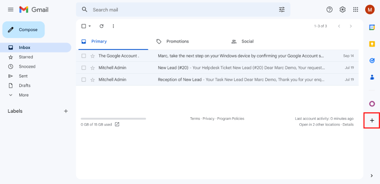
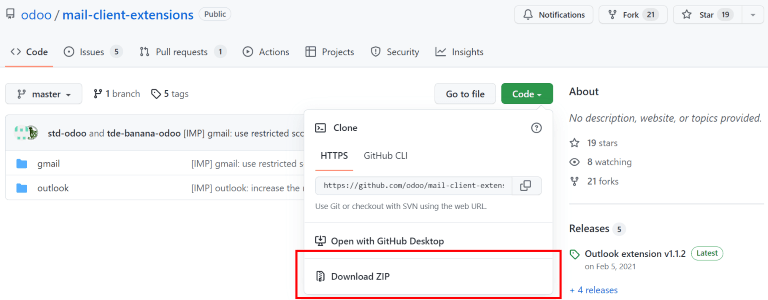

# Gmail Plugin

The *Gmail Plugin* integrates an Odoo database with a Gmail inbox, so
users can keep track of all their work between Gmail and Odoo, without
losing any information.

## Odoo Online users

For databases hosted on Odoo Online (or Odoo.sh), follow the steps below
to configure the Gmail Plugin.

### Install the Gmail Plugin

First, log in to the Gmail account that the user wishes to connect to
Odoo.

From the Gmail inbox, click the plus sign icon on the right side panel
to get add-ons. If the side panel is not visible, click on the arrow
icon at the bottom right corner of the inbox to reveal it.



Then, use the search bar to search for
<span class="title-ref">Odoo</span> and locate the `Odoo Inbox Addin`.


Or, go directly to the `Odoo Inbox Addin` page on the [Google Workspace
Marketplace](https://workspace.google.com/marketplace/app/odoo_inbox_addin/873497133275).

Once the plugin is located, click `Install`. Then, click `Continue` to
start the installation.

Next, select which Gmail account the user wishes to connect to Odoo.
Then click `Allow` to let Odoo access the Google account. Google will
then show a pop-up window confirming that the installation was
successful.

### Configure the Odoo database

The `Mail Plugin` feature must be enabled in the Odoo database in order
to use the Gmail Plugin. To enable the feature, go to
`Settings --> General Settings`. Under the `Integrations` section,
activate `Mail Plugin`, and then click `Save`.


### Configure the Gmail inbox

In the Gmail inbox, a purple Odoo icon is now visible on the right side
panel. Click on the Odoo icon to open up the Odoo plugin window. Then,
click on any email in the inbox. Click `Authorize Access` in the plugin
window to grant Odoo access to the Gmail inbox.


Next, click `Login`. Then, enter the URL of the Odoo database that the
user wishes to connect to the Gmail inbox, and log in to the database.

> [!NOTE]
> Use the general URL for the database, not the URL of a specific page
> in the database. For example, use
> <span class="title-ref">https://mycompany.odoo.com</span>, not
> <span class="title-ref">https://mycompany.odoo.com/web#cids=1&action=menu</span>.

Finally, click `Allow` to let Gmail access the Odoo database. The
browser will then show a `Success!` message. After that, close the
window. The Gmail inbox and Odoo database are now connected.

## Odoo On-Premise users

For databases hosted on servers other than Odoo Online (or Odoo.sh),
follow the steps below to configure the Gmail Plugin.

> [!NOTE]
> As part of their security guidelines, Google requires add-on creators
> to provide a list of URLs that can be used in actions and redirections
> launched by the add-on. This protects users by ensuring, for example,
> that no add-on redirects users toward a malicious website. (Read more
> on [Google Apps
> Script](https://developers.google.com/apps-script/manifest/allowlist-url).)
>
> Since Odoo can only list the <span class="title-ref">odoo.com</span>
> domain and not every on-premise customer's unique server domain,
> on-premise customers cannot install the Gmail Plugin from the Google
> Workspace Marketplace.

### Install the Gmail Plugin

First, access the [GitHub
repository](https://github.com/odoo/mail-client-extensions) for the Odoo
Mail Plugins. Next, click on the green `Code` button. Then, click
`Download ZIP` to download the Mail Plugin files onto the user's
computer.



Open the ZIP file on the computer. Then, go to
`mail-client-extensions-master -->
gmail --> src --> views`, and open the `login.ts` file using any text
editor software, such as Notepad (Windows), TextEdit (Mac), or Visual
Studio Code.

Delete the following three lines of text from the `login.ts` file:

``` 
if (!/^https:\/\/([^\/?]*\.)?odoo\.com(\/|$)/.test(validatedUrl)) {
     return notify("The URL must be a subdomain of odoo.com");
}
```

This removes the <span class="title-ref">odoo.com</span> domain
constraint from the Gmail Plugin program.

Next, in the ZIP file, go to `mail-client-extensions-master --> gmail`,
and open the file called `appsscript.json`. In the `urlFetchWhitelist`
section, replace all the references to
<span class="title-ref">odoo.com</span> with the Odoo customer's unique
server domain.

Then, in the same `gmail` folder, open the file called `README.md`.
Follow the instructions in the `README.md` file to push the Gmail Plugin
files as a Google Project.

> [!NOTE]
> The computer must be able to run Linux commands in order to follow the
> instructions on the `README.md` file.

After that, share the Google Project with the Gmail account that the
user wishes to connect to Odoo. Then, click `Publish` and
`Deploy from manifest`. Lastly, click `Install the add-on` to install
the Gmail Plugin.

### Configure the Odoo database

The `Mail Plugin` feature must be enabled in the Odoo database in order
to use the Gmail Plugin. To enable the feature, go to
`Settings --> General Settings`. Under the `Integrations` section,
activate `Mail Plugin`, and then click `Save`.


### Configure the Gmail inbox

In the Gmail inbox, a purple Odoo icon is now visible on the right side
panel. Click on the Odoo icon to open up the Odoo plugin window. Then,
click on any email in the inbox. Click `Authorize Access` in the plugin
window to grant Odoo access to the Gmail inbox.


Next, click `Login`. Then, enter the URL of the Odoo database that the
user wishes to connect to the Gmail inbox, and log in to the database.

> [!NOTE]
> Use the general URL for the database, not the URL of a specific page
> in the database. For example, use
> <span class="title-ref">https://mycompany.odoo.com</span>, not
> <span class="title-ref">https://mycompany.odoo.com/web#cids=1&action=menu</span>.

Finally, click `Allow` to let Gmail access the Odoo database. The
browser will then show a `Success!` message. After that, close the
window. The Gmail inbox and Odoo database are now connected.
