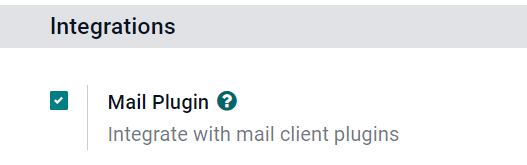

# Gmail Plugin

The *Gmail Plugin* integrates an Konvergo ERP database with a Gmail inbox, so
users can keep track of all their work between Gmail and Konvergo ERP, without
losing any information.

## Konvergo ERP Online users

For databases hosted on Konvergo ERP Online (or Konvergo ERP.sh), follow the steps below
to configure the Gmail Plugin.

### Install the Gmail Plugin

First, log in to the Gmail account that the user wishes to connect to
Konvergo ERP.

From the Gmail inbox, click the plus sign icon on the right side panel
to get add-ons. If the side panel is not visible, click on the arrow
icon at the bottom right corner of the inbox to reveal it.


Then, use the search bar to search for
<span class="title-ref">Konvergo ERP</span> and locate the `Konvergo ERP Inbox Addin`.


Or, go directly to the `Konvergo ERP Inbox Addin` page on the [Google Workspace
Marketplace](https://workspace.google.com/marketplace/app/odoo_inbox_addin/873497133275).

Once the plugin is located, click `Install`. Then, click `Continue` to
start the installation.

Next, select which Gmail account the user wishes to connect to Konvergo ERP.
Then click `Allow` to let Konvergo ERP access the Google account. Google will
then show a pop-up window confirming that the installation was
successful.

### Configure the Konvergo ERP database

The `Mail Plugin` feature must be enabled in the Konvergo ERP database in order
to use the Gmail Plugin. To enable the feature, go to
`Settings --> General Settings`. Under the `Integrations` section,
activate `Mail Plugin`, and then click `Save`.



### Configure the Gmail inbox

In the Gmail inbox, a purple Konvergo ERP icon is now visible on the right side
panel. Click on the Konvergo ERP icon to open up the Konvergo ERP plugin window. Then,
click on any email in the inbox. Click `Authorize Access` in the plugin
window to grant Konvergo ERP access to the Gmail inbox.


Next, click `Login`. Then, enter the URL of the Konvergo ERP database that the
user wishes to connect to the Gmail inbox, and log in to the database.

> [!NOTE]
> Use the general URL for the database, not the URL of a specific page
> in the database. For example, use
> <span class="title-ref">https://mycompany.odoo.com</span>, not
> <span class="title-ref">https://mycompany.odoo.com/web#cids=1&action=menu</span>.

Finally, click `Allow` to let Gmail access the Konvergo ERP database. The
browser will then show a `Success!` message. After that, close the
window. The Gmail inbox and Konvergo ERP database are now connected.

## Konvergo ERP On-Premise users

For databases hosted on servers other than Konvergo ERP Online (or Konvergo ERP.sh),
follow the steps below to configure the Gmail Plugin.

> [!NOTE]
> As part of their security guidelines, Google requires add-on creators
> to provide a list of URLs that can be used in actions and redirections
> launched by the add-on. This protects users by ensuring, for example,
> that no add-on redirects users toward a malicious website. (Read more
> on [Google Apps
> Script](https://developers.google.com/apps-script/manifest/allowlist-url).)
>
> Since Konvergo ERP can only list the <span class="title-ref">odoo.com</span>
> domain and not every on-premise customer's unique server domain,
> on-premise customers cannot install the Gmail Plugin from the Google
> Workspace Marketplace.

### Install the Gmail Plugin

First, access the [GitHub
repository](https://github.com/odoo/mail-client-extensions) for the Konvergo ERP
Mail Plugins. Next, click on the green `Code` button. Then, click
`Download ZIP` to download the Mail Plugin files onto the user's
computer.


Open the ZIP file on the computer. Then, go to
`mail-client-extensions-master -->
gmail --> src --> views`, and open the `login.ts` file using any text
editor software, such as Notepad (Windows), TextEdit (Mac), or Visual
Studio Code.

Delete the following three lines of text from the `login.ts` file:

``` 
if (!/^https:\/\/([^\/?]*\.)?odoo\.com(\/|$)/.test(validatedUrl)) {
     return notify("The URL must be a subdomain of odoo.com");
}
```

This removes the <span class="title-ref">odoo.com</span> domain
constraint from the Gmail Plugin program.

Next, in the ZIP file, go to `mail-client-extensions-master --> gmail`,
and open the file called `appsscript.json`. In the `urlFetchWhitelist`
section, replace all the references to
<span class="title-ref">odoo.com</span> with the Konvergo ERP customer's unique
server domain.

Then, in the same `gmail` folder, open the file called `README.md`.
Follow the instructions in the `README.md` file to push the Gmail Plugin
files as a Google Project.

> [!NOTE]
> The computer must be able to run Linux commands in order to follow the
> instructions on the `README.md` file.

After that, share the Google Project with the Gmail account that the
user wishes to connect to Konvergo ERP. Then, click `Publish` and
`Deploy from manifest`. Lastly, click `Install the add-on` to install
the Gmail Plugin.

### Configure the Konvergo ERP database

The `Mail Plugin` feature must be enabled in the Konvergo ERP database in order
to use the Gmail Plugin. To enable the feature, go to
`Settings --> General Settings`. Under the `Integrations` section,
activate `Mail Plugin`, and then click `Save`.


### Configure the Gmail inbox

In the Gmail inbox, a purple Konvergo ERP icon is now visible on the right side
panel. Click on the Konvergo ERP icon to open up the Konvergo ERP plugin window. Then,
click on any email in the inbox. Click `Authorize Access` in the plugin
window to grant Konvergo ERP access to the Gmail inbox.


Next, click `Login`. Then, enter the URL of the Konvergo ERP database that the
user wishes to connect to the Gmail inbox, and log in to the database.

> [!NOTE]
> Use the general URL for the database, not the URL of a specific page
> in the database. For example, use
> <span class="title-ref">https://mycompany.odoo.com</span>, not
> <span class="title-ref">https://mycompany.odoo.com/web#cids=1&action=menu</span>.

Finally, click `Allow` to let Gmail access the Konvergo ERP database. The
browser will then show a `Success!` message. After that, close the
window. The Gmail inbox and Konvergo ERP database are now connected.
