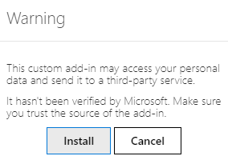

# Outlook Plugin

Outlook allows for third-party applications to connect in order to
execute database actions from emails. Odoo has a plugin for Outlook that
allows for the creation of an opportunity from the email panel.

## Configuration

The Outlook `Mail Plugin <../mail_plugins>` needs to be configured both
on Odoo and Outlook.

### Enable Mail Plugin

First, enable the *Mail Plugin* feature in the database. Go to
`Settings --> General
Settings --> Integrations`, enable `Mail Plugin`, and `Save` the
configuration.

### Install the Outlook Plugin

Download (`Save Page As --> Web Page XML only`) the following XML file
to upload later:
<https://download.odoocdn.com/plugins/outlook/manifest.xml>.

Next, open the Outlook mailbox, and select any email. After completing
this, click on the `More actions` button in the upper right-side and
select `Get Add-ins`.

> [!TIP]
> For locally installed versions of Microsoft Outlook, access the
> `Get Add-ins` menu item while in preview mode (**not** with a message
> open). First, click on the `...
> (ellipsis)` icon in the upper right of the previewed message, then
> scroll down, and click on `Get Add-ins`.

Following this step, select the `My add-ins` tab on the left-side.

Under `Custom add-ins` towards the bottom, click on
`+ Add a custom add-in`, and then on `Add from file...`

For the next step, attach the
manifest.xml file downloaded above, and
press `OK`. Next, read the warning and click on `Install`.

### Connect the database

Now, Outlook will be connected to the Odoo database. First, open any
email in the Outlook mailbox, click on the `More actions` button in the
upper right-side, and select `Odoo for
Outlook`.

The right-side panel can now display **Company Insights**. At the
bottom, click on `Login`.

> [!NOTE]
> Only a limited amount of **Company Insights** (*Lead Enrichment*)
> requests are available as a trial database. This feature requires
> `prepaid credits <mail_plugins/pricing>`.

> [!TIP]
> If, after a short while, the panel is still empty, it is possible that
> the browser cookie settings prevented it from loading. Note that these
> settings also change if the browser is in "Incognito" mode.
>
> To fix this issue, configure the browser to always allow cookies on
> Odoo's plugin page.
>
> For Google Chrome, change the browser cookie settings by following the
> guide at: <https://support.google.com/chrome/answer/95647> and adding
> download.odoo.com to the list of
> `Sites that can always use cookies`.
>
> Once this is complete, the Outlook panel needs to be opened again.

Now, enter the Odoo database URL and click on `Login`.

Next, click on `Allow` to open the pop-up window.

If the user isn't logged into the database, enter the credentials. Click
on `Allow` to let the Outlook Plugin connect to the database.

### Add a shortcut to the plugin

By default, the Outlook Plugin can be opened from the *More actions*
menu. However, to save time, it's possible to add it next to the other
default actions.

In the Outlook mailbox, click on `Settings`, then on `View all Outlook
settings`.

Now, select `Customize actions` under `Mail`, click on `Odoo for
Outlook`, and then `Save`.

Following this step, open any email; the shortcut should be displayed.

### Using the plugin

Now that the plug-in is installed and operational, all that needs to be
done to create a lead is to click on the
O \[Odoo icon\] or navigate to
`More actions` and click on `Odoo
for Outlook`. The side panel will appear on the right-side, and under
`Opportunities` click on `New`. A new window with the created
opportunity in the Odoo database will populate.
