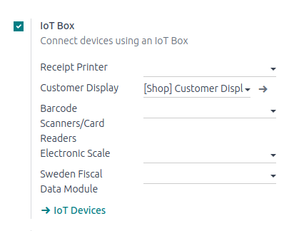

# Use an IoT box with a PoS

## Prerequisites

Before starting, make sure the following equipment is available:

- An `IoT (Internet of Things)` box, with its power adapter.
- A computer or tablet with an up-to-date web browser.
- Konvergo ERP Online or an Konvergo ERP instance with the *Point of Sale* and *IoT*
  applications installed.
- A local network set up with
  `DHCP (Dynamic Host Configuration Protocol)` (this is the default
  setting).
- An RJ45 Ethernet Cable (optional, but preferred over WiFi, which is
  already built in).
- Any of the supported hardware (receipt printer, barcode scanner, cash
  drawer, payment terminal, scale, customer display, etc.). The list of
  supported hardware can be found on the [POS Hardware
  page](https://www.odoo.com/page/point-of-sale-hardware).

## Setup

<figure>

<figcaption>A suggested configuration for a point of sale
system.</figcaption>
</figure>

To connect hardware to the `PoS (Point of Sale)`, the first step is to
connect an `IoT
(Internet of Things)` box to the database. To do this, follow these
instructions: `Connect an
Internet of Things (IoT) box to the Konvergo ERP database <connect>`.

Then, connect the peripheral devices to the `IoT (Internet of Things)`
box.

| Device Name      | Instructions                                                                                                                                                                                                      |
|------------------|-------------------------------------------------------------------------------------------------------------------------------------------------------------------------------------------------------------------|
| Printer          | Connect a supported receipt printer to a `USB (Universal Serial Bus)` port or to the network, and power it on. Refer to `/applications/sales/point_of_sale/restaurant/kitchen_printing`.                          |
| Cash drawer      | The cash drawer should be connected to the printer with an RJ25 cable.                                                                                                                                            |
| Barcode scanner  | In order for the barcode scanner to be compatible it must end barcodes with an ENTER character (keycode 28). This is most likely the default configuration of the barcode scanner. |
| Scale            | Connect the scale and power it on. Refer to `../devices/scale`.                                                                                                                                                   |
| Customer display | Connect a screen to the `IoT (Internet of Things)` box to display the `PoS (Point                                                                                                                                 
                    of Sale)` order. Refer to `../devices/screen`.                                                                                                                                                                     |
| Payment terminal | The connection process depends on the terminal. Refer to the `payment terminals                                                                                                                                   
                    documentation </applications/sales/point_of_sale/payment_methods>`.                                                                                                                                                |

Once this is completed, connect the `IoT (Internet of Things)` box to
the `PoS` application. To do this, go to
`Point of Sale --> Configuration --> PoS`, tick the `IoT Box` option,
and select the devices to be used in this `PoS (Point of Sale)`. `Save`
the the changes.

Once set up is done, a new `PoS (Point of Sale)` session can be
launched.
