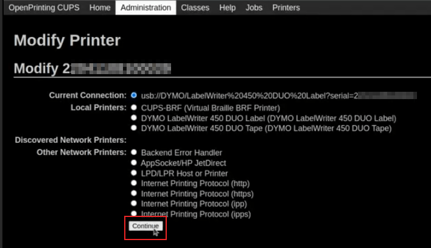

# Troubleshooting

## IoT box connection

### Unable to locate the pairing code to connect the IoT box

The pairing code should be printed on receipt printers connected to the
`IoT (Internet of
Things)` box and should also be displayed on connected monitors.

The pairing code does not show under the following circumstances:

- The `IoT (Internet of Things)` box is already connected to an Odoo
  database.
- The `IoT (Internet of Things)` box is not connected to the Internet.
- The code is only valid for 5 minutes after the
  `IoT (Internet of Things)` box has started. It is automatically
  removed from connected displays when this time has expired.
- The version of the `IoT (Internet of Things)` box image is too old. If
  the `IoT
  (Internet of Things)` box image is from an earlier version, then the
  SD card of the `IoT
  (Internet of Things)` box needs to be re-flashed to update the image
  (see `Flashing the SD
  Card <iot/config/flash>`).

If none of the cases listed above correct the issue, then make sure the
`IoT (Internet of
Things)` box has correctly started, by checking that a fixed green LED
is showing next to the power port.

### IoT box is connected but it is not showing in the database

When an `IoT (Internet of Things)` box connects to a database, it may
restart. If so, it can take up to five minutes before appearing in the
database. If the `IoT (Internet of Things)` box is still not showing
after five minutes, make sure that the `IoT (Internet of Things)` box
can reach the database and that the server does not use a multi-database
environment.

To access the database from the `IoT (Internet of Things)` box, open a
browser and type in the database address.

### The IoT box is connected to the Odoo database, but cannot be reached

Make sure that the `IoT (Internet of Things)` box and the computer
running the browser are located on the same network, as the
`IoT (Internet of Things)` box cannot be reached from outside the local
network.

### The HTTPS certificate does not generate

In order to generate a `HTTPS (Hypertext Transfer Protocol Secure)`
certificate, an IoT box subscription is required for the
`IoT (Internet of Things)` box. Connecting the `IoT
(Internet of Things)` box prior to configuring an
`IoT (Internet of Things)` subscription for the database and
`IoT (Internet of Things)` box with the Account Manager will result in
an unsecured connection.

In addition, a firewall can also prevent the
`HTTPS (Hypertext Transfer Protocol Secure)` certificate from generating
correctly. In this case, deactivate the firewall until the certificate
is successfully generated. It should also be noted that certain devices,
such as a router that has a built-in firewall, can prevent the
`HTTPS (Hypertext Transfer Protocol Secure)` certificate from
generating.

`HTTPS certificate (IoT) <https_certificate_iot>`

## Printer

### The printer is not detected

If a printer does not appear in the devices list, go to the
`IoT (Internet of Things)` box homepage and make sure that it is listed
under `Printers`.

If the printer is not present on the `IoT (Internet of Things)` box
homepage, click `Printers Server`, go to the `Administration` tab and
click on `Add
Printer`. If the printer is not present in the list, it is likely not
connected properly.

### The printer outputs random text

For most printers, the correct driver should be automatically detected
and selected. However, in some cases, the automatic detection mechanism
might not be enough, and if no driver is found, the printer might print
random characters.

The solution is to manually select the corresponding driver. On the
`IoT (Internet of Things)` box homepage, click on `Printers Server`, go
to the `Printers` tab and select the printer in the list. In the
`Administration` drop-down menu, click on `Modify Printer`. Follow the
steps and select the *make* and *model* corresponding to the printer.

> [!NOTE]
> Epson and Star receipt printers and Zebra label printers do not need a
> driver to work. Make sure that no driver is selected for those
> printers.

#### Epson configuration special case

Most Epson printers support printing receipts in Odoo
`POS (Point of Sale)` using the GS v 0
command. However, the following Epson printer models do not support this
command:

- TM-U220
- TM-U230
- TM-P60
- TMP-P60II

Bypass this issue by configuring the printer to use the
ESC \* command instead.

##### Process to force ESC \* command

###### Epson printer compatibility

The first step is to check whether the printer is incompatible with
GS v 0 command.

- [Epson GS v 0 documentation
  \<https://reference.epson-biz.com/modules/ref_escpos/index.php?
  content_id=94\>]() for GS v 0
  compatible printers.
- [Epson ESC \* documentation
  \<https://reference.epson-biz.com/modules/ref_escpos/index.php
  ?content_id=88\>]() for ESC \*
  compatible printers.

If the printer is not compatible with the ESC
\* command then the following process is not possible. Should the
printer be compatible to use the ESC \*
command to print, follow this process to configure the printer with the
`IoT (Internet of Things)` box.

###### IoT box configuration for ESC \*

To configure the `IoT (Internet of Things)` box to use the
ESC \* command to print, go to the
`IoT (Internet of Things)` box homepage by navigating to
`IoT app --> IoT
Boxes`. Then click on the `IP address` and this will direct to the
`IoT (Internet of
Things)` box homepage.

**Choosing the printer**

Now click on the `Printers server` button. This will redirect the
browser to the *CUPS* page. Next, go to
`Administration --> Printers --> Add Printer`, choose the printer that
should be modified, and then click `Continue`.

> [!TIP]
> If the name of the printer is still uncertain, take the following
> steps:
>
> 1.  Take note of the listed printers on the *CUPS* page.
> 2.  Turn the printer off and refresh the page.
> 3.  Now compare the difference with the first list to see which
>     printer disappeared.
> 4.  Turn the printer back on and refresh the page again.
> 5.  Double-check the list again to see if the printer re-appears.
> 6.  The printer that disappeared and reappears again on the listed
>     printers is the name of the printer in question.
>
> > [!NOTE]
> > This can be `Unknown` under `Local printers`.

**CUPS naming convention**

CUPS will prompt the administrator for
three pieces of information: the `Name`, `Description` and the
`Location`. The last two pieces of information do not need to be
specific, however, the `Name` should follow a particular convention to
work with the ESC \* command.

The `Name` should match this convention:
\<printer_name\>\_\_IMC\_\<param_1\>\_\<param_2\>\_...\_\<param_n\>\_\_

A breakdown of the naming convention:

- \`printer_name[: This is the printer name. It can be any character as
  long as it does not contain ](),
  /, \#\`, or
    (space character).
- \`IMC\`: This stands for *Image Mode Column* (the simplified name for
  ESC \*).
- \`param_1\`: This stands for the specific parameter:
  - \`SCALE\<X\>: Scale of the picture (with the
    same aspect ratio). \`X should be an integer describing the
    scale percentage that should be used.

    

    100 is the original size,
    50 is half the size,
    200 is twice the size.

    

  - \`LDV\`: *Low Density Vertical* (will be set to *High Density
    Vertical* if not specified).

  - \`LDH\`: *Low Density Horizontal* (will be set to *High Density
    Horizontal* if not specified).

    > [!NOTE]
    > *Density* parameters might need to be configured in a particular
    > way depending on the printer model.

Visit [Epson's ESC \*
documentation](https://reference.epson-biz.com/modules/ref_escpos/index.php?content_id=88)
and click on the printer model printer in the table above to see if the
printer should set these parameters.

The following are examples of proper and improper name formatting:

Proper name formatting:

- EPSONTMm30II\_\_IMC\_\_
- EPSON_TM_U220\_\_IMC_LDV_LDH_SCALE80\_\_

Improper name formatting (this will not prevent printing, but the result
might not have the expected printed output):

- EPSON TMm 30II -\> The name cannot have
  spaces.
- EPSONTMm30II -\> The name itself is
  correct, but it will not use ESC \*.
- EPSONTMm30II\_\_IMC -\> This name is
  missing the end \_\_.
- EPSONTMm30II\_\_IMC_XDV\_\_ -\> The
  parameter XDV does not match any
  existing parameters.
- EPSONTMm30II\_\_IMC_SCALE\_\_ -\> The
  parameter SCALE is missing the scale
  value.

**Finish adding a printer**

After setting the name of the printer with the appropriate naming
convention, click `Continue`. Next, set the `Make` value to `Raw` and
for the `Model` value, set this to `Raw Queue (en)`.

After completing these steps, click `Add Printer`. If everything was
done correctly, the page should redirect to the *Banners* page.

At this point the printer should have been created, now the
`IoT (Internet of Things)` box just needs to detect it and then sync to
Odoo's server (this could take a few minutes).

**Adding the printer to Odoo PoS**

Once the printer is visible on the Odoo database, do not forget to
choose it in the `` PoS
(Point of Sale)`configuration as the :abbr:`IoT (Internet of Things) ``
printer. Navigate to
`Pos App --> Settings --> Connected Devices --> IoT Box --> Receipt Printer -->
Save`.

> [!NOTE]
> If the printer was set up incorrectly (it is still printing random
> text or the printed receipt is too big or small), then it cannot be
> modified via the printer name with *CUPS*. Instead, the above process
> can be repeated to set up another printer from scratch to create one
> with modified parameters.

**Example setup of the Epson TM-U220B printer using ESC**

Click this text to reveal the example

The following is an example of the troubleshooting process for a
TM-U220B printer model using the ESC \*
command. The receipt pictured below is an example of a receipt that is
printing correctly due to proper formatting (in theory):

Trying to print this receipt right-away prior to the proper formatting
will not work as the TM-U220B printer model does not support
GS v 0. Instead random characters will
print:

To properly configure formatting for the Epson TM-U220B printer model
take the following steps.

After consulting Epson's website for compatibility for both of the
commands: [GS v
0](https://reference.epson-biz.com/modules/ref_escpos/index.php?content_id=94)
and [ESC
\*](https://reference.epson-biz.com/modules/ref_escpos/index.php?content_id=88),
it can be seen that indeed the TM-U220B is not compatible with
GS v 0, but is compatible with
ESC \*.

When adding the printer, *CUPS* will ask which printer should be added:

In this case, the printer is connected via `USB (Universal Serial Bus)`
so it won' be part of the `Discovered Network Printers`. Instead it is
likely part of the `Unknown` selection under `Local Printers`. By
unplugging the printer's `USB (Universal Serial Bus)` cable from the
`IoT (Internet of Things)` box and refreshing the page, the `Unknown`
printer disappears. By plugging it back in, the printer reappears, so it
can be said that this is the printer in question.

For the naming convention, since it needs to print using the
ESC \* command, it is imperative to add
\_\_IMC. Reference the printer model on
[Epson's ESC \*
site](https://reference.epson-biz.com/modules/ref_escpos/index.php?content_id=88)
to find out more about the *density* parameters.

For this particular model, TM-U220, m
should be equal to 0 or 1. While referencing the `Description` below the
pink box in the above picture, the m
values could be 0, 1, 32 or 33. So in this printers case, the
m value can NOT be 32 or 33 (otherwise
there will be random characters printed).

The table includes the numeric values: 32 and 33, they both occur if the
`Number of
bits for vertical data` is set to 24. This means that is a *High
Vertical Density*. In the case of configuring the Epson TM-U220, the
*Low Vertical Density* will need to be forced, as this printer model
does not support *High Vertical Density* for this command
ESC \*.

To add a *Low Vertical Density*, add the
LDV parameter to the naming convention.

Click `Continue` to proceed. Next, set the `Make` value to `Raw` and for
the `Model` value, set this to `Raw Queue (en)`.

However, when trying to print with the naming convention:
EpsonTMU220B\_\_IMC_LDV\_\_, it prints
the receipt, but it is too big and outside the margin. To resolve this,
add a new printer (and naming convention) with the
SCALE\<X\> parameter to adapt to our
receipt size.

Here are some examples:

| Printer Naming Convention                                           | EpsonTMU220B\_\_IMC_LDV\_\_                | EpsonTMU220B\_\_IMC_LDV_SCALE75\_\_                | EpsonTMU220B\_\_IMC_LDV_LDH\_\_                | EpsonTMU220B\_\_IMC_LDV_LDH_SCALE35\_\_                |
|---------------------------------------------------------------------|---------------------------------------------------------------------------|-----------------------------------------------------------------------------------|-------------------------------------------------------------------------------|---------------------------------------------------------------------------------------|
|                                      |   |   |   |   |

### DYMO LabelWriter print issue

The DYMO LabelWriter has a known issue in printing with the
`IoT (Internet of Things)` box. The OpenPrinting CUPS server installs
the printer using `Local RAW Printer` drivers. In order to print
anything, the correct `Make and Model` needs to be set, so the correct
driver is referenced when using the device.

Additionally, a new printer needs to be added to reduce a print delay
that occurs after updating the driver.

> [!IMPORTANT]
> The DYMO LabelWriter 450 DUO printer is the recommended DYMO printer
> for use with Odoo and the `IoT (Internet of Things)` box. It **must**
> already be connected to, and recognized on, the
> `IoT (Internet of Things)` box.
>
> The DYMO LabelWriter 450 DUO printer contains two printers in one: a
> label printer and a tape printer. Choosing the correct model (either
> DYMO LabelWriter 450 DUO Label (en) or DYMO LabelWriter 450 DUO Tape
> (en)) is crucial when configuring the following processes.
>
> To keep things consistent, both of the following processes detail the
> configuration for the DYMO LabelWriter 450 DUO Label (en) model.
> Change the model when needed.

#### DYMO LabelWriter not printing

In the case where the DYMO LabelWriter is not printing anything, a new
driver needs to be installed.

First, open the OpenPrinting CUPS console by clicking `Printers server`
at the bottom of the `IoT (Internet of Things)` box homepage. Next,
click on `Printers` in the top menu. Click into the printer in question,
and select `Maintenance` in the first drop-down menu. Then, select
`Modify Printer` in the second drop-down menu.

Next, select the specific network connection/printer that the
modification should be made on. Click `Continue`.

On the next page, click `Continue` to proceed to set the `Make` of the
printer.

Under `Make` select `DYMO` from the menu. Click on `Continue` to set the
`Model`.

On the following page, set the `Model` to
`DYMO LabelWriter 450 DUO Label (en)` (or whichever DYMO printer model
is being used). Click on `Modify Printer` to complete setting the new
driver, a confirmation page will appear.

After being redirected to a confirmation page, acknowledging a
successful update, click on the `Printers` button in the top menu.

All the printers installed on the OpenPrinting CUPS server appear,
including the newly updated: `DYMO LabelWriter 450 DUO Label` (or
whichever DYMO printer model is being used). Click into the printer that
was just updated.

To print a test label, click on the `Maintenance` drop-down menu to the
left of the `Administration` drop-down menu, and select
`Print Test Page`. The test label will print out with a ten-second delay
if the driver update was successful.

To reduce this delay a new printer will need to be added, follow the
process below.

#### DYMO LabelWriter print delay

To resolve the delay issue after modifying the driver, the printer
**must** be reinstalled. To reinstall the printer, open the OpenPrinting
CUPS administration page by clicking `Printers server`, at the bottom of
the `IoT (Internet of Things)` box homepage. Then, click on
`Administration` in the top menu, then click `Add
a Printer`.

> [!TIP]
> If the DYMO LabelWriter 450 DUO printer is not printing at all, or is
> not recognizable (has a RAW driver type), then update the drivers on
> the device. See `troubleshooting/dymo/update_drivers`.

On the next screen, in the `Local Printers` section, select the `DYMO
LabelWriter 450 DUO Label (DYMO LabelWriter 450 DUO Label)` (or
whichever DYMO printer model is being used) pre-installed printer. Click
`Continue`.

On the following screen, modify the `Name` to something recognizable, as
the original printer will still be present. Click `Continue` to be taken
to the next screen.

Next, choose the `Model`. Select `DYMO LabelWriter 450 DUO Label (en)`
(or whichever DYMO printer model is being used), and finally, click
`Add Printer` to complete the installation.

After being redirected to a confirmation page, acknowledging a
successful installation, click on the `Printers` button in the top menu.

All the printers installed on the OpenPrinting CUPS server appear,
including the newly installed: `DYMO LabelWriter 450 DUO Label` (or
whichever DYMO printer model is being used). Click into the printer that
was just installed.

To print a test label, click on the `Maintenance` drop-down menu to the
left of the `Administration` drop-down menu, and select
`Print Test Page`. The test label should print out immediately
(one-to-two seconds delay).

### The Zebra printer does not print anything

Zebra printers are quite sensitive to the format of the Zebra
Programming Language (ZPL) code that is printed. If nothing comes out of
the printer or blank labels are printed, try changing the format of the
report that is sent to the printer by accessing
`Settings --> Technical -->
User Interface --> Views` in `developer mode <developer-mode>` and look
for the corresponding template.

Check out Zebra's instructions on printing
`ZPL (Zebra Programming Language)` files
[here](https://supportcommunity.zebra.com/s/article/Print-a-zpl-file-using-the-Generic-Text-Printer).

## Barcode scanner

### The characters read by the barcode scanner do not match the barcode

By default, most barcode scanners are configured in the US QWERTY
format. If the barcode scanner uses a different layout, go to the form
view of the device (`IoT App --> Devices -->
Barcode Device`) and select the correct format.

### Nothing happens when a barcode is scanned

Make sure that the correct device is selected in the `Point of Sale`
configuration and that the barcode is configured to send an
ENTER character (keycode 28) at the end
of every barcode. To do so, navigate to
`PoS app --> 3-Dot Menu on the PoS --> IoT Box section
--> Edit`.

### The barcode scanner is detected as a keyboard

> [!IMPORTANT]
> Some barcode scanners do not advertise themselves as barcode scanners
> but as a USB keyboard instead, and will not be recognized by the
> `IoT (Internet of Things)` box.

The device type can be manually changed by going to its form view
(`IoT App -->
Devices --> Barcode Device`) and activating the `Is scanner` option.

### Barcode scanner processes barcode characters individually

When accessing the mobile version of Odoo from a mobile device, or
tablet, paired with a barcode scanner, via the
`IoT (Internet of Things)` box, the scanner may process each barcode
character as an individual scan. In this case, the *Keyboard Layout*
option **must** be filled out with the appropriate language of the
barcode scanner on the *Barcode Scanner* form page.

> [!TIP]
> Access the barcode scanner form page by navigating to
> `IoT App --> Devices -->
> Barcode Scanner`.

The `Keyboard Layout` is language based, and the options available vary,
depending on the device and the language of the database. For example:
`English (UK)`, `English
(US)`, etc.

## Cash drawer

### The cash drawer does not open

The cash drawer should be connected to the printer and the `Cash drawer`
checkbox should be ticked in the `PoS (Point of Sale)` configuration. To
do so, navigate to
`POS app --> 3-Dot Menu on the POS --> IoT Box section --> Edit --> Receipt Printer
--> Cashdrawer checkbox`.

## Scale

Scales play a crucial role in the checkout process, especially for
products sold by weight, rather than fixed pricing.

### Set up Ariva S scales

Odoo has determined that a specific setting in Ariva S series scales
(manufactured by Mettler-Toledo, LLC.) needs modification, and a
dedicated Mettler `USB (Universal Serial
Bus)`-to-proprietary RJ45 cable is required for the scale to function
with Odoo's `IoT
(Internet of Things)` box.

To correctly configure the scale for recognition by the
`IoT (Internet of Things)` box, follow this setup process for the Ariva
S series scales.

> [!IMPORTANT]
> It is crucial to use the official Mettler
> `USB (Universal Serial Bus)`-to-RJ45 cable during this process.

#### Cable

The Mettler part number is 72256236 -
`USB (Universal Serial Bus)`-to-`POS (Point of
Sale)` cable. Contact Mettler, or a partner, to purchase an authentic
cable. Note that **no other** cable outside of this Mettler cable works
for this configuration. Using a serial-only cable attached to a
serial-to-`USB (Universal Serial Bus)` adapter is **not** effective.

#### Setup

Refer to Mettler's Setup Guide for Ariva S series scales during the
following configuration: [Ariva Checkout Scale User's
Guide](https://www.mt.com/dam/RET_DOCS/Ariv.pdf).

To begin, go to page 17 in the above manual for *Setup*. This guide
lists potential settings for the Ariva S series scales.

Follow the instructions, along with the following process, to set the
scale to setup mode. First, hold the **\>T\<** button for eight seconds,
or until `CONF` appears.

Next, press **\>T\<** until `GRP 3` appears, then press **\>0\<** to
confirm.

Under `3.1`, ensure the setting is set to `1` (USB Virtual COM ports).
Press **\>T\<** to cycle through the options under group 3.1.

Once `3.1` is set to `1`, press **\>0\<** to confirm the selection.
Continue to press **\>0\<** until `GRP 4` appears.

Now, press **\>T\<** until `EXIT` appears.

> [!IMPORTANT]
> Do **not** make any other changes unless otherwise needed.

Once `EXIT` appears, press **\>0\<**. Following this, press **\>0\<**
again to `SAVE`. Now the scale restarts.

Finally, restart the `IoT (Internet of Things)` box to recognize the
changes made on the scale's configuration. After restarting, the scale
appears as Toledo 8217, as opposed to the
previous display, where it appeared as Adam
Equipment Serial.
